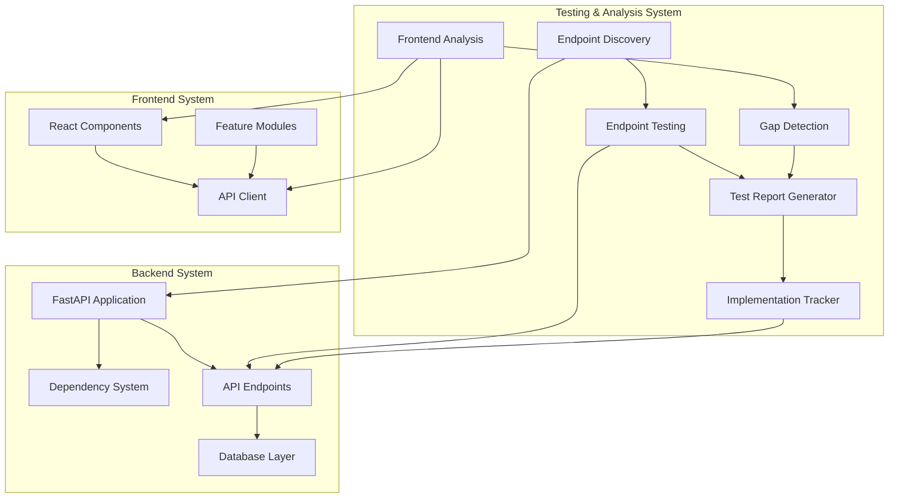

# Design Document

## Overview

This design document outlines the architecture and implementation strategy for comprehensive backend-frontend integration testing, gap analysis, and missing functionality implementation for the Career Copilot application. The system will ensure all endpoints are accessible, identify missing backend implementations, and provide a robust testing framework.

## Architecture

### High-Level Architecture



### Component Architecture

1. **Endpoint Discovery Module**: Automatically discovers all registered FastAPI routes
2. **Endpoint Testing Module**: Tests each endpoint with valid and invalid inputs
3. **Frontend Analysis Module**: Scans frontend code for API calls
4. **Gap Detection Module**: Compares frontend requirements with backend capabilities
5. **Implementation Module**: Provides missing backend functionality
6. **Dependency Consolidation Module**: Resolves conflicting dependency implementations

## Components and Interfaces

### 1. Endpoint Discovery System

**Purpose**: Automatically enumerate all backend API endpoints

**Interface**:
```python
class EndpointDiscovery:
    def discover_endpoints(app: FastAPI) -> List[EndpointInfo]
    def categorize_endpoints(endpoints: List[EndpointInfo]) -> Dict[str, List[EndpointInfo]]
    def generate_endpoint_map() -> Dict[str, EndpointMetadata]
```

**Data Structures**:
```python
@dataclass
class EndpointInfo:
    path: str
    method: str
    name: str
    tags: List[str]
    parameters: List[ParameterInfo]
    response_model: Optional[Type]
    requires_auth: bool
```

### 2. Endpoint Testing Framework

**Purpose**: Systematically test all endpoints with various inputs

**Interface**:
```python
class EndpointTester:
    def test_endpoint(endpoint: EndpointInfo, test_data: Dict) -> TestResult
    def test_all_endpoints() -> List[TestResult]
    def generate_test_data(endpoint: EndpointInfo) -> List[Dict]
    def validate_response(response: Response, expected: EndpointInfo) -> ValidationResult
```

**Test Categories**:
- Health checks and status endpoints
- CRUD operations (Create, Read, Update, Delete)
- Search and filter endpoints
- Analytics and reporting endpoints
- File upload/download endpoints
- WebSocket connections

**Test Data Generation**:
- Valid data: Proper types, required fields, valid ranges
- Invalid data: Missing fields, wrong types, out-of-range values
- Edge cases: Empty strings, null values, maximum lengths

### 3. Frontend Analysis System

**Purpose**: Scan frontend code to identify all API calls and required endpoints

**Interface**:
```python
class FrontendAnalyzer:
    def scan_api_calls(directory: str) -> List[ApiCall]
    def extract_endpoints_from_client(client_file: str) -> List[str]
    def identify_required_features() -> List[FeatureRequirement]
```

**Data Structures**:
```python
@dataclass
class ApiCall:
    component: str
    file_path: str
    line_number: int
    endpoint: str
    method: str
    parameters: Dict
    
@dataclass
class FeatureRequirement:
    feature_name: str
    required_endpoints: List[str]
    priority: str  # critical, high, medium, low
```

### 4. Gap Detection Module

**Purpose**: Identify missing backend implementations

**Interface**:
```python
class GapDetector:
    def compare_frontend_backend(
        frontend_calls: List[ApiCall],
        backend_endpoints: List[EndpointInfo]
    ) -> List[Gap]
    
    def categorize_gaps(gaps: List[Gap]) -> Dict[str, List[Gap]]
    def prioritize_gaps(gaps: List[Gap]) -> List[Gap]
```

**Gap Categories**:
- Missing endpoints: Frontend calls endpoint that doesn't exist
- Incomplete implementations: Endpoint exists but missing required functionality
- Parameter mismatches: Endpoint exists but parameters don't match
- Response format issues: Endpoint returns data in unexpected format

### 5. Dependency Consolidation

**Purpose**: Resolve conflicting get_current_user implementations

**Current State**:
- `app/dependencies.py`: Returns Moatasim user from database
- `app/core/dependencies.py`: Returns mock user with ID 1

**Design Decision**: Use database-backed implementation from `app/dependencies.py` as the canonical version

**Implementation Strategy**:
1. Audit all imports of get_current_user
2. Update all imports to use `app.dependencies.get_current_user`
3. Remove or deprecate `app.core.dependencies.get_current_user`
4. Add tests to ensure consistent user across all endpoints

### 6. Missing Backend Implementations

Based on frontend analysis, the following backend implementations are required:

#### 6.1 Data Export Endpoints

**Endpoints**:
- `POST /api/v1/export/jobs` - Export jobs to JSON/CSV/PDF
- `POST /api/v1/export/applications` - Export applications to JSON/CSV/PDF
- `POST /api/v1/export/full-backup` - Export all user data

**Implementation**:
```python
@router.post("/export/jobs")
async def export_jobs(
    format: str = "json",  # json, csv, pdf
    filters: Optional[Dict] = None,
    current_user: User = Depends(get_current_user),
    db: AsyncSession = Depends(get_db)
) -> Response:
    # Query jobs with filters
    # Format data according to requested format
    # Return file response
```

#### 6.2 Data Import Endpoints

**Endpoints**:
- `POST /api/v1/import/jobs` - Import jobs from CSV
- `POST /api/v1/import/applications` - Import applications from CSV

**Implementation**:
```python
@router.post("/import/jobs")
async def import_jobs(
    file: UploadFile,
    current_user: User = Depends(get_current_user),
    db: AsyncSession = Depends(get_db)
) -> Dict:
    # Parse CSV file
    # Validate data
    # Bulk insert jobs
    # Return import summary
```

#### 6.3 Bulk Operations Endpoints

**Endpoints**:
- `POST /api/v1/jobs/bulk-create` - Create multiple jobs
- `PUT /api/v1/jobs/bulk-update` - Update multiple jobs
- `DELETE /api/v1/jobs/bulk-delete` - Delete multiple jobs
- `POST /api/v1/applications/bulk-create` - Create multiple applications
- `PUT /api/v1/applications/bulk-update` - Update multiple applications
- `DELETE /api/v1/applications/bulk-delete` - Delete multiple applications

**Implementation**:
```python
@router.post("/jobs/bulk-create")
async def bulk_create_jobs(
    jobs: List[JobCreate],
    current_user: User = Depends(get_current_user),
    db: AsyncSession = Depends(get_db)
) -> BulkOperationResult:
    # Validate all jobs
    # Bulk insert with transaction
    # Return success/failure counts
```

#### 6.4 Enhanced Search Endpoints

**Endpoints**:
- `GET /api/v1/jobs/search` - Advanced job search with multiple filters
- `GET /api/v1/applications/search` - Advanced application search

**Implementation**:
```python
@router.get("/jobs/search")
async def search_jobs(
    query: Optional[str] = None,
    location: Optional[str] = None,
    remote: Optional[bool] = None,
    job_type: Optional[str] = None,
    min_salary: Optional[int] = None,
    max_salary: Optional[int] = None,
    tech_stack: Optional[List[str]] = Query(None),
    skip: int = 0,
    limit: int = 100,
    current_user: User = Depends(get_current_user),
    db: AsyncSession = Depends(get_db)
) -> List[Job]:
    # Build dynamic query with filters
    # Execute search
    # Return paginated results
```

#### 6.5 Notification Management Endpoints

**Endpoints**:
- `GET /api/v1/notifications` - List notifications
- `PUT /api/v1/notifications/{id}/read` - Mark as read
- `PUT /api/v1/notifications/{id}/unread` - Mark as unread
- `PUT /api/v1/notifications/read-all` - Mark all as read
- `DELETE /api/v1/notifications/{id}` - Delete notification
- `POST /api/v1/notifications/bulk-delete` - Delete multiple notifications
- `GET /api/v1/notifications/preferences` - Get notification preferences
- `PUT /api/v1/notifications/preferences` - Update notification preferences

**Implementation**:
```python
@router.get("/notifications")
async def get_notifications(
    skip: int = 0,
    limit: int = 50,
    unread_only: bool = False,
    current_user: User = Depends(get_current_user),
    db: AsyncSession = Depends(get_db)
) -> List[Notification]:
    # Query notifications for user
    # Filter by read status if requested
    # Return paginated results
```

#### 6.6 WebSocket Real-time Updates

**Implementation**:
```python
@router.websocket("/ws/notifications")
async def websocket_notifications(
    websocket: WebSocket,
    db: AsyncSession = Depends(get_db)
):
    await websocket.accept()
    # Get user from connection
    # Subscribe to notification events
    # Send real-time updates
    # Handle disconnection
```

#### 6.7 Analytics Enhancements

**Endpoints**:
- `GET /api/v1/analytics/summary` - Summary statistics
- `GET /api/v1/analytics/trends` - Trend data over time
- `GET /api/v1/analytics/skills` - Skill analysis
- `GET /api/v1/analytics/comprehensive-dashboard` - Complete dashboard data

**Implementation**:
```python
@router.get("/analytics/summary")
async def get_analytics_summary(
    days: int = 30,
    current_user: User = Depends(get_current_user),
    db: AsyncSession = Depends(get_db)
) -> AnalyticsSummary:
    # Calculate application counts by status
    # Calculate interview and offer rates
    # Calculate daily/weekly/monthly trends
    # Analyze top skills and companies
    # Return comprehensive summary
```

## Data Models

### Test Result Models

```python
@dataclass
class TestResult:
    endpoint: str
    method: str
    status: str  # passed, failed, error
    status_code: int
    response_time: float
    error_message: Optional[str]
    request_data: Dict
    response_data: Optional[Dict]

@dataclass
class ValidationResult:
    is_valid: bool
    errors: List[str]
    warnings: List[str]
```

### Gap Analysis Models

```python
@dataclass
class Gap:
    gap_type: str  # missing_endpoint, incomplete_implementation, parameter_mismatch
    frontend_component: str
    expected_endpoint: str
    expected_method: str
    expected_parameters: Dict
    backend_status: str  # not_found, partial, mismatch
    priority: str  # critical, high, medium, low
    description: str
```

### Export/Import Models

```python
class ExportFormat(str, Enum):
    JSON = "json"
    CSV = "csv"
    PDF = "pdf"

class ExportRequest(BaseModel):
    format: ExportFormat
    filters: Optional[Dict] = None
    include_fields: Optional[List[str]] = None

class ImportResult(BaseModel):
    total_records: int
    successful: int
    failed: int
    errors: List[Dict]
```

### Bulk Operation Models

```python
class BulkOperationResult(BaseModel):
    total: int
    successful: int
    failed: int
    errors: List[Dict[str, Any]]
    created_ids: Optional[List[int]] = None
    updated_ids: Optional[List[int]] = None
    deleted_ids: Optional[List[int]] = None
```

## Error Handling

### Error Categories

1. **Validation Errors (400, 422)**:
   - Missing required fields
   - Invalid data types
   - Out-of-range values
   - Format errors

2. **Not Found Errors (404)**:
   - Resource doesn't exist
   - Endpoint not found

3. **Server Errors (500)**:
   - Database errors
   - Unexpected exceptions
   - External service failures

### Error Response Format

```python
class ErrorResponse(BaseModel):
    error: str
    detail: str
    status_code: int
    request_id: str
    timestamp: datetime
    field_errors: Optional[Dict[str, List[str]]] = None
```

### Error Handling Strategy

1. **Catch all exceptions** at the endpoint level
2. **Log errors** with full context (request ID, user, endpoint, parameters)
3. **Return structured error responses** with appropriate status codes
4. **Don't expose sensitive information** (database details, stack traces in production)
5. **Provide actionable error messages** that help users fix the issue

## Testing Strategy

### Unit Tests

Test individual components in isolation:
- Endpoint discovery logic
- Test data generation
- Gap detection algorithms
- Export/import formatters
- Bulk operation handlers

### Integration Tests

Test component interactions:
- Endpoint testing with real database
- Frontend-backend communication
- WebSocket connections
- File upload/download
- Bulk operations with transactions

### End-to-End Tests

Test complete user workflows:
- Create job → Create application → Update status → Export data
- Import jobs → Search → Filter → Apply
- Receive notification → Mark as read → Delete
- View analytics → Filter by date → Export report

### Performance Tests

Test system under load:
- 100 concurrent requests to various endpoints
- Large dataset queries (10,000+ records)
- Bulk operations with 1,000+ records
- WebSocket connections with 100+ clients
- Export operations with large datasets

### Test Data

Create comprehensive test datasets:
- 1,000 jobs with varied attributes
- 500 applications in different statuses
- 100 notifications
- Multiple users with different profiles
- Edge cases (empty fields, maximum lengths, special characters)

## Implementation Phases

### Phase 1: Dependency Consolidation (Critical)
- Audit all get_current_user imports
- Update to use canonical implementation
- Remove duplicate implementation
- Add tests for consistency

### Phase 2: Endpoint Testing Framework
- Implement endpoint discovery
- Create test data generators
- Build endpoint tester
- Generate test reports

### Phase 3: Frontend Analysis
- Scan frontend code for API calls
- Extract endpoint requirements
- Identify feature dependencies

### Phase 4: Gap Detection
- Compare frontend and backend
- Categorize and prioritize gaps
- Generate implementation plan

### Phase 5: Missing Implementations
- Implement export endpoints
- Implement import endpoints
- Implement bulk operations
- Implement enhanced search
- Implement notification management
- Implement WebSocket support
- Enhance analytics endpoints

### Phase 6: Comprehensive Testing
- Run full endpoint test suite
- Verify all frontend features
- Performance testing
- Generate final report

## Monitoring and Logging

### Logging Strategy

1. **Request Logging**:
   - Log all incoming requests with method, path, parameters
   - Include request ID for tracing
   - Log response status and time

2. **Error Logging**:
   - Log all errors with full context
   - Include stack traces in development
   - Sanitize sensitive data in production

3. **Performance Logging**:
   - Log slow queries (>1 second)
   - Log slow endpoints (>500ms)
   - Track database connection pool usage

### Metrics

Track key metrics:
- Request count by endpoint
- Response time percentiles (p50, p95, p99)
- Error rate by endpoint
- Database query performance
- WebSocket connection count
- Cache hit/miss rates

## Security Considerations

### Input Validation

- Validate all input parameters
- Sanitize user-provided data
- Limit file upload sizes
- Validate file types for uploads
- Prevent SQL injection with parameterized queries

### Rate Limiting

- Implement rate limiting per user
- Different limits for different endpoint types
- Graceful degradation under load

### Data Privacy

- Don't log sensitive data (passwords, tokens)
- Sanitize error messages
- Implement data export with user consent
- Support data deletion (GDPR compliance)

## Performance Optimization

### Database Optimization

- Use indexes on frequently queried fields
- Implement connection pooling
- Use async database operations
- Batch database operations where possible
- Implement query result caching

### API Optimization

- Implement response caching for read-heavy endpoints
- Use pagination for large result sets
- Implement field selection (return only requested fields)
- Compress responses (gzip)
- Use async/await throughout

### Caching Strategy

- Cache analytics results (5-minute TTL)
- Cache user profiles (1-hour TTL)
- Cache job listings (15-minute TTL)
- Invalidate cache on updates
- Use Redis for distributed caching

## Deployment Considerations

### Environment Configuration

- Separate configurations for dev/staging/production
- Environment variables for sensitive data
- Feature flags for gradual rollout

### Database Migrations

- Version all schema changes
- Test migrations on staging first
- Implement rollback procedures
- Backup before migrations

### Monitoring

- Health check endpoints
- Metrics collection
- Error tracking (Sentry)
- Performance monitoring (APM)
- Log aggregation

## Success Criteria

1. **All endpoints accessible**: 100% of endpoints return valid responses
2. **No authentication errors**: Zero 401/403 errors when auth is disabled
3. **Frontend-backend parity**: All frontend features have backend support
4. **Performance targets met**: Response times under 500ms for 95% of requests
5. **Comprehensive test coverage**: >80% code coverage
6. **Zero critical bugs**: No P0/P1 issues in production
7. **Documentation complete**: All endpoints documented with examples
