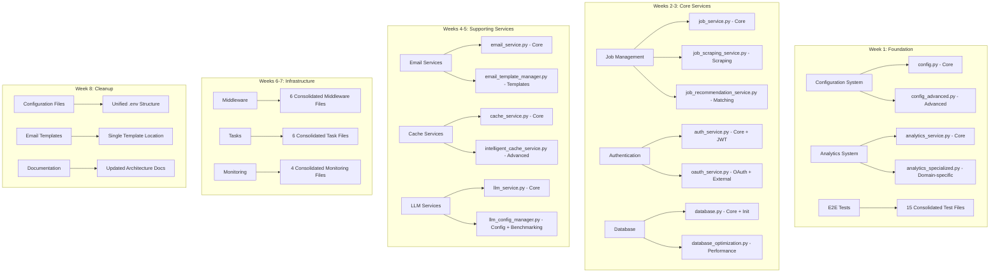

# Design Document

## Overview

The codebase consolidation design implements a systematic approach to reduce file count by 50% (from ~313 to ~157 files) while maintaining 100% functionality. The design follows a phased consolidation strategy over 8 weeks, prioritizing high-impact, low-risk consolidations first, followed by core services, supporting services, infrastructure, and finally cleanup and documentation.

## Architecture

### Consolidation Strategy

The architecture employs a **layered consolidation approach** with the following principles:

1. **Functional Grouping**: Related functionality is consolidated into logical modules
2. **Separation of Concerns**: Core functionality is separated from advanced/specialized features
3. **Backward Compatibility**: Import compatibility layers maintain existing interfaces during transition
4. **Incremental Migration**: One category at a time to minimize risk
5. **Testing-First**: Comprehensive testing before and after each consolidation step

### System Architecture Diagram



## Components and Interfaces

### 1. Configuration Management System

**Core Component**: `config.py`
- Configuration loading and validation
- Environment variable management
- Settings initialization and access

**Advanced Component**: `config_advanced.py`
- Hot reload functionality
- Configuration templates
- Integration management
- Dynamic configuration updates

**Interface Design**:
```python
class ConfigurationManager:
    def load_config(self, env: str = None) -> Dict[str, Any]
    def validate_config(self, config: Dict[str, Any]) -> bool
    def get_setting(self, key: str, default: Any = None) -> Any
    def reload_config(self) -> None
    def apply_template(self, template_name: str) -> None
```

### 2. Analytics Service System

**Core Component**: `analytics_service.py`
- Data collection and processing
- Core analytics functionality
- Event tracking and metrics

**Specialized Component**: `analytics_specialized.py`
- Application-specific analytics
- Email analytics
- Job analytics
- Slack integration analytics

**Interface Design**:
```python
class AnalyticsService:
    def collect_event(self, event_type: str, data: Dict[str, Any]) -> None
    def process_analytics(self, batch_size: int = 100) -> None
    def get_metrics(self, metric_type: str, timeframe: str) -> Dict[str, Any]
    def generate_report(self, report_type: str) -> AnalyticsReport
```

### 3. Job Management System

**Core Component**: `job_service.py`
- Job CRUD operations
- Job lifecycle management
- Core job processing logic

**Scraping Component**: `job_scraping_service.py`
- Job data scraping
- Data ingestion and normalization
- Source management

**Recommendation Component**: `job_recommendation_service.py`
- Job matching algorithms
- Recommendation generation
- Feedback processing

**Interface Design**:
```python
class JobManagementSystem:
    def create_job(self, job_data: JobData) -> Job
    def scrape_jobs(self, sources: List[str]) -> List[Job]
    def generate_recommendations(self, user_id: str, criteria: Dict) -> List[JobRecommendation]
    def process_feedback(self, feedback: RecommendationFeedback) -> None
```

### 4. Authentication System

**Core Component**: `auth_service.py`
- User authentication
- JWT token management
- Session handling
- Core authorization logic

**OAuth Component**: `oauth_service.py`
- OAuth provider integration
- Firebase authentication
- External authentication services
- Social login management

**Interface Design**:
```python
class AuthenticationSystem:
    def authenticate_user(self, credentials: UserCredentials) -> AuthResult
    def generate_jwt(self, user_id: str, permissions: List[str]) -> str
    def validate_token(self, token: str) -> TokenValidationResult
    def oauth_login(self, provider: str, oauth_data: Dict) -> AuthResult
```

### 5. Database Management System

**Core Component**: `database.py`
- Database connections
- Connection pooling
- Basic CRUD operations
- Database initialization

**Optimization Component**: `database_optimization.py`
- Performance monitoring
- Query optimization
- Backup management
- Migration handling

**Interface Design**:
```python
class DatabaseManager:
    def get_connection(self) -> DatabaseConnection
    def execute_query(self, query: str, params: Dict = None) -> QueryResult
    def optimize_performance(self) -> OptimizationReport
    def create_backup(self, backup_name: str) -> BackupResult
    def run_migration(self, migration_id: str) -> MigrationResult
```

## Data Models

### Consolidation Tracking Model

```python
@dataclass
class ConsolidationProgress:
    phase: str
    week: int
    category: str
    files_before: int
    files_after: int
    reduction_percentage: float
    status: ConsolidationStatus
    completion_date: Optional[datetime]
    test_results: List[TestResult]
    rollback_available: bool
```

### File Mapping Model

```python
@dataclass
class FileMapping:
    original_path: str
    consolidated_path: str
    consolidation_type: ConsolidationType
    dependencies: List[str]
    import_changes: List[ImportChange]
    backup_location: str
```

### Service Interface Model

```python
@dataclass
class ServiceInterface:
    service_name: str
    original_files: List[str]
    consolidated_files: List[str]
    public_methods: List[str]
    interface_changes: List[InterfaceChange]
    compatibility_layer: Optional[str]
```

## Error Handling

### Consolidation Error Management

1. **File Conflict Resolution**
   - Automated conflict detection
   - Manual resolution prompts
   - Rollback mechanisms
   - Backup restoration

2. **Import Path Failures**
   - Compatibility layer activation
   - Gradual migration support
   - Error logging and tracking
   - Developer notification system

3. **Test Failure Handling**
   - Automatic test execution
   - Failure analysis and reporting
   - Rollback triggers
   - Manual intervention alerts

4. **Data Loss Prevention**
   - Pre-consolidation backups
   - Functionality verification
   - Data integrity checks
   - Recovery procedures

### Error Recovery Strategies

```python
class ConsolidationErrorHandler:
    def handle_file_conflict(self, conflict: FileConflict) -> ConflictResolution
    def manage_import_failure(self, import_error: ImportError) -> ImportFix
    def process_test_failure(self, test_failure: TestFailure) -> TestResolution
    def initiate_rollback(self, rollback_request: RollbackRequest) -> RollbackResult
```

## Testing Strategy

### Multi-Level Testing Approach

1. **Pre-Consolidation Testing**
   - Baseline functionality verification
   - Performance benchmarking
   - Integration test execution
   - E2E test validation

2. **During Consolidation Testing**
   - Incremental functionality testing
   - Import path validation
   - Interface compatibility testing
   - Performance regression testing

3. **Post-Consolidation Testing**
   - Full functionality verification
   - Performance comparison
   - Integration test re-execution
   - E2E test validation

### Test Categories

#### Unit Tests
- Individual component functionality
- Method-level testing
- Mock and stub validation
- Edge case coverage

#### Integration Tests
- Service interaction testing
- Database integration validation
- API endpoint testing
- Cross-component communication

#### E2E Tests (Consolidated)
- User workflow validation
- System-wide functionality
- Performance under load
- Real-world scenario testing

#### Performance Tests
- Load testing
- Stress testing
- Memory usage validation
- Response time measurement

### Testing Automation

```python
class ConsolidationTestSuite:
    def run_pre_consolidation_tests(self) -> TestResults
    def validate_consolidation_step(self, step: ConsolidationStep) -> ValidationResult
    def run_post_consolidation_tests(self) -> TestResults
    def generate_test_report(self) -> TestReport
```

## Implementation Phases

### Phase 1: Foundation (Week 1)
- **Risk Level**: Low
- **Impact**: High
- **Dependencies**: Minimal
- **Rollback Complexity**: Low

### Phase 2: Core Services (Weeks 2-3)
- **Risk Level**: Medium
- **Impact**: High
- **Dependencies**: Phase 1 completion
- **Rollback Complexity**: Medium

### Phase 3: Supporting Services (Weeks 4-5)
- **Risk Level**: Medium
- **Impact**: Medium
- **Dependencies**: Phase 2 completion
- **Rollback Complexity**: Medium

### Phase 4: Infrastructure (Weeks 6-7)
- **Risk Level**: High
- **Impact**: Medium
- **Dependencies**: Phase 3 completion
- **Rollback Complexity**: High

### Phase 5: Cleanup (Week 8)
- **Risk Level**: Low
- **Impact**: Low
- **Dependencies**: All previous phases
- **Rollback Complexity**: Low

## Migration Strategy

### Import Compatibility Layer

```python
# compatibility_layer.py
import warnings
from typing import Any

def deprecated_import(old_module: str, new_module: str, item: str) -> Any:
    warnings.warn(
        f"Importing {item} from {old_module} is deprecated. "
        f"Use {new_module} instead.",
        DeprecationWarning,
        stacklevel=2
    )
    # Dynamic import and return
    return getattr(__import__(new_module, fromlist=[item]), item)
```

### Gradual Migration Process

1. **Preparation Phase**
   - Create consolidated files
   - Implement compatibility layer
   - Update internal imports

2. **Transition Phase**
   - Activate compatibility warnings
   - Monitor usage patterns
   - Provide migration guidance

3. **Completion Phase**
   - Remove old files
   - Deactivate compatibility layer
   - Update documentation

## Performance Considerations

### Expected Performance Improvements

1. **Import Performance**: 20-30% improvement due to reduced import chains
2. **Build Performance**: 20-30% improvement due to fewer files
3. **Memory Usage**: 15-25% reduction due to consolidated modules
4. **Developer Productivity**: 25% improvement due to clearer structure

### Performance Monitoring

```python
class PerformanceTracker:
    def measure_import_time(self, module: str) -> float
    def track_build_performance(self) -> BuildMetrics
    def monitor_memory_usage(self) -> MemoryMetrics
    def measure_developer_productivity(self) -> ProductivityMetrics
```

## Security Considerations

### Security Impact Assessment

1. **Authentication Consolidation**: Enhanced security through unified auth logic
2. **Configuration Management**: Improved security through centralized config validation
3. **Middleware Consolidation**: Streamlined security middleware stack
4. **Access Control**: Maintained through consolidated authorization services

### Security Validation

- Security audit of consolidated components
- Penetration testing of consolidated services
- Access control verification
- Data protection validation