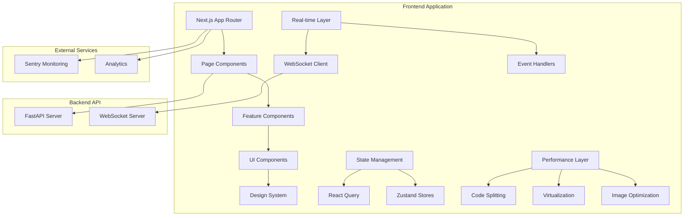

# Design Document

## Overview

This design document outlines the architecture and implementation approach for completing the remaining TODO tasks in the Career Copilot application. The system is built with Next.js 16 (App Router), React 18, TypeScript, and Tailwind CSS, with a comprehensive design system already in place. The implementation will follow a phased approach, building upon existing components and patterns while introducing new advanced features.

### Current State

**Completed:**
- Phase 1: Design system foundation (tokens, Button2, Card2, Input suite, Modal/Dialog system, Form validation)
- Phase 3: Enterprise DataTable with full feature set
- Storybook setup with component documentation
- Accessibility foundation with axe-core integration

**Remaining:**
- Phase 2: Visual polish (animations, dark mode completion, responsive refinement)
- Phase 3: Advanced features (Command Palette, Advanced Search, Bulk Operations, Notifications)
- Phase 4: Performance optimization
- Phase 5: Advanced UX patterns (Onboarding, Charts, WebSockets, Drag & Drop)
- Phase 6: Production readiness (Error handling, Help system, Export/Import, Settings, QA)

## Architecture

### High-Level Architecture



### Technology Stack

**Core:**
- Next.js 16.0.1 (App Router, React Server Components)
- React 18.3.1 with TypeScript 5
- Tailwind CSS 4.1.17 with custom design tokens

**State & Data:**
- @tanstack/react-query 5.90.7 (server state, caching)
- Zustand 5.0.8 (client state)
- React Hook Form 7.66.0 + Zod 4.1.12 (forms & validation)

**UI & Interactions:**
- Framer Motion 12.23.24 (animations)
- @dnd-kit 6.3.1 (drag & drop)
- cmdk 1.1.1 (command palette)
- Recharts 3.3.0 (data visualization)
- Lucide React 0.553.0 (icons)

**Performance:**
- @tanstack/react-virtual (list virtualization)
- Next.js Image optimization
- Bundle analyzer

**Quality:**
- @axe-core/react 4.11.0 (accessibility)
- @sentry/nextjs 10.23.0 (error monitoring)
- Storybook 10.0.6 (component documentation)

## Components and Interfaces

### 1. Animation System

**Location:** `frontend/src/lib/animations.ts`

```typescript
// Animation variants for Framer Motion
export const fadeVariants = {
  hidden: { opacity: 0 },
  visible: { opacity: 1, transition: { duration: 0.2 } },
  exit: { opacity: 0, transition: { duration: 0.15 } }
};

export const slideVariants = {
  left: {
    hidden: { x: -20, opacity: 0 },
    visible: { x: 0, opacity: 1 }
  },
  right: {
    hidden: { x: 20, opacity: 0 },
    visible: { x: 0, opacity: 1 }
  },
  up: {
    hidden: { y: 20, opacity: 0 },
    visible: { y: 0, opacity: 1 }
  },
  down: {
    hidden: { y: -20, opacity: 0 },
    visible: { y: 0, opacity: 1 }
  }
};

export const staggerContainer = {
  hidden: { opacity: 0 },
  visible: {
    opacity: 1,
    transition: {
      staggerChildren: 0.1
    }
  }
};

export const springConfigs = {
  gentle: { type: "spring", stiffness: 100, damping: 15 },
  bouncy: { type: "spring", stiffness: 300, damping: 20 },
  stiff: { type: "spring", stiffness: 400, damping: 30 }
};
```

**Integration Points:**
- Page transitions in `app/layout.tsx`
- Button micro-interactions in `Button2.tsx`
- Card hover effects in `Card2.tsx`
- List animations in JobsPage, ApplicationsPage
- Modal/Dialog entrance/exit

### 2. Dark Mode System

**Location:** `frontend/src/hooks/useDarkMode.ts`

```typescript
interface DarkModeHook {
  isDark: boolean;
  toggle: () => void;
  setDark: () => void;
  setLight: () => void;
  setSystem: () => void;
}

export function useDarkMode(): DarkModeHook {
  // Priority: localStorage > system preference > default (light)
  // Persist to localStorage
  // Apply 'dark' class to <html> element
  // Emit storage event for cross-tab sync
}
```

**Component:** `frontend/src/components/ui/ThemeToggle.tsx`

```typescript
interface ThemeToggleProps {
  className?: string;
  showLabel?: boolean;
}

export function ThemeToggle({ className, showLabel }: ThemeToggleProps) {
  // Sun/Moon icon toggle
  // Smooth icon transition animation
  // Tooltip: "Toggle theme (⌘/Ctrl + D)"
  // Keyboard shortcut support
}
```

**Theme Transition CSS:**
```css
* {
  transition: background-color 200ms, border-color 200ms, color 200ms;
}
```

### 3. Command Palette

**Location:** `frontend/src/components/ui/CommandPalette.tsx`

```typescript
interface Command {
  id: string;
  label: string;
  category: 'navigation' | 'action' | 'setting' | 'search';
  icon: LucideIcon;
  keywords: string[];
  action: () => void | Promise<void>;
  shortcut?: string;
}

interface CommandPaletteProps {
  isOpen: boolean;
  onClose: () => void;
}

export function CommandPalette({ isOpen, onClose }: CommandPaletteProps) {
  // Uses cmdk library
  // Fuzzy search across commands
  // Recent commands/searches
  // Dynamic job/application search
  // Keyboard navigation
  // Glass morphism backdrop
}
```

**Command Registry:** `frontend/src/lib/commands.ts`

```typescript
export const commandRegistry: Command[] = [
  {
    id: 'nav-dashboard',
    label: 'Go to Dashboard',
    category: 'navigation',
    icon: LayoutDashboard,
    keywords: ['home', 'overview'],
    action: () => router.push('/dashboard')
  },
  // ... more commands
];
```

**Keyboard Hook:** `frontend/src/hooks/useKeyboardShortcut.ts`

```typescript
export function useKeyboardShortcut(
  key: string,
  callback: () => void,
  options?: { ctrl?: boolean; meta?: boolean; shift?: boolean }
) {
  // Listen for keyboard events
  // Handle platform differences (Cmd on Mac, Ctrl on Windows)
  // Prevent default browser behavior
}
```

### 4. Advanced Search System

**Location:** `frontend/src/components/features/AdvancedSearch.tsx`

```typescript
interface SearchRule {
  id: string;
  field: string;
  operator: 'equals' | 'contains' | 'gt' | 'lt' | 'between' | 'isEmpty';
  value: any;
}

interface SearchGroup {
  id: string;
  logic: 'AND' | 'OR';
  rules: SearchRule[];
  groups?: SearchGroup[];
}

interface AdvancedSearchProps {
  isOpen: boolean;
  onClose: () => void;
  onSearch: (query: SearchGroup) => void;
  fields: SearchField[];
}
```

**Query Builder:** `frontend/src/components/features/QueryBuilder.tsx`

```typescript
interface QueryBuilderProps {
  query: SearchGroup;
  onChange: (query: SearchGroup) => void;
  fields: SearchField[];
}

// Visual tree structure with add/remove buttons
// Nested groups support
// Field-specific operators and value inputs
```

**Saved Searches:** `frontend/src/components/features/SavedSearches.tsx`

```typescript
interface SavedSearch {
  id: string;
  name: string;
  query: SearchGroup;
  createdAt: Date;
  resultCount?: number;
}

// CRUD operations for saved searches
// Load search into query builder
// Share search (future feature)
```

### 5. Bulk Operations System

**Location:** `frontend/src/components/ui/BulkActionBar.tsx`

```typescript
interface BulkAction {
  id: string;
  label: string;
  icon: LucideIcon;
  variant: 'default' | 'destructive';
  requiresConfirmation: boolean;
  action: (selectedIds: string[]) => Promise<void>;
}

interface BulkActionBarProps {
  selectedCount: number;
  actions: BulkAction[];
  onClearSelection: () => void;
}

// Fixed position at bottom
// Slide up animation
// Progress indicators for long operations
// Undo functionality for non-destructive actions
```

### 6. Notification System

**Location:** `frontend/src/components/notifications/NotificationCenter.tsx`

```typescript
interface Notification {
  id: string;
  category: 'system' | 'job_alert' | 'application' | 'recommendation' | 'social';
  title: string;
  description: string;
  timestamp: Date;
  read: boolean;
  actionUrl?: string;
  actionLabel?: string;
  icon?: LucideIcon;
}

interface NotificationCenterProps {
  isOpen: boolean;
  onClose: () => void;
}

// Bell icon with unread badge
// Dropdown panel with recent notifications
// Category filters
// Mark as read/unread
// Real-time updates via WebSocket
```

**Notification Preferences:** `frontend/src/components/settings/NotificationPreferences.tsx`

```typescript
interface NotificationPreference {
  category: string;
  enabled: boolean;
  emailEnabled: boolean;
  emailFrequency: 'immediate' | 'daily' | 'off';
  pushEnabled: boolean;
  soundEnabled: boolean;
}

// Toggle per category
// Email digest settings
// Push notification permission
// Do Not Disturb schedule
```

### 7. WebSocket Client

**Location:** `frontend/src/lib/websocket.ts`

```typescript
interface WebSocketClient {
  connect: () => void;
  disconnect: () => void;
  subscribe: (event: string, handler: (data: any) => void) => () => void;
  send: (event: string, data: any) => void;
  getStatus: () => 'connected' | 'connecting' | 'disconnected';
}

export function createWebSocketClient(url: string): WebSocketClient {
  // Auto-reconnect with exponential backoff
  // Event subscription system
  // Connection status tracking
  // Message queue for offline mode
}
```

**Connection Status:** `frontend/src/components/ui/ConnectionStatus.tsx`

```typescript
// Small indicator in navigation
// States: connected (green), connecting (yellow), disconnected (red)
// Tooltip with status message
// Manual reconnect button
```

### 8. Onboarding Wizard

**Location:** `frontend/src/components/onboarding/OnboardingWizard.tsx`

```typescript
interface OnboardingStep {
  id: string;
  title: string;
  description: string;
  component: React.ComponentType<StepProps>;
  optional: boolean;
}

interface OnboardingWizardProps {
  steps: OnboardingStep[];
  onComplete: () => void;
  onSkip: () => void;
}

// Multi-step wizard with progress indicator
// Save progress to backend
// Resume from last step
// Skip individual steps or entire wizard
```

**Steps:**
1. Welcome & Profile Setup
2. Skills & Expertise
3. Resume Upload
4. Job Preferences
5. Feature Tour

### 9. Data Visualization

**Location:** `frontend/src/components/charts/`

**Base Chart Wrapper:** `ChartWrapper.tsx`

```typescript
interface ChartWrapperProps {
  title: string;
  description?: string;
  children: React.ReactNode;
  actions?: React.ReactNode;
  loading?: boolean;
  error?: string;
}

// Consistent styling with design tokens
// Loading skeleton
// Error state
// Export button
// Full-screen mode
```

**Chart Components:**
- `ApplicationStatusChart.tsx` - Pie/donut chart
- `ApplicationTimelineChart.tsx` - Line chart with zoom/pan
- `SalaryDistributionChart.tsx` - Bar chart/histogram
- `SkillsDemandChart.tsx` - Bar chart with comparison
- `SuccessRateChart.tsx` - Funnel chart

**Chart Features:**
- Interactive tooltips
- Click to filter
- Smooth animations
- Responsive layouts
- Dark mode support

### 10. Drag & Drop System

**Location:** Uses `@dnd-kit` library

**Dashboard Widgets:** `frontend/src/components/dashboard/DraggableDashboard.tsx`

```typescript
interface DashboardWidget {
  id: string;
  type: string;
  position: number;
  visible: boolean;
}

// Drag to reorder widgets
// Save layout to user preferences
// Reset to default layout
```

**Kanban Board:** `frontend/src/components/pages/ApplicationKanban.tsx`

```typescript
interface KanbanColumn {
  id: string;
  title: string;
  status: ApplicationStatus;
  items: Application[];
}

// Drag cards between columns
// Update status on drop
// Optimistic updates
// Keyboard navigation support
```

### 11. Error Handling System

**Location:** `frontend/src/lib/errorHandling.ts`

```typescript
interface ErrorHandler {
  handleError: (error: Error, context?: ErrorContext) => void;
  classifyError: (error: Error) => ErrorType;
  getErrorMessage: (error: Error) => string;
  shouldRetry: (error: Error) => boolean;
}

type ErrorType = 'network' | 'auth' | 'server' | 'client' | 'unknown';

interface ErrorContext {
  component?: string;
  action?: string;
  userId?: string;
}

// Intercept API errors
// Classify and format errors
// Show appropriate notifications
// Log to Sentry with context
```

**Enhanced Error Boundary:** `frontend/src/components/ErrorBoundary.tsx`

```typescript
interface ErrorBoundaryProps {
  children: React.ReactNode;
  fallback?: React.ComponentType<ErrorFallbackProps>;
  onError?: (error: Error, errorInfo: React.ErrorInfo) => void;
}

// Catch component errors
// User-friendly error UI
// Retry button
// Report issue button
// Different UIs for different error types
```

### 12. Export/Import System

**Location:** `frontend/src/lib/export/`

**CSV Export:** `exportToCSV.ts`

```typescript
export function exportToCSV<T>(
  data: T[],
  columns: ColumnDef<T>[],
  filename: string
): void {
  // Convert data to CSV format
  // Escape special characters
  // Trigger download
}
```

**PDF Export:** `exportToPDF.ts`

```typescript
export function exportToPDF<T>(
  data: T[],
  columns: ColumnDef<T>[],
  options: PDFOptions
): void {
  // Uses jspdf and jspdf-autotable
  // Format as table
  // Include logo and metadata
  // Trigger download
}
```

**Import System:** `frontend/src/components/features/DataImport.tsx`

```typescript
interface DataImportProps {
  onImport: (data: any[]) => Promise<void>;
  template: string; // CSV template URL
  validator: (data: any[]) => ValidationResult;
}

// File upload
// Parse CSV
// Validate data
// Preview import
// Column mapping
// Bulk import with progress
```

### 13. Settings System

**Location:** `frontend/src/app/settings/`

**Layout:** `layout.tsx`

```typescript
// Sidebar navigation
// Categories: Profile, Appearance, Notifications, Privacy, Account, Data
// Responsive: drawer on mobile
```

**Pages:**
- `profile/page.tsx` - Edit profile info, skills
- `appearance/page.tsx` - Theme, density, language
- `notifications/page.tsx` - Notification preferences
- `privacy/page.tsx` - Privacy settings
- `account/page.tsx` - Password, 2FA, sessions
- `data/page.tsx` - Export, delete data, delete account

## Data Models

### Command

```typescript
interface Command {
  id: string;
  label: string;
  category: 'navigation' | 'action' | 'setting' | 'search';
  icon: LucideIcon;
  keywords: string[];
  action: () => void | Promise<void>;
  shortcut?: string;
}
```

### Notification

```typescript
interface Notification {
  id: string;
  userId: string;
  category: 'system' | 'job_alert' | 'application' | 'recommendation' | 'social';
  title: string;
  description: string;
  timestamp: Date;
  read: boolean;
  actionUrl?: string;
  actionLabel?: string;
  metadata?: Record<string, any>;
}
```

### SavedSearch

```typescript
interface SavedSearch {
  id: string;
  userId: string;
  name: string;
  query: SearchGroup;
  createdAt: Date;
  updatedAt: Date;
  resultCount?: number;
  shared: boolean;
}
```

### UserPreferences

```typescript
interface UserPreferences {
  userId: string;
  theme: 'light' | 'dark' | 'system';
  density: 'comfortable' | 'compact';
  language: string;
  notifications: NotificationPreference[];
  dashboardLayout: DashboardWidget[];
  columnVisibility: Record<string, boolean>;
  columnOrder: Record<string, string[]>;
  columnWidths: Record<string, number>;
}
```

### WebSocketEvent

```typescript
interface WebSocketEvent {
  type: 'job:recommendation' | 'application:status_change' | 'notification:new';
  data: any;
  timestamp: Date;
}
```

## Error Handling

### Error Classification

1. **Network Errors** - Connection lost, timeout
   - Show: "Connection lost. Retrying..."
   - Action: Auto-retry with exponential backoff
   - Fallback: Offline mode with cached data

2. **Authentication Errors** - 401, 403
   - Show: "Session expired. Please log in."
   - Action: Redirect to login
   - Preserve: Current page URL for redirect after login

3. **Server Errors** - 500, 502, 503
   - Show: "Server error. Please try again later."
   - Action: Retry button
   - Log: Send to Sentry with context

4. **Client Errors** - 400, 404, 422
   - Show: Specific error message from API
   - Action: No retry (user must fix input)
   - Log: Only if unexpected

5. **Component Errors** - React errors
   - Show: Error boundary fallback UI
   - Action: Retry button, report issue
   - Log: Send to Sentry with component stack

### Retry Strategy

```typescript
interface RetryConfig {
  maxAttempts: number;
  baseDelay: number; // milliseconds
  maxDelay: number;
  backoffMultiplier: number;
}

const defaultRetryConfig: RetryConfig = {
  maxAttempts: 3,
  baseDelay: 1000,
  maxDelay: 10000,
  backoffMultiplier: 2
};

// Exponential backoff: delay = min(baseDelay * (backoffMultiplier ^ attempt), maxDelay)
```

### Offline Mode

- Detect: `navigator.onLine` and network request failures
- Show: Offline banner at top of page
- Cache: Store data in IndexedDB for offline viewing
- Queue: Store mutations in queue, replay when online
- Sync: Fetch latest data when connection restored

## Testing Strategy

### Unit Tests

**Target Coverage:** 80%

**Focus Areas:**
- Utility functions (animations, export, validation)
- Custom hooks (useDarkMode, useKeyboardShortcut, useWebSocket)
- Data transformations
- Error handling logic

**Tools:** Jest, React Testing Library

### Component Tests

**Focus Areas:**
- UI components render correctly
- Props are handled properly
- User interactions work
- Accessibility attributes present

**Tools:** Jest, React Testing Library, @testing-library/user-event

### Integration Tests

**Focus Areas:**
- Command palette search and execution
- Advanced search query building
- Bulk operations flow
- Onboarding wizard flow
- Export/import functionality

**Tools:** Playwright

### E2E Tests

**Critical Paths:**
1. User onboarding flow
2. Job search and save
3. Application tracking and status update
4. Bulk status change
5. Data export

**Tools:** Playwright

### Accessibility Tests

**Automated:**
- axe-core in development (already integrated)
- Lighthouse CI in GitHub Actions
- Storybook a11y addon

**Manual:**
- Keyboard navigation testing
- Screen reader testing (VoiceOver, NVDA)
- Color contrast verification
- Focus management

### Performance Tests

**Metrics:**
- Lighthouse Performance Score: Target 95+
- Core Web Vitals:
  - FCP < 1.5s
  - LCP < 2.5s
  - CLS < 0.1
  - FID < 100ms
- Bundle size: < 250KB gzipped

**Tools:**
- Lighthouse CI
- Bundle analyzer
- Chrome DevTools Performance panel

### Cross-Browser Tests

**Browsers:**
- Chrome (latest)
- Firefox (latest)
- Safari (latest)
- Edge (latest)

**Devices:**
- Desktop (1920x1080, 1366x768)
- Tablet (iPad, Android tablet)
- Mobile (iPhone SE, iPhone 14, Android)

**Tools:** BrowserStack or manual testing

## Performance Optimizations

### Code Splitting

1. **Route-based splitting** - Automatic with Next.js App Router
2. **Component-level splitting** - React.lazy() for heavy components
3. **Dynamic imports** - For conditionally used features

```typescript
// Heavy chart library loaded only when needed
const ChartComponent = dynamic(() => import('./ChartComponent'), {
  loading: () => <ChartSkeleton />,
  ssr: false
});
```

### Image Optimization

1. **Next.js Image component** - Automatic optimization, WebP format
2. **Responsive images** - Multiple sizes with `sizes` prop
3. **Blur placeholders** - LQIP for better perceived performance
4. **Lazy loading** - Images below fold loaded on scroll

### List Virtualization

**Use Cases:**
- Job lists with 100+ items
- Application lists with 100+ items
- DataTable with 1000+ rows

**Implementation:**
```typescript
import { useVirtualizer } from '@tanstack/react-virtual';

function VirtualList({ items }) {
  const parentRef = useRef<HTMLDivElement>(null);
  
  const virtualizer = useVirtualizer({
    count: items.length,
    getScrollElement: () => parentRef.current,
    estimateSize: () => 80, // estimated row height
    overscan: 5 // render 5 extra items above/below viewport
  });
  
  // Render only visible items
}
```

### Caching Strategy

**React Query Configuration:**

```typescript
const queryClient = new QueryClient({
  defaultOptions: {
    queries: {
      staleTime: 5 * 60 * 1000, // 5 minutes
      cacheTime: 10 * 60 * 1000, // 10 minutes
      refetchOnWindowFocus: false,
      retry: 3,
      retryDelay: (attemptIndex) => Math.min(1000 * 2 ** attemptIndex, 30000)
    }
  }
});
```

**Cache Strategies by Data Type:**
- **Jobs list:** staleTime 5 min, refetch on mount
- **Applications:** staleTime 1 min, refetch on mount
- **User profile:** staleTime 30 min, refetch on focus
- **Analytics:** staleTime 10 min, no auto-refetch
- **Notifications:** staleTime 30 sec, refetch on focus

### Optimistic Updates

**Pattern:**
```typescript
const mutation = useMutation({
  mutationFn: updateApplication,
  onMutate: async (newData) => {
    // Cancel outgoing refetches
    await queryClient.cancelQueries({ queryKey: ['applications'] });
    
    // Snapshot previous value
    const previousData = queryClient.getQueryData(['applications']);
    
    // Optimistically update
    queryClient.setQueryData(['applications'], (old) => {
      return updateOptimistically(old, newData);
    });
    
    return { previousData };
  },
  onError: (err, newData, context) => {
    // Rollback on error
    queryClient.setQueryData(['applications'], context.previousData);
  },
  onSettled: () => {
    // Refetch to ensure consistency
    queryClient.invalidateQueries({ queryKey: ['applications'] });
  }
});
```

### Bundle Optimization

1. **Tree shaking** - Remove unused code
2. **Code splitting** - Separate vendor and app bundles
3. **Compression** - Gzip/Brotli compression
4. **Minification** - Terser for production builds
5. **Bundle analysis** - Regular monitoring with bundle analyzer

**Bundle Size Targets:**
- Initial bundle: < 150KB gzipped
- Route bundles: < 50KB gzipped each
- Total JS: < 250KB gzipped

## Security Considerations

### Input Validation

- All user inputs validated with Zod schemas
- Sanitize HTML content (prevent XSS)
- Validate file uploads (type, size, content)

### Authentication

- No authentication required (per TODO.md)
- Future: JWT tokens, refresh tokens, secure storage

### API Security

- CORS configured for frontend domain
- Rate limiting on backend
- Input validation on all endpoints
- SQL injection prevention (parameterized queries)

### Data Privacy

- User data encrypted at rest (backend)
- HTTPS only in production
- Secure cookie settings
- GDPR compliance (data export, deletion)

### Error Handling

- Never expose sensitive data in error messages
- Log errors securely to Sentry
- Sanitize error messages shown to users

## Deployment Strategy

### Build Process

1. **Type checking** - `tsc --noEmit`
2. **Linting** - `eslint .`
3. **Testing** - `jest --coverage`
4. **Build** - `next build`
5. **Bundle analysis** - Check bundle sizes
6. **Lighthouse** - Performance audit

### Environment Variables

```env
# API
NEXT_PUBLIC_API_URL=https://api.example.com
NEXT_PUBLIC_WS_URL=wss://api.example.com/ws

# Monitoring
NEXT_PUBLIC_SENTRY_DSN=...
SENTRY_AUTH_TOKEN=...

# Feature Flags
NEXT_PUBLIC_ENABLE_WEBSOCKETS=true
NEXT_PUBLIC_ENABLE_ANALYTICS=true
```

### Deployment Platforms

**Recommended:** Vercel (optimized for Next.js)

**Alternatives:**
- Netlify
- AWS Amplify
- Docker + Kubernetes

### CI/CD Pipeline

```yaml
# .github/workflows/deploy.yml
name: Deploy

on:
  push:
    branches: [main]

jobs:
  test:
    runs-on: ubuntu-latest
    steps:
      - Checkout code
      - Install dependencies
      - Run linting
      - Run type checking
      - Run tests
      - Run Lighthouse CI
  
  build:
    needs: test
    runs-on: ubuntu-latest
    steps:
      - Build Next.js app
      - Upload build artifacts
  
  deploy:
    needs: build
    runs-on: ubuntu-latest
    steps:
      - Deploy to Vercel
      - Run smoke tests
      - Notify team
```

### Monitoring

**Sentry:**
- Error tracking
- Performance monitoring
- User feedback
- Release tracking

**Analytics:**
- Page views
- User flows
- Feature usage
- Performance metrics

### Rollback Strategy

1. **Vercel:** Instant rollback to previous deployment
2. **Feature flags:** Disable problematic features
3. **Database migrations:** Reversible migrations only
4. **Monitoring:** Alert on error rate spikes

## Migration Plan

### Phase 2: Visual Polish (Week 1-2)

1. Implement animation system
2. Complete dark mode
3. Refine responsive design
4. Add gradients and visual enhancements

### Phase 3: Advanced Features (Week 3-4)

1. Build Command Palette
2. Implement Advanced Search
3. Add Bulk Operations
4. Enhance Notification System

### Phase 4: Performance (Week 5)

1. Implement code splitting
2. Add list virtualization
3. Optimize images
4. Configure caching

### Phase 5: Advanced UX (Week 6-7)

1. Create Onboarding Wizard
2. Build Chart components
3. Implement WebSocket client
4. Add Drag & Drop features

### Phase 6: Production Ready (Week 8-9)

1. Enhance error handling
2. Build Help system
3. Implement Export/Import
4. Create Settings pages
5. Comprehensive testing
6. Documentation

### Testing & QA (Week 10)

1. Cross-browser testing
2. Mobile device testing
3. Accessibility audit
4. Performance audit
5. Security audit
6. User acceptance testing

## Success Metrics

### Performance
- Lighthouse Performance Score: 95+
- FCP < 1.5s
- LCP < 2.5s
- CLS < 0.1
- Bundle size < 250KB gzipped

### Accessibility
- WCAG 2.1 AA: 100% compliance
- Keyboard navigation: 100% functional
- Screen reader compatible: 100%
- Color contrast: > 4.5:1

### Quality
- Test coverage: > 80%
- Zero console errors in production
- All components documented in Storybook
- Zero ESLint errors

### User Experience
- Onboarding completion rate: > 80%
- Feature discovery rate: > 60%
- User satisfaction: > 4.5/5
- Task completion time: < 2 minutes for common tasks
