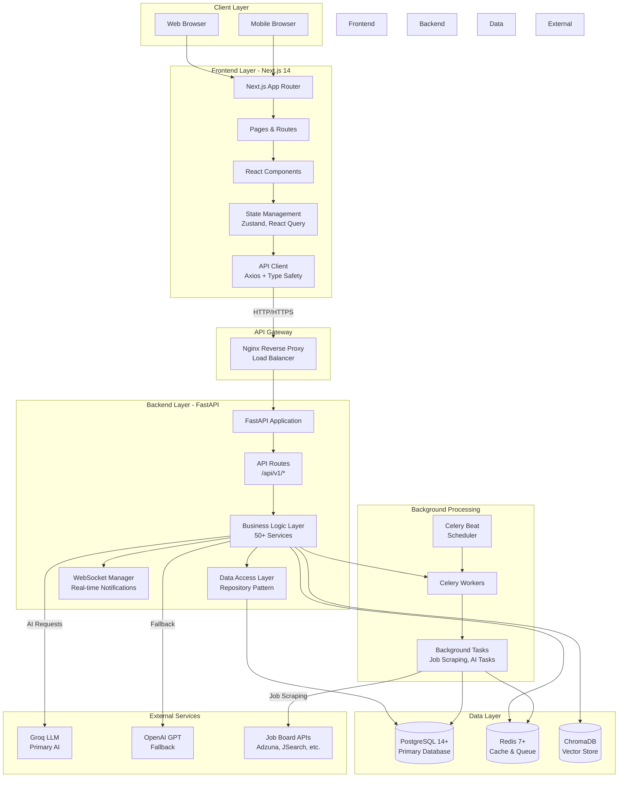

# Career Copilot System Architecture

> **Comprehensive System Architecture**: High-level design, component interactions, and deployment architecture.

**Quick Links**: [[README|Architecture Hub]] | [[SYSTEM_COMPONENTS|Component Details]] | [[AI_AND_INTEGRATIONS|AI & Integrations]]

---

## Table of Contents

1. [System Overview](#system-overview)
2. [Architecture Diagram](#architecture-diagram)
3. [Technology Stack](#technology-stack)
4. [Core Components](#core-components)
5. [Data Flow](#data-flow)
6. [Deployment Architecture](#deployment-architecture)
7. [Design Patterns](#design-patterns)
8. [Scalability & Performance](#scalability--performance)

---

## System Overview

Career Copilot is a full-stack AI-powered job search assistant built with **FastAPI** (backend) and **Next.js 14** (frontend). The system follows a modern microservices-inspired architecture with clear separation of concerns.

### Key Characteristics

- **API-First Design**: RESTful API with OpenAPI/Swagger documentation
- **Real-time Updates**: WebSocket support for live notifications
- **Async Processing**: Celery for background jobs (scraping, AI tasks)
- **Multi-Provider AI**: Groq (primary), OpenAI, Claude with automatic fallback
- **Scalable**: Stateless services, horizontal scaling ready
- **Observable**: Structured logging, metrics, health checks

---

## Architecture Diagram

### High-Level System Architecture



### Component Interaction Flow

```
┌─────────────────────────────────────────────────────────────┐
│                     User Interaction                        │
└────────────────────┬────────────────────────────────────────┘
                     │
                     ▼
┌─────────────────────────────────────────────────────────────┐
│                  Frontend (Next.js 14)                      │
│  ┌──────────────┐  ┌────────────────┐  ┌────────────────┐  │
│  │   Pages      │──│  Components    │──│ State Mgmt     │  │
│  │ (App Router) │  │ (React 18)     │  │ (Zustand/RQ)   │  │
│  └──────────────┘  └────────────────┘  └───────┬────────┘  │
└─────────────────────────────────────────────────┼──────────┘
                                                  │
                                HTTP/WebSocket    │
                                                  ▼
┌──────────────────────────────────────────────────────────────┐
│                   API Layer (FastAPI)                        │
│  ┌──────────────┐  ┌────────────────┐  ┌────────────────┐  │
│  │   Routes     │──│   Middleware   │──│  Auth Guard    │  │
│  │ (REST/WS)    │  │ (CORS, etc.)   │  │  (JWT/OAuth)   │  │
│  └──────┬───────┘  └────────────────┘  └────────────────┘  │
└─────────┼────────────────────────────────────────────────────┘
          │
          ▼
┌──────────────────────────────────────────────────────────────┐
│               Service Layer (Business Logic)                 │
│  ┌─────────────┐ ┌─────────────┐ ┌───────────────────────┐  │
│  │ Job Service │ │ AI Service  │ │Application Service    │  │
│  │ User Service│ │ LLM Manager │ │Notification Service   │  │
│  │ ... (50+)   │ │ Analytics   │ │ ... (50+ services)    │  │
│  └──────┬──────┘ └──────┬──────┘ └──────────┬────────────┘  │
└─────────┼───────────────┼───────────────────┼───────────────┘
          │               │                   │
          ▼               ▼                   ▼
┌──────────────────────────────────────────────────────────────┐
│            Repository Layer (Data Access)                    │
│  ┌─────────────┐ ┌─────────────┐ ┌───────────────────────┐  │
│  │ Job Repo    │ │ User Repo   │ │ Application Repo      │  │
│  │ Query       │ │ Query       │ │ ... (Repositories)    │  │
│  │ Builders    │ │ Builders    │ │                       │  │
│  └──────┬──────┘ └──────┬──────┘ └──────────┬────────────┘  │
└─────────┼───────────────┼───────────────────┼───────────────┘
          │               │                   │
          └───────────────┴───────────────────┘
                          │
                          ▼
┌──────────────────────────────────────────────────────────────┐
│                    Data Layer                                │
│  ┌────────────┐  ┌──────────┐  ┌──────────────────────────┐ │
│  │ PostgreSQL │  │  Redis   │  │    ChromaDB              │ │
│  │ (Primary)  │  │  (Cache) │  │ (Vector Embeddings)      │ │
│  └────────────┘  └──────────┘  └──────────────────────────┘ │
└──────────────────────────────────────────────────────────────┘
```

---

## Technology Stack

### Frontend Stack

| Technology | Version | Purpose |
|------------|---------|---------|
| **Next.js** | 14+ | React framework, App Router |
| **React** | 18+ | UI library |
| **TypeScript** | 5+ | Type safety |
| **Tailwind CSS** | v4 | Styling framework |
| **Framer Motion** | Latest | Animations |
| **TanStack React Query** | v5 | Server state management |
| **Zustand** | Latest | Client state management |
| **React Hook Form** | Latest | Form handling |
| **Zod** | Latest | Schema validation |

### Backend Stack

| Technology | Version | Purpose |
|------------|---------|---------|
| **FastAPI** | 0.100+ | Web framework |
| **Python** | 3.11+ | Programming language |
| **PostgreSQL** | 14+ | Primary database |
| **Redis** | 7+ | Cache & message broker |
| **Celery** | 5+ | Async task queue |
| **SQLAlchemy** | 2+ | ORM |
| **Alembic** | Latest | Database migrations |
| **Pydantic** | 2+ | Data validation |
| **ChromaDB** | Latest | Vector database |

### Infrastructure

| Technology | Purpose |
|------------|---------|
| **Docker** | Containerization |
| **Docker Compose** | Local orchestration |
| **Nginx** | Reverse proxy, load balancing |
| **GitHub Actions** | CI/CD pipeline |

---

## Core Components

### 1. Frontend Components

- **Pages (App Router)**: Route-based page components
- **UI Components**: Reusable UI primitives (shadcn/ui based)
- **Feature Components**: Domain-specific components (Jobs, Applications, Dashboard)
- **Layout Components**: Navigation, headers, footers
- **API Client**: Axios-based typed HTTP client

**See**: [[SYSTEM_COMPONENTS#frontend-architecture|Frontend Component Details]]

### 2. Backend Components

- **API Routes** (`/api/v1/*`): 80+ REST endpoints
-**Service Layer**: 50+ business logic services
- **Repository Layer**: Data access abstraction
- **WebSocket Manager**: Real-time notification system
- **Background Tasks**: Celery workers for async jobs

**See**: [[SYSTEM_COMPONENTS#backend-architecture|Backend Component Details]]

### 3. Data Components

- **PostgreSQL**: User data, jobs, applications, analytics
- **Redis**: Session cache, rate limiting, Celery broker
- **ChromaDB**: Resume/job embeddings for semantic search

**See**: [[SYSTEM_COMPONENTS#data-architecture|Data Architecture Details]]

### 4. External Integration Components

- **AI/LLM Services**: Groq, OpenAI, Claude integration
- **Job Board APIs**: Adzuna, JSearch, The Muse, etc.
- **OAuth Providers**: Google, GitHub, LinkedIn

**See**: [[AI_AND_INTEGRATIONS|AI & Integration Architecture]]

---

## Data Flow

### User Request Flow

```
1. User Action
   ↓
2. Frontend Component Event Handler
   ↓
3. API Client (React Query mutation/query)
   ↓
4. HTTP Request → Nginx → FastAPI
   ↓
5. API Route Handler
   ↓
6. Middleware (Auth, Validation, CORS)
   ↓
7. Service Layer (Business Logic)
   ↓
8. Repository Layer (Data Access)
   ↓
9. Database Query/Update
   ↓
10. Response ← Database
   ↓
11. Service Processing
   ↓
12. API Response (JSON)
   ↓
13. Frontend State Update
   ↓
14. UI Re-render
```

### Background Job Flow

```
1. Service triggers async task
   ↓
2. Celery task queued in Redis
   ↓
3. Celery worker picks up task
   ↓
4. Task executes (e.g., job scraping, AI generation)
   ↓
5. Results stored in PostgreSQL
   ↓
6. WebSocket notification sent to connected clients
   ↓
7. Frontend receives real-time update
   ↓
8. UI updates automatically
```

---

## Deployment Architecture

### Docker Compose Deployment

```
┌─────────────────────────────────────────────────────────────┐
│                  Docker Compose Network                     │
│                 (career-copilot-network)                    │
│                                                             │
│  ┌──────────────┐  ┌──────────────┐  ┌─────────────────┐  │
│  │   Frontend   │  │   Backend    │  │     Nginx       │  │
│  │  (Next.js)   │  │  (FastAPI)   │  │ (Reverse Proxy) │  │
│  │  Port: 3000  │  │  Port: 8000  │  │   Port: 80/443  │  │
│  └──────────────┘  └──────────────┘  └─────────────────┘  │
│                                                             │
│  ┌──────────────┐  ┌──────────────┐  ┌─────────────────┐  │  │  │ PostgreSQL  │  │    Redis     │  │  Celery Worker  │  │
│  │  (Database)  │  │   (Cache)    │  │ (Async Tasks)   │  │
│  │  Port: 5432  │  │  Port: 6379  │  │                 │  │
│  └──────────────┘  └──────────────┘  └─────────────────┘  │
│                                                             │
│  ┌──────────────┐                                          │
│  │ Celery Beat  │                                          │
│  │ (Scheduler)  │                                          │
│  └──────────────┘                                          │
└─────────────────────────────────────────────────────────────┘

             ┌────────────────────┐
             │  Persistent Data   │
             │   (Docker Volumes) │
             │  - postgres_data   │
             │  - redis_data      │
             └────────────────────┘
```

### Service Communication

- **Frontend ↔ Backend**: HTTP/HTTPS via Nginx
- **Frontend ↔ WebSocket**: WS/WSS via Nginx
- **Backend ↔ Database**: PostgreSQL wire protocol (port 5432)
- **Backend ↔ Redis**: Redis protocol (port 6379)
- **Backend ↔ Celery**: Message queue via Redis
- **Celery Beat → Celery Workers**: Task scheduling via Redis

---

## Design Patterns

### Backend Patterns

1. **Repository Pattern**
   - Abstracts data access logic
   - Enables easier testing and mocking
   - Decouples business logic from database implementation

2. **Dependency Injection**
   - FastAPI's dependency system
   - Services injected into route handlers
   - Database sessions managed via DI

3. **Service Layer Pattern**
   - Business logic separated from routes
   - Reusable across different endpoints
   - Easier to test and maintain

4. **Factory Pattern**
   - LLM provider factories
   - Scraper factories for different job boards

5. **Observer Pattern**
   - WebSocket notifications
   - Event-driven updates

### Frontend Patterns

1. **Container/Presentational Components**
   - Smart components handle logic
   - Dumb components handle presentation

2. **Custom Hooks**
   - Reusable stateful logic
   - API calls abstracted into hooks

3. **Render Props & Composition**
   - Component reusability
   - Flexible component APIs

---

## Scalability & Performance

### Horizontal Scaling

- **Stateless Services**: Backend can scale horizontally
- **Load Balancing**: Nginx distributes requests across instances
- **Database Read Replicas**: PostgreSQL replication for read-heavy loads
- **Redis Cluster**: High availability for cache and queue

### Caching Strategy

- **Application-Level Cache**: Redis for frequently accessed data
- **HTTP Cache**: Nginx caching for static assets
- **Query Result Cache**: Redis for expensive database queries
- **CDN**: Next.js static assets served via CDN

### Performance Optimizations

- **Database Indexing**: Optimized indexes on frequently queried columns
- **Connection Pooling**: SQLAlchemy connection pool
- **Async I/O**: FastAPI async endpoints, Celery for blocking operations
- **Code Splitting**: Next.js automatic code splitting
- **Lazy Loading**: React lazy loading for non-critical components

---

## Security Architecture

For detailed security architecture, see [[/security/ARCHITECTURE|Security Architecture]].

**Key Security Features**:
- JWT-based authentication
- OAuth 2.0 integration (Google, GitHub, LinkedIn)
- HTTPS/TLS encryption
- CORS configuration
- Rate limiting
- Input validation (Pydantic, Zod)
- SQL injection prevention (SQLAlchemy ORM)
- XSS protection

---

## Related Documentation

- **Component Details**: [[SYSTEM_COMPONENTS|System Components Architecture]]
- **AI & Integrations**: [[AI_AND_INTEGRATIONS|AI/LLM & Job Board Integrations]]
- **Security**: [[/security/ARCHITECTURE|Security Architecture]]
- **Performance**: [[/performance/ARCHITECTURE|Performance Architecture]]
- **Deployment**: [[/deployment/README|Deployment Guide]]
- **Development**: [[/development/DEVELOPER_GUIDE|Developer Guide]]

---

**Last Updated**: November 2025  
**Architecture Version**: 2.0
