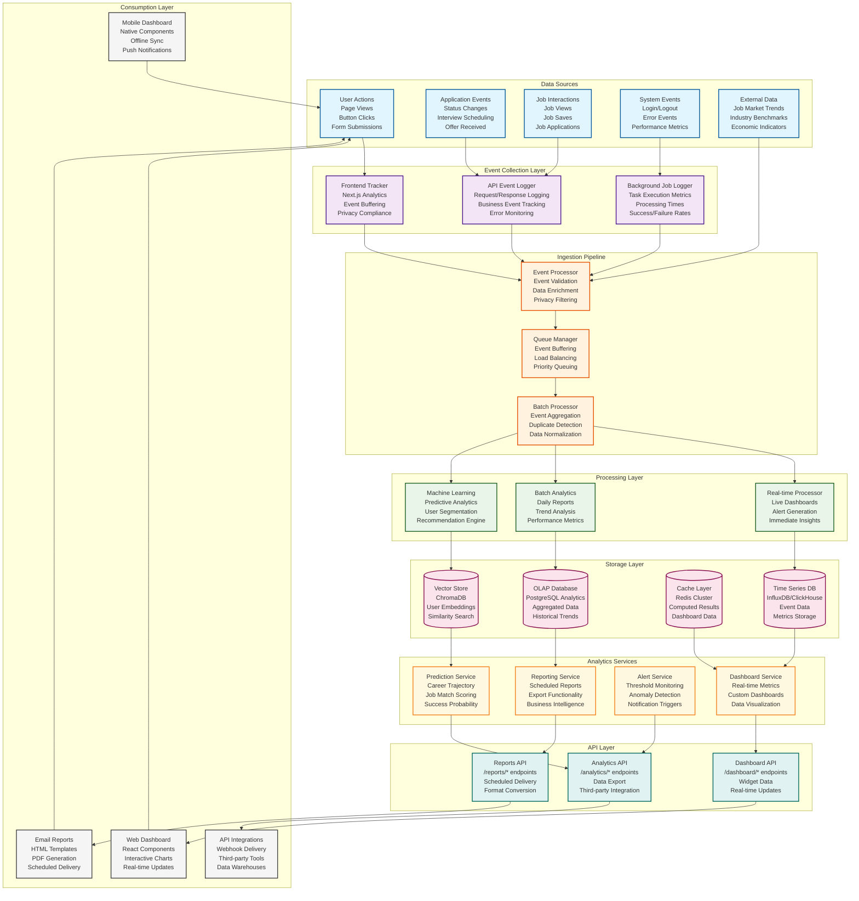

# Analytics Component Architecture



## Analytics Component Architecture

This diagram illustrates the comprehensive analytics subsystem architecture for the Career Copilot platform, designed to provide real-time insights, predictive analytics, and actionable business intelligence.

### Data Collection Layer

#### Event Sources
The analytics system collects data from multiple sources:

**User Actions:**
- Page views and navigation patterns
- Button clicks and form interactions
- Search queries and filter usage
- Time spent on different features

**Application Events:**
- Job application status changes
- Interview scheduling and feedback
- Offer acceptance/rejection
- Follow-up activities

**Job Interactions:**
- Job view and save actions
- Application submission events
- Job search and filtering patterns
- Bookmark and sharing activities

**System Events:**
- Authentication events (login/logout)
- Error occurrences and stack traces
- Performance metrics (response times, load times)
- Background job execution status

**External Data:**
- Job market trends and salary data
- Industry benchmarks and statistics
- Economic indicators affecting job markets
- Competitor analysis data

#### Event Collection Implementation
```typescript
// frontend/src/lib/analytics/tracker.ts
class AnalyticsTracker {
  private eventQueue: AnalyticsEvent[] = [];
  private flushInterval: NodeJS.Timeout;

  constructor() {
    this.flushInterval = setInterval(() => this.flush(), 30000); // 30s batch
  }

  track(event: AnalyticsEvent) {
    this.eventQueue.push({
      ...event,
      timestamp: new Date(),
      sessionId: this.getSessionId(),
      userId: this.getUserId()
    });

    if (this.eventQueue.length >= 10) {
      this.flush();
    }
  }

  private async flush() {
    if (this.eventQueue.length === 0) return;

    try {
      await fetch('/api/analytics/events', {
        method: 'POST',
        headers: { 'Content-Type': 'application/json' },
        body: JSON.stringify({ events: this.eventQueue })
      });
      this.eventQueue = [];
    } catch (error) {
      console.error('Analytics flush failed:', error);
    }
  }
}
```

### Data Ingestion Pipeline

#### Event Processing
```python
# backend/app/services/analytics/event_processor.py
class EventProcessor:
    def __init__(self, db: Session, cache: Redis, queue: Redis):
        self.db = db
        self.cache = cache
        self.queue = queue

    async def process_event(self, event: dict) -> None:
        # Validate event schema
        validated_event = self.validate_event(event)

        # Enrich with additional context
        enriched_event = await self.enrich_event(validated_event)

        # Apply privacy filtering
        filtered_event = self.apply_privacy_filters(enriched_event)

        # Queue for further processing
        await self.queue_event(filtered_event)

    async def enrich_event(self, event: dict) -> dict:
        # Add user context
        user_context = await self.get_user_context(event['user_id'])

        # Add session context
        session_context = await self.get_session_context(event['session_id'])

        # Add geo context
        geo_context = await self.get_geo_context(event.get('ip_address'))

        return {
            **event,
            'user_context': user_context,
            'session_context': session_context,
            'geo_context': geo_context
        }
```

#### Queue Management
```python
# backend/app/services/analytics/queue_manager.py
class QueueManager:
    def __init__(self, redis_client: Redis):
        self.redis = redis_client
        self.real_time_queue = 'analytics:realtime'
        self.batch_queue = 'analytics:batch'

    async def enqueue_event(self, event: dict, priority: str = 'normal'):
        queue_name = self.get_queue_for_event(event, priority)

        await self.redis.lpush(queue_name, json.dumps(event))

        # Trigger real-time processing for high-priority events
        if priority == 'high':
            await self.trigger_realtime_processing(event)
```

### Processing Layer

#### Real-time Processing
```python
# backend/app/services/analytics/realtime_processor.py
class RealtimeProcessor:
    def __init__(self, redis: Redis, websocket_manager: WebSocketManager):
        self.redis = redis
        self.websocket = websocket_manager

    async def process_event(self, event: dict) -> None:
        # Update real-time metrics
        await self.update_realtime_metrics(event)

        # Check alert conditions
        alerts = await self.check_alert_conditions(event)
        if alerts:
            await self.trigger_alerts(alerts)

        # Update live dashboards
        await self.update_live_dashboards(event)

        # Broadcast to connected clients
        await self.broadcast_realtime_updates(event)

    async def update_realtime_metrics(self, event: dict):
        metric_key = f"metrics:{event['type']}:{event['user_id']}"
        await self.redis.incr(metric_key)
        await self.redis.expire(metric_key, 3600)  # 1 hour TTL
```

#### Batch Analytics Processing
```python
# backend/app/tasks/analytics_batch_processor.py
@shared_task(bind=True, name="analytics.batch_processing")
def process_analytics_batch(self, date: str):
    """Daily analytics processing task"""

    # Aggregate daily metrics
    daily_metrics = aggregate_daily_metrics(date)

    # Calculate trends
    trends = calculate_trends(date)

    # Generate insights
    insights = generate_insights(daily_metrics, trends)

    # Update user profiles
    update_user_profiles(insights)

    # Generate reports
    generate_daily_reports(date, insights)

    # Clean up old data
    cleanup_old_data(date)
```

#### Machine Learning Processing
```python
# backend/app/services/analytics/ml_processor.py
class MLProcessor:
    def __init__(self, vector_store: ChromaDB, model_cache: Redis):
        self.vector_store = vector_store
        self.model_cache = model_cache

    async def process_user_behavior(self, user_id: int, events: List[dict]):
        # Extract features from user events
        features = self.extract_features(events)

        # Generate user embedding
        embedding = await self.generate_user_embedding(features)

        # Store in vector database
        await self.vector_store.store_embedding(user_id, embedding)

        # Update user segmentation
        segment = await self.predict_user_segment(embedding)
        await self.update_user_segment(user_id, segment)

        # Generate personalized recommendations
        recommendations = await self.generate_recommendations(user_id, embedding)
        await self.cache_recommendations(user_id, recommendations)
```

### Storage Layer Architecture

#### Time Series Database
```sql
-- InfluxDB schema for time series metrics
CREATE DATABASE career_copilot_analytics;

-- User activity metrics
CREATE MEASUREMENT user_activity
WITH FIELDS
  page_views: INTEGER,
  job_views: INTEGER,
  applications: INTEGER,
  time_spent: FLOAT

-- System performance metrics
CREATE MEASUREMENT system_performance
WITH FIELDS
  response_time: FLOAT,
  error_rate: FLOAT,
  throughput: INTEGER,
  memory_usage: FLOAT
```

#### OLAP Database Schema
```sql
-- PostgreSQL analytics schema
CREATE TABLE daily_user_metrics (
    user_id INTEGER REFERENCES users(id),
    date DATE,
    page_views INTEGER DEFAULT 0,
    job_views INTEGER DEFAULT 0,
    applications_submitted INTEGER DEFAULT 0,
    interviews_scheduled INTEGER DEFAULT 0,
    offers_received INTEGER DEFAULT 0,
    time_spent_minutes INTEGER DEFAULT 0,

    PRIMARY KEY (user_id, date)
);

CREATE TABLE job_market_trends (
    date DATE,
    industry VARCHAR(100),
    location VARCHAR(100),
    average_salary DECIMAL(10,2),
    job_postings_count INTEGER,
    competition_level DECIMAL(3,2),

    PRIMARY KEY (date, industry, location)
);
```

#### Cache Layer Strategy
```python
# Redis caching strategy for analytics
CACHE_KEYS = {
    'user_metrics': 'analytics:user:{user_id}:metrics:{period}',
    'dashboard_data': 'analytics:dashboard:{user_id}:{date}',
    'trends': 'analytics:trends:{industry}:{period}',
    'recommendations': 'analytics:recommendations:{user_id}',
    'alerts': 'analytics:alerts:{user_id}:active'
}

class AnalyticsCache:
    def __init__(self, redis: Redis):
        self.redis = redis

    async def get_user_metrics(self, user_id: int, period: str) -> dict:
        cache_key = CACHE_KEYS['user_metrics'].format(
            user_id=user_id, period=period
        )

        cached = await self.redis.get(cache_key)
        if cached:
            return json.loads(cached)

        # Compute metrics
        metrics = await self.compute_user_metrics(user_id, period)

        # Cache for 15 minutes
        await self.redis.setex(cache_key, 900, json.dumps(metrics))

        return metrics
```

### Analytics Services

#### Dashboard Service
```python
# backend/app/services/analytics/dashboard_service.py
class DashboardService:
    def __init__(self, db: Session, cache: Redis, realtime: RealtimeProcessor):
        self.db = db
        self.cache = cache
        self.realtime = realtime

    async def get_dashboard_data(self, user_id: int, date_range: str) -> dict:
        # Try cache first
        cache_key = f"dashboard:{user_id}:{date_range}"
        cached_data = await self.cache.get(cache_key)

        if cached_data:
            return cached_data

        # Compute dashboard data
        dashboard_data = await self.compute_dashboard_data(user_id, date_range)

        # Cache for 5 minutes
        await self.cache.setex(cache_key, 300, json.dumps(dashboard_data))

        return dashboard_data

    async def compute_dashboard_data(self, user_id: int, date_range: str) -> dict:
        # Application metrics
        applications = await self.get_application_metrics(user_id, date_range)

        # Job search metrics
        job_search = await self.get_job_search_metrics(user_id, date_range)

        # Goal progress
        goals = await self.get_goal_progress(user_id)

        # Recommendations
        recommendations = await self.get_personalized_recommendations(user_id)

        return {
            'applications': applications,
            'job_search': job_search,
            'goals': goals,
            'recommendations': recommendations,
            'last_updated': datetime.utcnow().isoformat()
        }
```

#### Reporting Service
```python
# backend/app/services/analytics/reporting_service.py
class ReportingService:
    def __init__(self, db: Session, email_service: EmailService):
        self.db = db
        self.email = email_service

    async def generate_weekly_report(self, user_id: int) -> bytes:
        # Get weekly data
        weekly_data = await self.get_weekly_data(user_id)

        # Generate insights
        insights = await self.generate_insights(weekly_data)

        # Create PDF report
        pdf_content = await self.create_pdf_report(weekly_data, insights)

        return pdf_content

    async def schedule_weekly_reports(self):
        # Get all users with weekly reports enabled
        users = await self.db.execute(
            select(User).where(User.weekly_report_enabled == True)
        )

        for user in users.scalars():
            try:
                report_pdf = await self.generate_weekly_report(user.id)
                await self.email.send_report_email(
                    user.email,
                    "Your Weekly Career Report",
                    report_pdf
                )
            except Exception as e:
                logger.error(f"Failed to send weekly report to {user.id}: {e}")
```

#### Alert Service
```python
# backend/app/services/analytics/alert_service.py
class AlertService:
    def __init__(self, db: Session, notification_service: NotificationService):
        self.db = db
        self.notifications = notification_service

    async def check_alert_conditions(self, user_id: int):
        alerts = []

        # Check application goal progress
        goal_progress = await self.check_goal_progress(user_id)
        if goal_progress['needs_attention']:
            alerts.append({
                'type': 'goal_progress',
                'message': f"You're {goal_progress['percent_behind']}% behind your weekly application goal",
                'action_url': '/goals'
            })

        # Check interview opportunities
        interview_alert = await self.check_interview_opportunities(user_id)
        if interview_alert:
            alerts.append(interview_alert)

        # Check job market changes
        market_alert = await self.check_market_changes(user_id)
        if market_alert:
            alerts.append(market_alert)

        return alerts

    async def process_alerts(self, user_id: int, alerts: List[dict]):
        for alert in alerts:
            # Create notification
            await self.notifications.create_notification(
                user_id=user_id,
                type='alert',
                priority='high',
                title=alert['type'].replace('_', ' ').title(),
                message=alert['message'],
                action_url=alert.get('action_url')
            )
```

### API Layer

#### Analytics API Endpoints
```python
# backend/app/api/v1/analytics.py
@router.get("/metrics/{period}")
async def get_user_metrics(
    period: str = Path(..., regex="^(day|week|month|year)$"),
    user_id: int = Depends(get_current_user_id),
    db: Session = Depends(get_db),
    cache: Redis = Depends(get_cache)
):
    service = AnalyticsService(db, cache)
    return await service.get_metrics(user_id, period)

@router.get("/trends")
async def get_trends(
    industry: Optional[str] = None,
    location: Optional[str] = None,
    user_id: int = Depends(get_current_user_id),
    db: Session = Depends(get_db)
):
    service = AnalyticsService(db)
    return await service.get_trends(user_id, industry, location)

@router.post("/export")
async def export_analytics(
    export_request: ExportRequest,
    user_id: int = Depends(get_current_user_id),
    background_tasks: BackgroundTasks,
    db: Session = Depends(get_db)
):
    service = AnalyticsService(db)
    return await service.schedule_export(user_id, export_request, background_tasks)
```

### Consumption Layer

#### Web Dashboard Implementation
```tsx
// frontend/src/components/dashboard/AnalyticsDashboard.tsx
'use client';

import { useAnalytics } from '@/hooks/useAnalytics';
import { MetricsChart } from './MetricsChart';
import { GoalProgress } from './GoalProgress';
import { RecommendationsList } from './RecommendationsList';

export function AnalyticsDashboard() {
  const { data: analytics, isLoading } = useAnalytics();

  if (isLoading) {
    return <DashboardSkeleton />;
  }

  return (
    <div className="grid grid-cols-1 md:grid-cols-2 lg:grid-cols-3 gap-6">
      <MetricsChart
        title="Applications This Week"
        data={analytics.applications}
        type="line"
      />

      <GoalProgress
        current={analytics.goals.current}
        target={analytics.goals.target}
        period="weekly"
      />

      <RecommendationsList
        recommendations={analytics.recommendations}
        onAction={handleRecommendationAction}
      />
    </div>
  );
}
```

#### Real-time Updates
```typescript
// frontend/src/hooks/useRealtimeAnalytics.ts
import { useWebSocket } from './useWebSocket';

export function useRealtimeAnalytics() {
  const { subscribe, unsubscribe } = useWebSocket();

  useEffect(() => {
    const handleAnalyticsUpdate = (data: AnalyticsUpdate) => {
      // Update local state with real-time data
      updateAnalyticsCache(data);
      // Trigger re-render of dashboard components
      triggerDashboardRefresh();
    };

    subscribe('analytics.updates', handleAnalyticsUpdate);

    return () => {
      unsubscribe('analytics.updates', handleAnalyticsUpdate);
    };
  }, [subscribe, unsubscribe]);

  return { /* real-time analytics data */ };
}
```

### Performance Optimization

#### Caching Strategy
```python
# Multi-level caching for analytics
ANALYTICS_CACHE_CONFIG = {
    'user_metrics': {
        'ttl': 300,  # 5 minutes
        'key_pattern': 'analytics:user:{user_id}:metrics:{period}'
    },
    'dashboard_data': {
        'ttl': 60,   # 1 minute
        'key_pattern': 'analytics:dashboard:{user_id}'
    },
    'trends': {
        'ttl': 3600, # 1 hour
        'key_pattern': 'analytics:trends:{industry}:{location}'
    }
}
```

#### Data Partitioning
```sql
-- Partition analytics tables by date for performance
CREATE TABLE user_metrics_y2024m01 PARTITION OF user_metrics
    FOR VALUES FROM ('2024-01-01') TO ('2024-02-01');

-- Partition by user ranges for large datasets
CREATE TABLE user_events_0_100000 PARTITION OF user_events
    FOR VALUES FROM (0) TO (100000);
```

#### Query Optimization
```sql
-- Optimized analytics queries
CREATE INDEX CONCURRENTLY idx_user_metrics_composite
ON user_metrics(user_id, date, metric_type);

-- Materialized view for common aggregations
CREATE MATERIALIZED VIEW weekly_user_summary AS
SELECT
    user_id,
    date_trunc('week', date) as week,
    SUM(page_views) as total_page_views,
    SUM(applications) as total_applications,
    AVG(time_spent_minutes) as avg_time_spent
FROM daily_user_metrics
GROUP BY user_id, date_trunc('week', date);
```

## Related Diagrams

- [[system-architecture|System Architecture]] - Overall system structure
- [[data-architecture|Data Architecture]] - Database relationships
- [[api-architecture|API Architecture]] - API endpoint organization
- [[deployment-architecture|Deployment Architecture]] - Infrastructure setup

## Component References

- [[auth-component|Authentication Component]] - User management
- [[applications-component|Applications Component]] - Job tracking
- [[notifications-component|Notifications Component]] - Alert system

---

*See also: [[analytics-api|Analytics API Reference]], [[dashboard-components|Dashboard Components]], [[reporting-engine|Reporting Engine Guide]]*"