# Applications Component Architecture

```mermaid
graph TB
    %% External Data Sources
    subgraph "External Data Sources"
        JOB_BOARDS[Job Boards APIs<br/>LinkedIn, Indeed, Glassdoor<br/>StepStone, Monster<br/>Real-time Job Feeds]
        USER_INPUTS[User Inputs<br/>Manual Job Entry<br/>Resume Upload<br/>Application Forms]
        EXTERNAL_INTEGRATIONS[External Integrations<br/>ATS Systems<br/>Recruitment Platforms<br/>Career Sites]
    end

    %% Data Ingestion Layer
    subgraph "Data Ingestion Layer"
        JOB_SCRAPER[Job Scraper<br/>Multi-board Scraping<br/>Deduplication Engine<br/>Data Normalization]
        MANUAL_ENTRY[Manual Entry<br/>Job Creation Forms<br/>Bulk Import<br/>CSV Processing]
        INTEGRATION_ADAPTERS[Integration Adapters<br/>Webhook Receivers<br/>API Connectors<br/>Data Transformers]
    end

    %% Core Application Management
    subgraph "Core Application Management"
        APPLICATION_SERVICE[Application Service<br/>CRUD Operations<br/>Status Transitions<br/>Business Logic]
        JOB_SERVICE[Job Service<br/>Job Matching<br/>Search & Filtering<br/>Bookmarking]
        STATUS_MANAGER[Status Manager<br/>Workflow Engine<br/>Transition Validation<br/>Timeline Tracking]
        DOCUMENT_MANAGER[Document Manager<br/>Resume Storage<br/>Cover Letter Mgmt<br/>File Attachments]
    end

    %% Advanced Features
    subgraph "Advanced Features"
        MATCHING_ENGINE[Matching Engine<br/>AI-Powered Matching<br/>Skill Analysis<br/>Compatibility Scoring]
        ANALYTICS_INTEGRATION[Analytics Integration<br/>Application Metrics<br/>Success Tracking<br/>Performance Insights]
        AUTOMATION_ENGINE[Automation Engine<br/>Follow-up Reminders<br/>Deadline Alerts<br/>Status Updates]
        COLLABORATION_TOOLS[Collaboration Tools<br/>Team Sharing<br/>Notes & Comments<br/>Progress Tracking]
    end

    %% Data Persistence
    subgraph "Data Persistence"
        APPLICATION_DB[(Application Database<br/>PostgreSQL<br/>Application Records<br/>Status History)]
        JOB_DB[(Job Database<br/>Job Listings<br/>Company Data<br/>Requirements)]
        DOCUMENT_DB[(Document Storage<br/>File System/S3<br/>Resumes & Attachments<br/>Version Control)]
        CACHE_LAYER[(Cache Layer<br/>Redis<br/>Search Results<br/>User Sessions)]
    end

    %% API Layer
    subgraph "API Layer"
    APPLICATION_API[Application API<br/>/applications/* endpoints<br/>CRUD operations<br/>Bulk actions]
        JOB_API[Job API<br/>/jobs/* endpoints<br/>Search & filtering<br/>Bookmarking]
        DOCUMENT_API[Document API<br/>/documents/* endpoints<br/>File management<br/>Resume processing]
        ANALYTICS_API[Analytics API<br/>/analytics/* endpoints<br/>Application metrics<br/>Success rates]
    end

    %% User Interface Layer
    subgraph "User Interface Layer"
        DASHBOARD[Application Dashboard<br/>Kanban Board<br/>Timeline View<br/>Status Overview]
        JOB_SEARCH[Job Search Interface<br/>Advanced Filters<br/>Saved Searches<br/>Recommendations]
        APPLICATION_FORMS[Application Forms<br/>Application Builder<br/>Document Upload<br/>Progress Tracking]
        REPORTING[Reporting Interface<br/>Success Metrics<br/>Application Trends<br/>Goal Tracking]
    end

    %% Background Processing
    subgraph "Background Processing"
        STATUS_MONITOR[Status Monitor<br/>Deadline Tracking<br/>Follow-up Scheduling<br/>Alert Generation]
        MATCH_UPDATER[Match Updater<br/>Job Updates<br/>New Opportunities<br/>Relevance Scoring]
        ANALYTICS_PROCESSOR[Analytics Processor<br/>Metrics Calculation<br/>Trend Analysis<br/>Report Generation]
        CLEANUP_WORKER[Cleanup Worker<br/>Data Archiving<br/>Old Record Removal<br/>Storage Optimization]
    end

    %% Notification Integration
    subgraph "Notification Integration"
        STATUS_NOTIFICATIONS[Status Notifications<br/>Application Updates<br/>Interview Reminders<br/>Offer Alerts]
        DEADLINE_ALERTS[Deadline Alerts<br/>Follow-up Reminders<br/>Application Deadlines<br/>Goal Check-ins]
        MATCH_NOTIFICATIONS[Match Notifications<br/>New Job Matches<br/>Application Success<br/>Market Insights]
    end

    %% Data Flow
    JOB_BOARDS --> JOB_SCRAPER
    USER_INPUTS --> MANUAL_ENTRY
    EXTERNAL_INTEGRATIONS --> INTEGRATION_ADAPTERS

    JOB_SCRAPER --> JOB_SERVICE
    MANUAL_ENTRY --> APPLICATION_SERVICE
    INTEGRATION_ADAPTERS --> APPLICATION_SERVICE

    APPLICATION_SERVICE --> STATUS_MANAGER
    JOB_SERVICE --> MATCHING_ENGINE
    APPLICATION_SERVICE --> DOCUMENT_MANAGER

    MATCHING_ENGINE --> ANALYTICS_INTEGRATION
    STATUS_MANAGER --> AUTOMATION_ENGINE
    APPLICATION_SERVICE --> COLLABORATION_TOOLS

    APPLICATION_SERVICE --> APPLICATION_DB
    JOB_SERVICE --> JOB_DB
    DOCUMENT_MANAGER --> DOCUMENT_DB
    MATCHING_ENGINE --> CACHE_LAYER

    APPLICATION_SERVICE --> APPLICATION_API
    JOB_SERVICE --> JOB_API
    DOCUMENT_MANAGER --> DOCUMENT_API
    ANALYTICS_INTEGRATION --> ANALYTICS_API

    APPLICATION_API --> DASHBOARD
    JOB_API --> JOB_SEARCH
    DOCUMENT_API --> APPLICATION_FORMS
    ANALYTICS_API --> REPORTING

    STATUS_MANAGER --> STATUS_MONITOR
    MATCHING_ENGINE --> MATCH_UPDATER
    ANALYTICS_INTEGRATION --> ANALYTICS_PROCESSOR
    APPLICATION_SERVICE --> CLEANUP_WORKER

    STATUS_MONITOR --> STATUS_NOTIFICATIONS
    MATCH_UPDATER --> MATCH_NOTIFICATIONS
    AUTOMATION_ENGINE --> DEADLINE_ALERTS

    %% Styling
    classDef sourceClass fill:#e1f5fe,stroke:#01579b,stroke-width:2px
    classDef ingestionClass fill:#f3e5f5,stroke:#4a148c,stroke-width:2px
    classDef coreClass fill:#e8f5e8,stroke:#1b5e20,stroke-width:2px
    classDef advancedClass fill:#fff3e0,stroke:#e65100,stroke-width:2px
    classDef storageClass fill:#fce4ec,stroke:#880e4f,stroke-width:2px
    classDef apiClass fill:#fff8e1,stroke:#f57f17,stroke-width:2px
    classDef uiClass fill:#e0f2f1,stroke:#00695c,stroke-width:2px
    classDef backgroundClass fill:#f5f5f5,stroke:#424242,stroke-width:2px
    classDef notificationClass fill:#e8eaf6,stroke:#283593,stroke-width:2px

    class JOB_BOARDS,USER_INPUTS,EXTERNAL_INTEGRATIONS sourceClass
    class JOB_SCRAPER,MANUAL_ENTRY,INTEGRATION_ADAPTERS ingestionClass
    class APPLICATION_SERVICE,JOB_SERVICE,STATUS_MANAGER,DOCUMENT_MANAGER coreClass
    class MATCHING_ENGINE,ANALYTICS_INTEGRATION,AUTOMATION_ENGINE,COLLABORATION_TOOLS advancedClass
    class APPLICATION_DB,JOB_DB,DOCUMENT_DB,CACHE_LAYER storageClass
    class APPLICATION_API,JOB_API,DOCUMENT_API,ANALYTICS_API apiClass
    class DASHBOARD,JOB_SEARCH,APPLICATION_FORMS,REPORTING uiClass
    class STATUS_MONITOR,MATCH_UPDATER,ANALYTICS_PROCESSOR,CLEANUP_WORKER backgroundClass
    class STATUS_NOTIFICATIONS,DEADLINE_ALERTS,MATCH_NOTIFICATIONS notificationClass
```



## Applications Component Architecture

This diagram illustrates the comprehensive job application tracking and management system for the Career Copilot platform, designed to provide end-to-end application lifecycle management with intelligent automation and analytics.

### Data Ingestion Layer

#### Job Board Integration
The system integrates with multiple job boards through specialized scrapers:

```python
# backend/app/services/scraping/job_scraper.py
class JobScraper:
    def __init__(self, deduplication_service: JobDeduplicationService):
        self.deduplication = deduplication_service
        self.scrapers = {
            'linkedin': LinkedInScraper(),
            'indeed': IndeedScraper(),
            'glassdoor': GlassdoorScraper(),
            'stepstone': StepStoneScraper()
        }

    async def scrape_all_platforms(self) -> List[Job]:
        """Scrape jobs from all configured platforms"""
        all_jobs = []

        for platform, scraper in self.scrapers.items():
            try:
                jobs = await scraper.scrape_jobs()
                all_jobs.extend(jobs)
                logger.info(f"Scraped {len(jobs)} jobs from {platform}")
            except Exception as e:
                logger.error(f"Failed to scrape {platform}: {e}")

        # Deduplicate across all platforms
        unique_jobs = await self.deduplication.deduplicate_jobs(all_jobs)

        return unique_jobs

    async def scrape_platform(self, platform: str, filters: dict) -> List[Job]:
        """Scrape specific platform with filters"""
        if platform not in self.scrapers:
            raise ValueError(f"Unsupported platform: {platform}")

        scraper = self.scrapers[platform]
        return await scraper.scrape_with_filters(filters)
```

#### Manual Job Entry
Users can manually add jobs not found through automated scraping:

```typescript
// frontend/src/components/jobs/ManualJobEntry.tsx
'use client';

import { useForm } from 'react-hook-form';
import { zodResolver } from '@hookform/resolvers/zod';
import { jobSchema } from '@/lib/validations/job';

export function ManualJobEntry() {
  const { register, handleSubmit, formState: { errors } } = useForm({
    resolver: zodResolver(jobSchema)
  });

  const onSubmit = async (data: JobFormData) => {
    try {
      const response = await fetch('/api/jobs', {
        method: 'POST',
        headers: { 'Content-Type': 'application/json' },
        body: JSON.stringify({
          ...data,
          source: 'manual',
          user_id: currentUser.id
        })
      });

      if (response.ok) {
        toast.success('Job added successfully');
        onJobAdded();
      }
    } catch (error) {
      toast.error('Failed to add job');
    }
  };

  return (
    <form onSubmit={handleSubmit(onSubmit)} className="space-y-4">
      <div>
        <label className="block text-sm font-medium">Job Title</label>
        <input
          {...register('title')}
          className="mt-1 block w-full rounded-md border-gray-300"
        />
        {errors.title && <p className="text-red-500 text-sm">{errors.title.message}</p>}
      </div>

      <div>
        <label className="block text-sm font-medium">Company</label>
        <input
          {...register('company')}
          className="mt-1 block w-full rounded-md border-gray-300"
        />
      </div>

      <div>
        <label className="block text-sm font-medium">Description</label>
        <textarea
          {...register('description')}
          rows={4}
          className="mt-1 block w-full rounded-md border-gray-300"
        />
      </div>

      <button type="submit" className="bg-blue-600 text-white px-4 py-2 rounded">
        Add Job
      </button>
    </form>
  );
}
```

### Core Application Management

#### Application Service
Central service handling all application-related business logic:

```python
# backend/app/services/application_service.py
class ApplicationService:
    def __init__(self, db: Session, cache: Redis, notification_service: NotificationService):
        self.db = db
        self.cache = cache
        self.notifications = notification_service

    async def create_application(self, user_id: int, job_id: int, application_data: dict) -> Application:
        """Create new job application"""
        # Validate job exists and user has access
        job = await self.db.get(Job, job_id)
        if not job:
            raise HTTPException(status_code=404, detail="Job not found")

        # Check for duplicate applications
        existing = await self.db.execute(
            select(Application).where(
                Application.user_id == user_id,
                Application.job_id == job_id
            )
        )
        if existing.scalar_one_or_none():
            raise HTTPException(status_code=400, detail="Application already exists")

        # Create application
        application = Application(
            user_id=user_id,
            job_id=job_id,
            status='applied',
            applied_date=date.today(),
            **application_data
        )

        self.db.add(application)
        await self.db.commit()
        await self.db.refresh(application)

        # Trigger notifications and analytics
        await self.notifications.application_created(application)
        await self.update_application_analytics(user_id)

        return application

    async def update_application_status(
        self,
        application_id: int,
        user_id: int,
        new_status: str,
        notes: str = None
    ) -> Application:
        """Update application status with validation"""
        application = await self.get_application(application_id, user_id)
        if not application:
            raise HTTPException(status_code=404, detail="Application not found")

        # Validate status transition
        if not self.is_valid_status_transition(application.status, new_status):
            raise HTTPException(
                status_code=400,
                detail=f"Invalid status transition from {application.status} to {new_status}"
            )

        # Update status and metadata
        old_status = application.status
        application.status = new_status
        application.updated_at = datetime.utcnow()

        if notes:
            application.notes = notes

        # Add status change to history
        await self.add_status_history(application.id, old_status, new_status, notes)

        await self.db.commit()

        # Trigger status-specific actions
        await self.handle_status_change(application, old_status, new_status)

        return application

    def is_valid_status_transition(self, from_status: str, to_status: str) -> bool:
        """Validate status transition logic"""
        valid_transitions = {
            'saved': ['applied', 'rejected'],
            'applied': ['interview', 'rejected', 'withdrawn'],
            'interview': ['offer', 'rejected', 'withdrawn'],
            'offer': ['accepted', 'declined', 'withdrawn'],
            'accepted': [],  # Terminal state
            'rejected': [],  # Terminal state
            'declined': [],  # Terminal state
            'withdrawn': []   # Terminal state
        }

        return to_status in valid_transitions.get(from_status, [])
```

#### Status Management
Workflow engine for managing application status transitions:

```python
# backend/app/services/status_manager.py
class StatusManager:
    def __init__(self, db: Session, automation_service: AutomationService):
        self.db = db
        self.automation = automation_service

    async def transition_application(
        self,
        application_id: int,
        new_status: str,
        metadata: dict = None
    ) -> Application:
        """Handle application status transition with side effects"""
        application = await self.db.get(Application, application_id)

        # Execute transition logic
        await self.execute_transition_actions(application, new_status, metadata)

        # Update application
        application.status = new_status
        application.updated_at = datetime.utcnow()

        # Set status-specific dates
        await self.set_status_dates(application, new_status)

        await self.db.commit()

        # Trigger post-transition actions
        await self.post_transition_actions(application)

        return application

    async def execute_transition_actions(
        self,
        application: Application,
        new_status: str,
        metadata: dict
    ):
        """Execute actions based on status transition"""
        actions = {
            'applied': self.handle_applied,
            'interview': self.handle_interview_scheduled,
            'offer': self.handle_offer_received,
            'accepted': self.handle_offer_accepted,
            'rejected': self.handle_rejected,
            'withdrawn': self.handle_withdrawn
        }

        handler = actions.get(new_status)
        if handler:
            await handler(application, metadata)

    async def handle_interview_scheduled(self, application: Application, metadata: dict):
        """Handle interview scheduling"""
        if 'interview_date' in metadata:
            application.interview_date = metadata['interview_date']

            # Schedule reminder notifications
            await self.automation.schedule_interview_reminder(
                application.id,
                application.interview_date
            )

    async def handle_offer_received(self, application: Application, metadata: dict):
        """Handle offer received"""
        if 'offer_date' in metadata:
            application.offer_date = metadata['offer_date']

        # Notify user of offer
        await self.automation.send_offer_notification(application)

        # Update goal progress
        await self.automation.update_goal_progress(application.user_id, 'offers')

    async def set_status_dates(self, application: Application, status: str):
        """Set appropriate dates based on status"""
        now = datetime.utcnow()

        if status == 'applied' and not application.applied_date:
            application.applied_date = now.date()
        elif status == 'interview' and not application.interview_date:
            # Set default interview date if not provided
            application.interview_date = now + timedelta(days=7)
        elif status in ['offer', 'accepted'] and not application.offer_date:
            application.offer_date = now.date()
```

### Advanced Features

#### AI-Powered Matching Engine
Intelligent job-application matching using vector embeddings:

```python
# backend/app/services/matching_engine.py
class MatchingEngine:
    def __init__(self, vector_store: ChromaDB, llm_service: LLMService):
        self.vector_store = vector_store
        self.llm = llm_service

    async def find_job_matches(self, user_id: int, limit: int = 20) -> List[JobMatch]:
        """Find best job matches for user"""
        # Get user profile and preferences
        user_profile = await self.get_user_profile(user_id)

        # Generate user embedding
        user_embedding = await self.generate_user_embedding(user_profile)

        # Find similar jobs using vector search
        similar_jobs = await self.vector_store.search_similar(
            embedding=user_embedding,
            limit=limit * 2,  # Get more for filtering
            collection='jobs'
        )

        # Apply additional filtering and scoring
        matches = []
        for job_data in similar_jobs:
            job = job_data['job']
            similarity_score = job_data['score']

            # Calculate compatibility score
            compatibility_score = await self.calculate_compatibility_score(
                user_profile, job
            )

            # Apply user preferences filter
            if self.matches_user_preferences(user_profile, job):
                matches.append(JobMatch(
                    job=job,
                    similarity_score=similarity_score,
                    compatibility_score=compatibility_score,
                    overall_score=(similarity_score + compatibility_score) / 2
                ))

        # Sort by overall score and return top matches
        matches.sort(key=lambda x: x.overall_score, reverse=True)
        return matches[:limit]

    async def generate_user_embedding(self, user_profile: dict) -> List[float]:
        """Generate embedding from user profile"""
        # Combine relevant user data
        profile_text = f"""
        Skills: {', '.join(user_profile.get('skills', []))}
        Experience: {user_profile.get('experience_level', '')}
        Preferred locations: {', '.join(user_profile.get('preferred_locations', []))}
        Target role: {user_profile.get('target_role', '')}
        Industry: {user_profile.get('industry', '')}
        """

        # Use LLM to generate embedding
        embedding = await self.llm.generate_embedding(profile_text)
        return embedding

    async def calculate_compatibility_score(self, user_profile: dict, job: Job) -> float:
        """Calculate detailed compatibility score"""
        score = 0.0
        factors = 0

        # Skills matching
        user_skills = set(user_profile.get('skills', []))
        job_skills = set(job.requirements.get('skills', []))
        skill_overlap = len(user_skills & job_skills)
        skill_score = skill_overlap / max(len(job_skills), 1)
        score += skill_score
        factors += 1

        # Experience level matching
        if user_profile.get('experience_level') == job.experience_level:
            score += 1.0
        factors += 1

        # Location preference
        if job.location in user_profile.get('preferred_locations', []):
            score += 1.0
        factors += 1

        # Salary expectations (if available)
        user_salary = user_profile.get('expected_salary')
        job_salary = job.benefits.get('salary_range')
        if user_salary and job_salary:
            # Calculate salary compatibility
            salary_score = self.calculate_salary_compatibility(user_salary, job_salary)
            score += salary_score
            factors += 1

        return score / factors if factors > 0 else 0.0
```

#### Document Management
File storage and processing for resumes and application documents:

```python
# backend/app/services/document_service.py
class DocumentService:
    def __init__(self, storage: S3Storage, parser: ResumeParser):
        self.storage = storage
        self.parser = parser

    async def upload_resume(self, user_id: int, file: UploadFile) -> Document:
        """Upload and process resume"""
        # Generate unique filename
        filename = f"resume_{user_id}_{uuid.uuid4()}.{file.filename.split('.')[-1]}"

        # Upload to storage
        file_url = await self.storage.upload_file(
            file=file,
            filename=filename,
            folder=f"users/{user_id}/resumes"
        )

        # Parse resume content
        parsed_data = await self.parser.parse_resume(file)

        # Create document record
        document = Document(
            user_id=user_id,
            filename=file.filename,
            file_type='resume',
            storage_path=file_url,
            file_size=file.size,
            parsed_data=parsed_data,
            uploaded_at=datetime.utcnow()
        )

        # Save to database
        await self.db.add(document)
        await self.db.commit()

        return document

    async def generate_cover_letter(
        self,
        user_id: int,
        job_id: int,
        customization: dict = None
    ) -> str:
        """Generate personalized cover letter"""
        # Get user profile and job details
        user = await self.get_user_profile(user_id)
        job = await self.get_job_details(job_id)

        # Use LLM to generate cover letter
        prompt = f"""
        Write a compelling cover letter for this job application:

        Job Title: {job.title}
        Company: {job.company}
        Job Description: {job.description[:500]}...

        Applicant Background:
        - Name: {user.name}
        - Current Role: {user.current_role}
        - Skills: {', '.join(user.skills)}
        - Experience: {user.experience_level}

        Customization: {customization or 'Professional and enthusiastic tone'}
        """

        cover_letter = await self.llm.generate_completion(
            prompt=prompt,
            max_tokens=800,
            temperature=0.7
        )

        return cover_letter.strip()
```

### Analytics Integration

#### Application Analytics
Comprehensive tracking of application success metrics:

```python
# backend/app/services/application_analytics.py
class ApplicationAnalytics:
    def __init__(self, db: Session, cache: Redis):
        self.db = db
        self.cache = cache

    async def get_application_metrics(self, user_id: int, period: str = 'month') -> dict:
        """Get comprehensive application metrics"""
        cache_key = f"app_metrics:{user_id}:{period}"

        # Try cache first
        cached = await self.cache.get(cache_key)
        if cached:
            return json.loads(cached)

        # Calculate metrics
        metrics = await self.calculate_metrics(user_id, period)

        # Cache for 1 hour
        await self.cache.setex(cache_key, 3600, json.dumps(metrics))

        return metrics

    async def calculate_metrics(self, user_id: int, period: str) -> dict:
        """Calculate detailed application metrics"""
        # Date range for period
        start_date, end_date = self.get_date_range(period)

        # Base query for applications in period
        base_query = select(Application).where(
            Application.user_id == user_id,
            Application.applied_date.between(start_date, end_date)
        )

        # Total applications
        total_applications = await self.db.execute(
            select(func.count()).select_from(base_query.subquery())
        )
        total_count = total_applications.scalar()

        # Status breakdown
        status_counts = await self.db.execute(
            select(
                Application.status,
                func.count(Application.id)
            ).select_from(base_query.subquery())
            .group_by(Application.status)
        )

        status_breakdown = {row[0]: row[1] for row in status_counts}

        # Success rate calculations
        interviews = status_breakdown.get('interview', 0) + status_breakdown.get('offer', 0) + status_breakdown.get('accepted', 0)
        offers = status_breakdown.get('offer', 0) + status_breakdown.get('accepted', 0)
        acceptances = status_breakdown.get('accepted', 0)

        success_metrics = {
            'interview_rate': interviews / total_count if total_count > 0 else 0,
            'offer_rate': offers / total_count if total_count > 0 else 0,
            'acceptance_rate': acceptances / total_count if total_count > 0 else 0,
            'interview_to_offer_rate': offers / interviews if interviews > 0 else 0,
            'offer_to_acceptance_rate': acceptances / offers if offers > 0 else 0
        }

        # Time-based metrics
        time_metrics = await self.calculate_time_metrics(user_id, start_date, end_date)

        # Trend analysis
        trends = await self.calculate_trends(user_id, period)

        return {
            'period': period,
            'total_applications': total_count,
            'status_breakdown': status_breakdown,
            'success_metrics': success_metrics,
            'time_metrics': time_metrics,
            'trends': trends,
            'calculated_at': datetime.utcnow().isoformat()
        }

    async def calculate_time_metrics(self, user_id: int, start_date: date, end_date: date) -> dict:
        """Calculate response time and timeline metrics"""
        applications = await self.db.execute(
            select(Application).where(
                Application.user_id == user_id,
                Application.applied_date.between(start_date, end_date),
                Application.response_date.isnot(None)
            )
        )

        response_times = []
        for app in applications.scalars():
            if app.response_date and app.applied_date:
                days_to_response = (app.response_date - app.applied_date).days
                response_times.append(days_to_response)

        if response_times:
            return {
                'avg_response_time_days': statistics.mean(response_times),
                'median_response_time_days': statistics.median(response_times),
                'min_response_time_days': min(response_times),
                'max_response_time_days': max(response_times),
                'responses_count': len(response_times)
            }
        else:
            return {
                'avg_response_time_days': None,
                'median_response_time_days': None,
                'min_response_time_days': None,
                'max_response_time_days': None,
                'responses_count': 0
            }
```

### User Interface Components

#### Application Dashboard
Kanban-style board for managing applications:

```tsx
// frontend/src/components/applications/ApplicationBoard.tsx
'use client';

import { useApplications } from '@/hooks/useApplications';
import { DragDropContext, Droppable, Draggable } from 'react-beautiful-dnd';
import { ApplicationCard } from './ApplicationCard';
import { StatusColumn } from './StatusColumn';

const STATUS_COLUMNS = [
  { id: 'saved', title: 'Saved', color: 'gray' },
  { id: 'applied', title: 'Applied', color: 'blue' },
  { id: 'interview', title: 'Interview', color: 'yellow' },
  { id: 'offer', title: 'Offer', color: 'green' },
  { id: 'accepted', title: 'Accepted', color: 'purple' },
  { id: 'rejected', title: 'Rejected', color: 'red' }
];

export function ApplicationBoard() {
  const { applications, updateApplicationStatus } = useApplications();

  const handleDragEnd = async (result) => {
    if (!result.destination) return;

    const { draggableId, destination } = result;
    const newStatus = destination.droppableId;

    try {
      await updateApplicationStatus(draggableId, newStatus);
    } catch (error) {
      console.error('Failed to update application status:', error);
    }
  };

  const getApplicationsByStatus = (status: string) => {
    return applications.filter(app => app.status === status);
  };

  return (
    <DragDropContext onDragEnd={handleDragEnd}>
      <div className="flex space-x-4 overflow-x-auto p-4">
        {STATUS_COLUMNS.map(column => (
          <Droppable key={column.id} droppableId={column.id}>
            {(provided, snapshot) => (
              <StatusColumn
                ref={provided.innerRef}
                {...provided.droppableProps}
                title={column.title}
                color={column.color}
                isDraggingOver={snapshot.isDraggingOver}
              >
                {getApplicationsByStatus(column.id).map((application, index) => (
                  <Draggable
                    key={application.id}
                    draggableId={application.id.toString()}
                    index={index}
                  >
                    {(provided, snapshot) => (
                      <ApplicationCard
                        ref={provided.innerRef}
                        {...provided.draggableProps}
                        {...provided.dragHandleProps}
                        application={application}
                        isDragging={snapshot.isDragging}
                      />
                    )}
                  </Draggable>
                ))}
                {provided.placeholder}
              </StatusColumn>
            )}
          </Droppable>
        ))}
      </div>
    </DragDropContext>
  );
}
```

#### Application Timeline View
Chronological view of application progress:

```tsx
// frontend/src/components/applications/ApplicationTimeline.tsx
'use client';

import { useApplications } from '@/hooks/useApplications';
import { TimelineItem } from './TimelineItem';

export function ApplicationTimeline() {
  const { applications } = useApplications();

  // Sort applications by most recent activity
  const sortedApplications = [...applications].sort((a, b) => {
    const aDate = new Date(a.updated_at || a.applied_date);
    const bDate = new Date(b.updated_at || b.applied_date);
    return bDate.getTime() - aDate.getTime();
  });

  return (
    <div className="space-y-4">
      {sortedApplications.map(application => (
        <div key={application.id} className="border rounded-lg p-4">
          <div className="flex items-center justify-between mb-4">
            <h3 className="text-lg font-semibold">
              {application.job.title} at {application.job.company}
            </h3>
            <span className={`px-2 py-1 rounded text-sm ${
              application.status === 'applied' ? 'bg-blue-100 text-blue-800' :
              application.status === 'interview' ? 'bg-yellow-100 text-yellow-800' :
              application.status === 'offer' ? 'bg-green-100 text-green-800' :
              application.status === 'accepted' ? 'bg-purple-100 text-purple-800' :
              'bg-red-100 text-red-800'
            }`}>
              {application.status}
            </span>
          </div>

          <div className="space-y-2">
            <TimelineItem
              date={application.applied_date}
              title="Application Submitted"
              description={`Applied to ${application.job.title}`}
              type="application"
            />

            {application.interview_date && (
              <TimelineItem
                date={application.interview_date}
                title="Interview Scheduled"
                description="Interview scheduled with company"
                type="interview"
              />
            )}

            {application.offer_date && (
              <TimelineItem
                date={application.offer_date}
                title="Offer Received"
                description="Job offer received from company"
                type="offer"
              />
            )}

            {application.response_date && (
              <TimelineItem
                date={application.response_date}
                title="Response Received"
                description={`Received response: ${application.status}`}
                type="response"
              />
            )}
          </div>

          {application.notes && (
            <div className="mt-4 p-3 bg-gray-50 rounded">
              <h4 className="font-medium mb-2">Notes</h4>
              <p className="text-sm text-gray-600">{application.notes}</p>
            </div>
          )}
        </div>
      ))}
    </div>
  );
}
```

### Background Processing

#### Status Monitoring
Automated monitoring and alerting for application deadlines:

```python
# backend/app/tasks/application_monitoring.py
@shared_task(bind=True, name="applications.monitor_status")
def monitor_application_status(self):
    """Monitor application statuses and trigger alerts"""
    try:
        # Get applications needing follow-up
        applications_needing_followup = get_applications_needing_followup()

        for application in applications_needing_followup:
            # Check if follow-up is overdue
            days_since_applied = (date.today() - application.applied_date).days

            if days_since_applied > 14 and not application.response_date:
                # Send follow-up reminder
                send_followup_reminder(application)

            elif application.follow_up_date and date.today() >= application.follow_up_date:
                # Send custom follow-up reminder
                send_custom_followup_reminder(application)

        # Check for upcoming interviews
        upcoming_interviews = get_upcoming_interviews()

        for application in upcoming_interviews:
            days_until_interview = (application.interview_date.date() - date.today()).days

            if days_until_interview == 1:
                # Send day-before reminder
                send_interview_reminder(application, "tomorrow")
            elif days_until_interview == 7:
                # Send week-before reminder
                send_interview_reminder(application, "next week")

    except Exception as e:
        logger.error(f"Application monitoring failed: {e}")
        raise self.retry(countdown=300)
```

#### Match Updates
Keep job matches fresh and relevant:

```python
# backend/app/tasks/match_updater.py
@shared_task(bind=True, name="applications.update_matches")
def update_job_matches(self, user_id: int = None):
    """Update job matches for users"""
    try:
        # Get users to update (all or specific)
        users = get_users_to_update(user_id)

        for user in users:
            try:
                # Find new job matches
                matching_engine = MatchingEngine()
                new_matches = await matching_engine.find_job_matches(user.id, limit=10)

                # Filter out already applied jobs
                existing_application_job_ids = get_user_application_job_ids(user.id)
                new_matches = [
                    match for match in new_matches
                    if match.job.id not in existing_application_job_ids
                ]

                # Save new matches
                save_job_matches(user.id, new_matches)

                # Notify user of new matches (if any)
                if new_matches:
                    await send_match_notification(user, new_matches)

            except Exception as e:
                logger.error(f"Failed to update matches for user {user.id}: {e}")

    except Exception as e:
        logger.error(f"Match update task failed: {e}")
        raise self.retry(countdown=300)
```

### API Layer

#### Applications API
RESTful endpoints for application management:

```python
# backend/app/api/v1/applications.py
@router.get("/")
async def get_applications(
    status: Optional[str] = None,
    company: Optional[str] = None,
    date_from: Optional[date] = None,
    date_to: Optional[date] = None,
    page: int = Query(1, ge=1),
    limit: int = Query(20, ge=1, le=100),
    user_id: int = Depends(get_current_user_id),
    db: Session = Depends(get_db)
):
    """Get user applications with filtering and pagination"""
    service = ApplicationService(db)

    applications = await service.get_applications(
        user_id=user_id,
        filters={
            'status': status,
            'company': company,
            'date_from': date_from,
            'date_to': date_to
        },
        page=page,
        limit=limit
    )

    return applications

@router.post("/")
async def create_application(
    application: ApplicationCreate,
    user_id: int = Depends(get_current_user_id),
    db: Session = Depends(get_db),
    background_tasks: BackgroundTasks
):
    """Create new application"""
    service = ApplicationService(db)

    new_application = await service.create_application(
        user_id=user_id,
        job_id=application.job_id,
        application_data=application.dict()
    )

    # Trigger background tasks
    background_tasks.add_task(
        update_application_analytics,
        user_id
    )

    return new_application

@router.put("/{application_id}/status")
async def update_application_status(
    application_id: int,
    status_update: StatusUpdate,
    user_id: int = Depends(get_current_user_id),
    db: Session = Depends(get_db)
):
    """Update application status"""
    service = ApplicationService(db)

    updated_application = await service.update_application_status(
        application_id=application_id,
        user_id=user_id,
        new_status=status_update.status,
        notes=status_update.notes
    )

    return updated_application

@router.post("/bulk/status")
async def bulk_update_status(
    bulk_update: BulkStatusUpdate,
    user_id: int = Depends(get_current_user_id),
    db: Session = Depends(get_db)
):
    """Bulk update application statuses"""
    service = ApplicationService(db)

    updated_applications = await service.bulk_update_status(
        user_id=user_id,
        application_ids=bulk_update.application_ids,
        new_status=bulk_update.status,
        notes=bulk_update.notes
    )

    return {"updated": len(updated_applications), "applications": updated_applications}
```

## Related Diagrams

- [[system-architecture|System Architecture]] - Overall system structure
- [[data-architecture|Data Architecture]] - Database relationships
- [[api-architecture|API Architecture]] - API endpoint organization
- [[deployment-architecture|Deployment Architecture]] - Infrastructure setup

## Component References

- [[auth-component|Authentication Component]] - User management
- [[applications-component|Applications Component]] - Job tracking system
- [[analytics-component|Analytics Component]] - Metrics and reporting
- [[notifications-component|Notifications Component]] - Alert system

---

*See also: [[application-workflows|Application Workflows]], [[job-matching|Job Matching Engine]], [[bulk-operations|Bulk Operations Guide]]*"