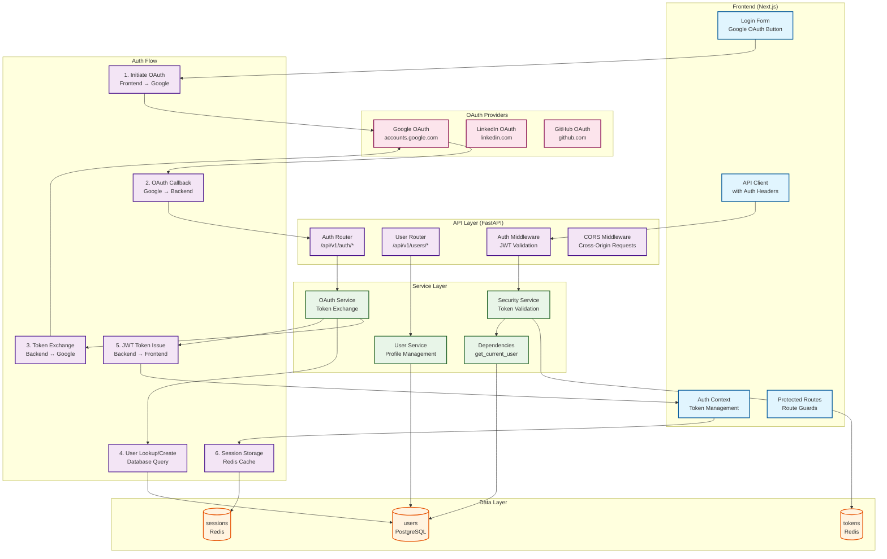

# Authentication Architecture



## Authentication Flow Details

### 1. OAuth Initiation
```javascript
// Frontend: Initiate Google OAuth
const handleGoogleLogin = () => {
  window.location.href = `${API_BASE}/auth/oauth/google/login`;
};
```

### 2. OAuth Callback Handling
```python
# Backend: Handle OAuth callback
@router.get("/auth/oauth/google/callback")
async def google_oauth_callback(
    code: str = Query(...),
    db: AsyncSession = Depends(get_db)
):
    # Exchange code for tokens
    token_data = await exchange_code_for_token(code)

    # Get user info from Google
    user_info = await get_google_user_info(token_data["access_token"])

    # Find or create user
    user = await get_or_create_user(db, user_info)

    # Generate JWT token
    jwt_token = create_jwt_token(user.id)

    return {"access_token": jwt_token, "token_type": "bearer"}
```

### 3. Token Validation
```python
# Backend: JWT token validation
async def get_current_user(
    token: str = Depends(oauth2_scheme),
    db: AsyncSession = Depends(get_db)
) -> User:
    try:
        payload = jwt.decode(token, SECRET_KEY, algorithms=[ALGORITHM])
        user_id = payload.get("sub")
        if user_id is None:
            raise HTTPException(status_code=401, detail="Invalid token")
    except JWTError:
        raise HTTPException(status_code=401, detail="Invalid token")

    user = await UserRepository.get_by_id(db, int(user_id))
    if user is None:
        raise HTTPException(status_code=401, detail="User not found")

    return user
```

### 4. Frontend Token Management
```typescript
// Frontend: Auth context with token storage
const AuthContext = createContext<AuthContextType>({
  user: null,
  login: async (token: string) => {
    localStorage.setItem('access_token', token);
    // Decode and set user info
  },
  logout: () => {
    localStorage.removeItem('access_token');
    setUser(null);
  }
});
```

## Security Features

### Token Security
- **JWT Expiration**: 15-minute access tokens, 7-day refresh tokens
- **Token Rotation**: New tokens issued on refresh
- **Secure Storage**: HttpOnly cookies for refresh tokens
- **Token Blacklisting**: Revoked tokens tracked in Redis

### OAuth Security
- **State Parameter**: CSRF protection for OAuth flows
- **PKCE**: Proof Key for Code Exchange for public clients
- **Scope Limitation**: Minimal OAuth scopes requested
- **Provider Validation**: Strict validation of OAuth provider responses

### Session Management
- **Session Timeout**: Automatic logout after 24 hours of inactivity
- **Concurrent Sessions**: Support for multiple active sessions
- **Device Tracking**: Optional device fingerprinting
- **Session Revocation**: Ability to revoke all sessions for a user

## Database Schema

### Users Table
```sql
CREATE TABLE users (
    id SERIAL PRIMARY KEY,
    email VARCHAR UNIQUE NOT NULL,
    username VARCHAR UNIQUE,
    hashed_password VARCHAR,  -- NULL for OAuth-only users
    is_active BOOLEAN DEFAULT true,
    is_verified BOOLEAN DEFAULT false,

    -- OAuth fields
    oauth_provider VARCHAR,  -- 'google', 'linkedin', 'github'
    oauth_id VARCHAR,        -- External provider user ID
    oauth_access_token VARCHAR,
    oauth_refresh_token VARCHAR,
    oauth_token_expires TIMESTAMP,

    -- Profile data
    first_name VARCHAR,
    last_name VARCHAR,
    profile_picture_url VARCHAR,

    created_at TIMESTAMP DEFAULT CURRENT_TIMESTAMP,
    updated_at TIMESTAMP DEFAULT CURRENT_TIMESTAMP
);

-- Indexes
CREATE INDEX idx_users_email ON users(email);
CREATE INDEX idx_users_oauth_provider_id ON users(oauth_provider, oauth_id);
```

### Sessions Table (Optional)
```sql
CREATE TABLE user_sessions (
    id SERIAL PRIMARY KEY,
    user_id INTEGER REFERENCES users(id) ON DELETE CASCADE,
    session_token VARCHAR UNIQUE NOT NULL,
    device_info JSONB,
    ip_address INET,
    user_agent TEXT,
    created_at TIMESTAMP DEFAULT CURRENT_TIMESTAMP,
    expires_at TIMESTAMP NOT NULL,
    is_active BOOLEAN DEFAULT true
);
```

## Error Handling

### Authentication Errors
- **Invalid Token**: 401 Unauthorized with token refresh suggestion
- **Expired Token**: 401 with automatic refresh attempt
- **Invalid OAuth Code**: 400 Bad Request with retry option
- **User Not Found**: 404 with account creation prompt

### OAuth Flow Errors
- **Provider Unavailable**: Retry with exponential backoff
- **Invalid Scope**: Clear error message with scope explanation
- **User Denied Access**: Graceful handling with alternative login options
- **Network Errors**: Retry logic with user feedback

## Testing Strategy

### Unit Tests
```python
def test_oauth_token_exchange():
    # Mock OAuth provider response
    mock_response = {"access_token": "mock_token", "token_type": "Bearer"}

    with patch('httpx.post') as mock_post:
        mock_post.return_value.json.return_value = mock_response

        result = exchange_code_for_token("mock_code")
        assert result["access_token"] == "mock_token"

def test_jwt_token_creation():
    user_id = 123
    token = create_jwt_token(user_id)

    # Decode and verify
    payload = jwt.decode(token, SECRET_KEY, algorithms=[ALGORITHM])
    assert payload["sub"] == str(user_id)
    assert "exp" in payload
```

### Integration Tests
```python
async def test_oauth_flow(client: TestClient, db: AsyncSession):
    # Mock Google OAuth response
    with patch('app.services.oauth_service.get_google_user_info') as mock_user:
        mock_user.return_value = {
            "id": "123456",
            "email": "test@example.com",
            "name": "Test User"
        }

        # Simulate OAuth callback
        response = client.get("/auth/oauth/google/callback?code=mock_code")
        assert response.status_code == 200

        data = response.json()
        assert "access_token" in data

        # Verify user was created
        user = await UserRepository.get_by_email(db, "test@example.com")
        assert user is not None
        assert user.oauth_provider == "google"
```

## Monitoring & Observability

### Authentication Metrics
- **Login Success Rate**: Percentage of successful authentications
- **OAuth Conversion Rate**: Users completing OAuth flow
- **Token Refresh Rate**: Frequency of token refreshes
- **Failed Login Attempts**: Security monitoring for brute force

### Performance Metrics
- **Token Validation Latency**: JWT decoding and verification time
- **OAuth Callback Latency**: End-to-end OAuth flow duration
- **Session Creation Rate**: New session establishment frequency
- **Database Query Performance**: User lookup and session queries

## Migration Strategies

### From Single-User to Multi-User
1. **Enable OAuth Providers**: Configure Google, LinkedIn OAuth
2. **Update User Model**: Add OAuth fields to existing users
3. **Migrate Sessions**: Convert single-user sessions to multi-user
4. **Update Frontend**: Add login/logout UI components
5. **Database Migration**: Add OAuth columns with proper constraints

### OAuth-Only Authentication
1. **Remove Password Fields**: Drop password-related columns
2. **Update Registration**: OAuth-only user creation
3. **Simplify Login Flow**: Direct OAuth provider redirects
4. **Update Dependencies**: Remove password validation logic

## Related Components

- [[auth-component|Authentication Component Reference]] - Detailed implementation
- [[users-component|Users Component]] - User profile management
- [[security-component|Security Component]] - Token validation and encryption
- [[api-auth|API Authentication]] - Endpoint protection patterns

---

*See also: [[system-architecture|System Architecture]], [[data-architecture|Data Architecture]], [[api-architecture|API Architecture]]*"