# Deployment Architecture

```mermaid
graph TB
    %% External Traffic
    subgraph "External Traffic"
        CDN[Cloudflare CDN<br/>Global Edge Network<br/>DDoS Protection<br/>SSL Termination]
        USERS[End Users<br/>Web Browsers<br/>Mobile Apps<br/>API Clients]
    end

    %% Load Balancer Layer
    subgraph "Load Balancer Layer"
        LB[Load Balancer<br/>AWS ALB / Nginx<br/>SSL Termination<br/>Health Checks<br/>Auto Scaling]
    end

    %% Web Tier
    subgraph "Web Tier"
        WEB_1[Web Server 1<br/>Next.js App<br/>SSR/SSG<br/>API Routes]
        WEB_2[Web Server 2<br/>Next.js App<br/>SSR/SSG<br/>API Routes]
        WEB_3[Web Server 3<br/>Next.js App<br/>SSR/SSG<br/>API Routes]
    end

    %% API Tier
    subgraph "API Tier"
        API_1[API Server 1<br/>FastAPI App<br/>Async Endpoints<br/>WebSocket Support]
        API_2[API Server 2<br/>FastAPI App<br/>Async Endpoints<br/>WebSocket Support]
        API_3[API Server 3<br/>FastAPI App<br/>Async Endpoints<br/>WebSocket Support]
    end

    %% Background Processing
    subgraph "Background Processing"
        CELERY_WORKER_1[Celery Worker 1<br/>Job Scraping<br/>Email Delivery<br/>Analytics Processing]
        CELERY_WORKER_2[Celery Worker 2<br/>Job Scraping<br/>Email Delivery<br/>Analytics Processing]
        CELERY_WORKER_3[Celery Worker 3<br/>Job Scraping<br/>Email Delivery<br/>Analytics Processing]
        CELERY_WORKER_4[Celery Worker 4<br/>Data Cleanup<br/>Maintenance Tasks]
    end

    %% Caching Layer
    subgraph "Caching Layer"
        REDIS_MASTER[(Redis Master<br/>Session Store<br/>Cache<br/>Message Broker)]
        REDIS_REPLICA_1[(Redis Replica 1<br/>Read Operations)]
        REDIS_REPLICA_2[(Redis Replica 2<br/>Read Operations)]
    end

    %% Database Layer
    subgraph "Database Layer"
        POSTGRES_MASTER[(PostgreSQL Master<br/>Primary Database<br/>Write Operations)]
        POSTGRES_REPLICA_1[(PostgreSQL Replica 1<br/>Read Operations)]
        POSTGRES_REPLICA_2[(PostgreSQL Replica 2<br/>Read Operations)]
        POSTGRES_REPLICA_3[(PostgreSQL Replica 3<br/>Read Operations<br/>Analytics Queries)]
    end

    %% Vector Database
    subgraph "Vector Database"
        CHROMA_MASTER[(ChromaDB Master<br/>Vector Embeddings<br/>Job Similarity)]
        CHROMA_REPLICA[(ChromaDB Replica<br/>Read Operations)]
    end

    %% File Storage
    subgraph "File Storage"
        S3[S3 Compatible Storage<br/>AWS S3 / MinIO<br/>Resume Files<br/>Documents<br/>Backups]
    end

    %% Monitoring & Observability
    subgraph "Monitoring & Observability"
        PROMETHEUS[(Prometheus<br/>Metrics Collection)]
        GRAFANA[(Grafana<br/>Dashboards<br/>Alerting)]
        LOKI[(Loki<br/>Log Aggregation)]
        TEMPO[(Tempo<br/>Distributed Tracing)]
    end

    %% External Services
    subgraph "External Services"
        SMTP[SMTP Service<br/>SendGrid / SES<br/>Email Delivery]
        OAUTH[OAuth Providers<br/>Google / GitHub<br/>Authentication]
        JOB_APIS[Job Board APIs<br/>LinkedIn / Indeed<br/>Job Scraping]
        LLM_APIS[LLM APIs<br/>OpenAI / Groq / Anthropic<br/>Content Generation]
    end

    %% Backup & Recovery
    subgraph "Backup & Recovery"
        BACKUP_STORAGE[(Backup Storage<br/>S3 / Glacier<br/>Database Backups<br/>File Backups)]
        BACKUP_SCHEDULER[Backup Scheduler<br/>Automated Backups<br/>Retention Policies]
    end

    %% Traffic Flow
    USERS --> CDN
    CDN --> LB

    LB --> WEB_1
    LB --> WEB_2
    LB --> WEB_3

    WEB_1 --> API_1
    WEB_2 --> API_2
    WEB_3 --> API_3

    API_1 --> CELERY_WORKER_1
    API_2 --> CELERY_WORKER_2
    API_3 --> CELERY_WORKER_3

    API_1 --> REDIS_MASTER
    API_2 --> REDIS_MASTER
    API_3 --> REDIS_MASTER

    CELERY_WORKER_1 --> REDIS_MASTER
    CELERY_WORKER_2 --> REDIS_MASTER
    CELERY_WORKER_3 --> REDIS_MASTER
    CELERY_WORKER_4 --> REDIS_MASTER

    REDIS_MASTER --> REDIS_REPLICA_1
    REDIS_MASTER --> REDIS_REPLICA_2

    API_1 --> POSTGRES_MASTER
    API_2 --> POSTGRES_MASTER
    API_3 --> POSTGRES_MASTER

    CELERY_WORKER_1 --> POSTGRES_MASTER
    CELERY_WORKER_2 --> POSTGRES_MASTER
    CELERY_WORKER_3 --> POSTGRES_MASTER
    CELERY_WORKER_4 --> POSTGRES_MASTER

    POSTGRES_MASTER --> POSTGRES_REPLICA_1
    POSTGRES_MASTER --> POSTGRES_REPLICA_2
    POSTGRES_MASTER --> POSTGRES_REPLICA_3

    API_1 --> CHROMA_MASTER
    CELERY_WORKER_1 --> CHROMA_MASTER

    CHROMA_MASTER --> CHROMA_REPLICA

    API_1 --> S3
    API_2 --> S3
    API_3 --> S3
    CELERY_WORKER_1 --> S3

    %% Monitoring Connections
    WEB_1 --> PROMETHEUS
    WEB_2 --> PROMETHEUS
    WEB_3 --> PROMETHEUS
    API_1 --> PROMETHEUS
    API_2 --> PROMETHEUS
    API_3 --> PROMETHEUS
    CELERY_WORKER_1 --> PROMETHEUS
    CELERY_WORKER_2 --> PROMETHEUS
    CELERY_WORKER_3 --> PROMETHEUS
    CELERY_WORKER_4 --> PROMETHEUS
    REDIS_MASTER --> PROMETHEUS
    POSTGRES_MASTER --> PROMETHEUS
    CHROMA_MASTER --> PROMETHEUS

    PROMETHEUS --> GRAFANA
    LOKI --> GRAFANA
    TEMPO --> GRAFANA

    %% External Service Connections
    CELERY_WORKER_1 --> SMTP
    CELERY_WORKER_2 --> SMTP
    CELERY_WORKER_3 --> SMTP

    API_1 --> OAUTH
    API_2 --> OAUTH
    API_3 --> OAUTH

    CELERY_WORKER_1 --> JOB_APIS
    CELERY_WORKER_2 --> JOB_APIS

    API_1 --> LLM_APIS
    API_2 --> LLM_APIS
    API_3 --> LLM_APIS

    %% Backup Connections
    POSTGRES_MASTER --> BACKUP_SCHEDULER
    S3 --> BACKUP_SCHEDULER
    BACKUP_SCHEDULER --> BACKUP_STORAGE

    %% Styling
    classDef externalClass fill:#e1f5fe,stroke:#01579b,stroke-width:2px
    classDef loadBalancerClass fill:#f3e5f5,stroke:#4a148c,stroke-width:2px
    classDef webClass fill:#e8f5e8,stroke:#1b5e20,stroke-width:2px
    classDef apiClass fill:#fff3e0,stroke:#e65100,stroke-width:2px
    classDef workerClass fill:#e0f2f1,stroke:#00695c,stroke-width:2px
    classDef cacheClass fill:#fff8e1,stroke:#f57f17,stroke-width:2px
    classDef databaseClass fill:#fce4ec,stroke:#880e4f,stroke-width:2px
    classDef vectorClass fill:#f5f5f5,stroke:#424242,stroke-width:2px
    classDef storageClass fill:#e8eaf6,stroke:#283593,stroke-width:2px
    classDef monitoringClass fill:#fff3e0,stroke:#bf360c,stroke-width:2px
    classDef servicesClass fill:#f1f8e9,stroke:#33691e,stroke-width:2px
    classDef backupClass fill:#efebe9,stroke:#4e342e,stroke-width:2px

    class CDN,USERS externalClass
    class LB loadBalancerClass
    class WEB_1,WEB_2,WEB_3 webClass
    class API_1,API_2,API_3 apiClass
    class CELERY_WORKER_1,CELERY_WORKER_2,CELERY_WORKER_3,CELERY_WORKER_4 workerClass
    class REDIS_MASTER,REDIS_REPLICA_1,REDIS_REPLICA_2 cacheClass
    class POSTGRES_MASTER,POSTGRES_REPLICA_1,POSTGRES_REPLICA_2,POSTGRES_REPLICA_3 databaseClass
    class CHROMA_MASTER,CHROMA_REPLICA vectorClass
    class S3 storageClass
    class PROMETHEUS,GRAFANA,LOKI,TEMPO monitoringClass
    class SMTP,OAUTH,JOB_APIS,LLM_APIS servicesClass
    class BACKUP_STORAGE,BACKUP_SCHEDULER backupClass
```



## Deployment Architecture Overview

This diagram illustrates the production deployment architecture for the Career Copilot system, designed for high availability, scalability, and fault tolerance.

### Infrastructure Components

#### 1. External Traffic Layer
- **Cloudflare CDN**: Global edge network for low-latency content delivery, DDoS protection, and SSL termination
- **End Users**: Web browsers, mobile apps, and API clients accessing the system

#### 2. Load Balancer Layer
- **AWS ALB / Nginx**: Distributes traffic across web servers, performs health checks, and handles SSL termination
- **Auto Scaling**: Automatically adjusts capacity based on traffic patterns

#### 3. Web Tier (Next.js)
- **Next.js Applications**: Server-side rendered React applications with API routes
- **Horizontal Scaling**: Multiple instances behind load balancer for high availability
- **Static Asset Serving**: Optimized delivery of CSS, JavaScript, and images

#### 4. API Tier (FastAPI)
- **FastAPI Applications**: Asynchronous REST API with WebSocket support
- **Microservices Pattern**: Independent scaling of API services
- **Connection Pooling**: Efficient database and cache connections

#### 5. Background Processing (Celery)
- **Worker Nodes**: Asynchronous task processing for job scraping, email delivery, and analytics
- **Task Queues**: Redis-based message broker for reliable task distribution
- **Auto Scaling**: Worker pool scales based on queue depth

### Data Layer Architecture

#### Database Layer (PostgreSQL)
```yaml
# Production PostgreSQL configuration
postgresql:
  master:
    instance_type: db.r6g.2xlarge
    storage: 1000GB io2
    multi_az: true
    backup_retention: 30

  replicas:
    - instance_type: db.r6g.xlarge
    - instance_type: db.r6g.xlarge
    - instance_type: db.r6g.xlarge  # Analytics replica
```

**Read/Write Splitting:**
- **Master**: All write operations (INSERT, UPDATE, DELETE)
- **Replicas**: Read operations with automatic failover
- **Analytics Replica**: Heavy analytical queries isolated from OLTP

#### Caching Layer (Redis)
```yaml
# Redis cluster configuration
redis:
  master:
    instance_type: cache.r6g.large
    cluster_mode: true
    num_shards: 3

  replicas:
    read_replicas: 2
    failover: automatic
```

**Multi-purpose Usage:**
- **Session Store**: User session data and JWT tokens
- **Cache**: API response caching and computed results
- **Message Broker**: Celery task queue and WebSocket pub/sub
- **Rate Limiting**: Request throttling and abuse prevention

#### Vector Database (ChromaDB)
```yaml
# ChromaDB configuration for embeddings
chromadb:
  master:
    instance_type: r6g.large
    storage: 500GB
    persistence: s3

  replica:
    instance_type: r6g.large
    read_only: true
```

**Vector Operations:**
- **Job Similarity**: Semantic search across job descriptions
- **Content Matching**: Resume-job matching algorithms
- **Recommendation Engine**: Personalized job suggestions

### Storage Architecture

#### Object Storage (S3)
```yaml
# S3 bucket configuration
s3:
  buckets:
    - name: career-copilot-uploads
      region: us-east-1
      versioning: true
      encryption: AES256
      lifecycle:
        - prefix: temp/
          expiration: 7 days
        - prefix: backups/
          transition: glacier
          days: 30

    - name: career-copilot-backups
      region: us-east-1
      versioning: true
      encryption: AES256
```

**Storage Classes:**
- **Standard**: Frequently accessed files (resumes, documents)
- **Infrequent Access**: Older files with occasional access
- **Glacier**: Long-term backups and archives

### Monitoring & Observability

#### Metrics Collection (Prometheus)
```yaml
# Prometheus configuration
prometheus:
  scrape_configs:
    - job_name: 'api'
      static_configs:
        - targets: ['api-1:8000', 'api-2:8000', 'api-3:8000']
      metrics_path: '/metrics'

    - job_name: 'web'
      static_configs:
        - targets: ['web-1:3000', 'web-2:3000', 'web-3:3000']

    - job_name: 'database'
      static_configs:
        - targets: ['postgres-exporter:9187']
```

**Key Metrics:**
- **API Performance**: Response times, error rates, throughput
- **Database Health**: Connection count, query performance, replication lag
- **Cache Efficiency**: Hit rates, memory usage, eviction rates
- **Background Jobs**: Queue depth, processing rates, failure rates

#### Visualization (Grafana)
```yaml
# Grafana dashboard configuration
grafana:
  dashboards:
    - name: API Performance
      panels:
        - response_time: p95, p99
        - error_rate: 4xx, 5xx
        - throughput: requests_per_second

    - name: Database Health
      panels:
        - connection_count: active, idle
        - query_performance: slow_queries
        - replication_lag: seconds

    - name: Business Metrics
      panels:
        - user_registrations: daily, weekly
        - job_applications: daily, weekly
        - system_uptime: percentage
```

#### Log Aggregation (Loki)
```yaml
# Loki configuration for log aggregation
loki:
  configs:
    - name: application_logs
      clients:
        - url: http://loki:3100/loki/api/v1/push

    - name: infrastructure_logs
      clients:
        - url: http://loki:3100/loki/api/v1/push
```

**Log Sources:**
- **Application Logs**: API requests, errors, business events
- **Infrastructure Logs**: System events, container logs, network traffic
- **Security Logs**: Authentication attempts, access patterns

#### Distributed Tracing (Tempo)
```yaml
# Tempo configuration for distributed tracing
tempo:
  receivers:
    jaeger:
      protocols:
        grpc:
          endpoint: 0.0.0.0:14250
        thrift_http:
          endpoint: 0.0.0.0:14268

  storage:
    trace:
      backend: s3
      s3:
        bucket: career-copilot-traces
        region: us-east-1
```

**Trace Coverage:**
- **API Requests**: End-to-end request tracing
- **Database Queries**: SQL execution tracing
- **External Calls**: OAuth, LLM API, job board API calls
- **Background Jobs**: Celery task execution tracing

### Scaling Strategies

#### Horizontal Scaling
```yaml
# Auto scaling configuration
auto_scaling:
  web_tier:
    min_instances: 3
    max_instances: 20
    target_cpu_utilization: 70

  api_tier:
    min_instances: 3
    max_instances: 15
    target_cpu_utilization: 60

  workers:
    min_instances: 4
    max_instances: 50
    target_queue_depth: 100
```

#### Database Scaling
```yaml
# Read replica scaling
database_scaling:
  read_replicas:
    - analytics: true   # Heavy read workloads
    - api: true        # API read operations
    - backup: true     # Backup operations

  connection_pooling:
    max_connections: 100
    min_connections: 10
    connection_timeout: 30
```

#### Cache Scaling
```yaml
# Redis cluster scaling
redis_scaling:
  cluster:
    num_shards: 3
    replicas_per_shard: 2
    failover: automatic

  memory_management:
    max_memory: 8GB
    eviction_policy: allkeys-lru
```

### Backup & Disaster Recovery

#### Backup Strategy
```bash
# Automated backup schedule
0 2 * * * pg_dump -U postgres career_copilot > /backups/daily_$(date +\%Y\%m\%d).sql
0 3 * * 0 pg_dump -U postgres career_copilot > /backups/weekly_$(date +\%Y\%m\%d).sql
0 4 1 * * pg_dump -U postgres career_copilot > /backups/monthly_$(date +\%Y\%m\%d).sql
```

**Backup Types:**
- **Daily Backups**: Point-in-time recovery within 24 hours
- **Weekly Backups**: Longer retention for historical data
- **Continuous Archiving**: WAL files for point-in-time recovery

#### Disaster Recovery
```yaml
# Multi-region deployment
disaster_recovery:
  primary_region: us-east-1
  secondary_region: us-west-2

  failover_strategy:
    automatic: true
    rto: 300  # 5 minutes recovery time objective
    rpo: 60   # 1 minute recovery point objective

  data_replication:
    postgresql: streaming_replication
    redis: cross_region_replication
    s3: cross_region_replication
```

### Security Implementation

#### Network Security
```yaml
# Security group configuration
security_groups:
  web_tier:
    inbound:
      - port: 80,443
        source: 0.0.0.0/0
    outbound:
      - port: all
        source: api_sg

  api_tier:
    inbound:
      - port: 8000
        source: web_sg
    outbound:
      - port: 5432
        source: database_sg
      - port: 6379
        source: redis_sg

  database_tier:
    inbound:
      - port: 5432
        source: api_sg
    outbound: []
```

#### Application Security
```yaml
# Security headers and configurations
security:
  ssl:
    certificate: lets_encrypt
    hsts: max_age=31536000
    cipher_suites: ECDHE-RSA-AES128-GCM-SHA256

  headers:
    content_security_policy: "default-src 'self'"
    x_frame_options: DENY
    x_content_type_options: nosniff

  authentication:
    jwt_expiry: 3600  # 1 hour
    refresh_token_expiry: 604800  # 7 days
    password_policy: complexity_required
```

### Cost Optimization

#### Resource Optimization
```yaml
# Cost optimization strategies
cost_optimization:
  instance_scheduling:
    web_tier: 24/7  # Always on
    workers: auto   # Scale to zero when idle

  storage_optimization:
    s3_intelligent_tiering: true
    database_backup_retention: 30_days

  caching_strategy:
    api_cache_ttl: 300  # 5 minutes
    static_asset_cache: 31536000  # 1 year
```

#### Monitoring Costs
```yaml
# Cost monitoring and alerting
cost_monitoring:
  budgets:
    monthly_budget: 5000
    alert_threshold: 80

  metrics:
    - ec2_cost
    - rds_cost
    - s3_cost
    - cloudflare_cost
```

## Related Diagrams

- [[system-architecture|System Architecture]] - Overall system structure
- [[api-architecture|API Architecture]] - API endpoint organization
- [[data-architecture|Data Architecture]] - Database relationships
- [[authentication-architecture|Authentication Architecture]] - Auth flow details

## Component References

- [[auth-component|Authentication Component]] - Auth implementation
- [[applications-component|Applications Component]] - Job tracking system
- [[analytics-component|Analytics Component]] - Metrics and reporting
- [[notifications-component|Notifications Component]] - Communication system

---

*See also: [[infrastructure-setup|Infrastructure Setup Guide]], [[monitoring-setup|Monitoring Configuration]], [[backup-strategy|Backup and Recovery Guide]]*"