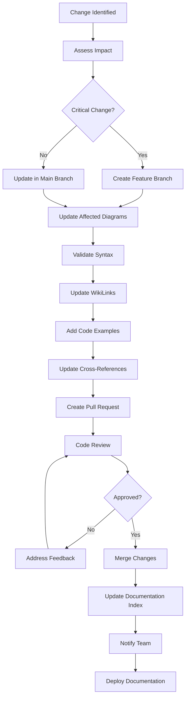

# Architecture Diagrams Maintenance Guidelines

## Overview

This document provides comprehensive guidelines for maintaining and updating the Career Copilot architecture diagrams. As the system evolves, these diagrams must remain accurate, consistent, and valuable for development, onboarding, and planning purposes.

## Maintenance Principles

### 1. Single Source of Truth
- **Architecture diagrams are the authoritative source** for system design decisions
- All code changes must validate against diagram specifications
- Diagrams must be updated before implementing breaking changes

### 2. Consistency Standards
- Use consistent Mermaid syntax and styling across all diagrams
- Maintain uniform color schemes and component naming conventions
- Follow established WikiLink patterns for cross-references

### 3. Version Control Integration
- Diagrams are version-controlled alongside code
- Changes require pull request review and approval
- Maintain changelog for significant architectural changes

## Update Triggers

### Immediate Updates Required
- **New Services/Components**: Adding microservices, databases, or external integrations
- **API Changes**: Breaking changes to service interfaces or data contracts
- **Security Updates**: New authentication flows, encryption changes, or compliance requirements
- **Performance Changes**: Significant caching strategy or optimization updates
- **Deployment Changes**: New environments, infrastructure components, or scaling strategies

### Regular Review Cycles
- **Monthly**: Review for accuracy and completeness
- **Quarterly**: Major architectural assessments and updates
- **Bi-annually**: Technology stack evaluations and migration planning

## Update Process

### 1. Change Assessment
```python
# backend/scripts/assess_architecture_change.py
from typing import Dict, List, Set
from dataclasses import dataclass

@dataclass
class ArchitectureChange:
    change_type: str  # 'add_service', 'modify_api', 'security_update', etc.
    affected_components: List[str]
    impact_level: str  # 'low', 'medium', 'high', 'breaking'
    required_diagrams: List[str]
    migration_complexity: str

class ArchitectureChangeAssessor:
    def __init__(self):
        self.change_patterns = {
            'new_service': {
                'diagrams': ['system-architecture', 'deployment-architecture', 'data-architecture'],
                'review_required': True,
                'testing_required': True
            },
            'api_change': {
                'diagrams': ['api-architecture', 'system-architecture'],
                'review_required': True,
                'testing_required': True
            },
            'security_update': {
                'diagrams': ['security-architecture', 'authentication-architecture'],
                'review_required': True,
                'testing_required': True
            }
        }

    def assess_change(self, change_description: str) -> ArchitectureChange:
        """Assess the impact of a proposed change"""
        # Analyze change description
        # Determine affected components
        # Calculate impact level
        # Identify required diagram updates
        pass

    def generate_update_plan(self, change: ArchitectureChange) -> Dict[str, Any]:
        """Generate a structured update plan"""
        return {
            'diagrams_to_update': change.required_diagrams,
            'estimated_effort': self._calculate_effort(change),
            'testing_requirements': self._get_testing_requirements(change),
            'rollback_plan': self._create_rollback_plan(change)
        }
```

### 2. Diagram Update Workflow


### 3. Validation Checklist
- [ ] **Syntax Validation**: All Mermaid diagrams render correctly
- [ ] **WikiLink Integrity**: All cross-references are valid and functional
- [ ] **Code Examples**: Sample code is syntactically correct and follows patterns
- [ ] **Consistency**: Naming conventions and styling match existing diagrams
- [ ] **Completeness**: All components and relationships are documented
- [ ] **Accuracy**: Diagrams reflect current system implementation

## Diagram Standards

### Mermaid Syntax Standards
```javascript
// Standard flowchart template
flowchart TD
    A[Component Name] --> B[Another Component]
    B --> C{Decision Point}
    C -->|Yes| D[Action 1]
    C -->|No| E[Action 2]

// Standard styling
classDef primaryClass fill:#1976d2,stroke:#0d47a1,stroke-width:2px,color:#ffffff
classDef secondaryClass fill:#e3f2fd,stroke:#1976d2,stroke-width:2px
classDef externalClass fill:#f5f5f5,stroke:#616161,stroke-width:1px

class A primaryClass
class B,C secondaryClass
class D,E externalClass
```

### Component Naming Conventions
- **Services**: `[ServiceName] Service` (e.g., `User Service`)
- **Databases**: `[Type] Database` (e.g., `PostgreSQL Database`)
- **External Systems**: `[SystemName] API` (e.g., `LinkedIn API`)
- **Infrastructure**: `[Component] ([Technology])` (e.g., `API Gateway (Kong)`)

### Color Coding Standards
- **Primary Services**: Blue (#1976d2)
- **Secondary Services**: Light Blue (#e3f2fd)
- **External Dependencies**: Gray (#f5f5f5)
- **Databases**: Green (#388e3c)
- **Security Components**: Red (#d32f2f)
- **Infrastructure**: Orange (#f57c00)

## WikiLink Management

### Link Patterns
```markdown
<!-- Component references -->
[[component-name|Display Name]]

<!-- Architecture diagrams -->
[[system-architecture|System Architecture]]
[[data-architecture|Data Architecture]]

<!-- Related documentation -->
[[api-reference|API Reference]]
[[deployment-guide|Deployment Guide]]
```

### Link Validation Script
```python
# scripts/validate_wikilinks.py
import re
import os
from pathlib import Path
from typing import Set, Dict, List

class WikiLinkValidator:
    def __init__(self, docs_path: str):
        self.docs_path = Path(docs_path)
        self.all_files: Set[str] = set()
        self.wikilinks: Dict[str, List[str]] = {}

    def scan_files(self):
        """Scan all markdown files for WikiLinks"""
        for md_file in self.docs_path.rglob("*.md"):
            self.all_files.add(md_file.stem)
            content = md_file.read_text()

            # Find all WikiLinks
            links = re.findall(r'\[\[([^\]|]+)', content)
            if links:
                self.wikilinks[md_file.stem] = links

    def validate_links(self) -> Dict[str, List[str]]:
        """Validate all WikiLinks"""
        broken_links = {}

        for file, links in self.wikilinks.items():
            broken = []
            for link in links:
                # Extract link target (before | if present)
                target = link.split('|')[0].strip()
                if target not in self.all_files:
                    broken.append(link)
            if broken:
                broken_links[file] = broken

        return broken_links

    def generate_report(self) -> str:
        """Generate validation report"""
        broken_links = self.validate_links()

        if not broken_links:
            return "✅ All WikiLinks are valid!"

        report = "❌ Broken WikiLinks found:\n\n"
        for file, links in broken_links.items():
            report += f"## {file}.md\n"
            for link in links:
                report += f"  - [[{link}]]\n"
            report += "\n"

        return report

# Usage
if __name__ == "__main__":
    validator = WikiLinkValidator("docs")
    validator.scan_files()
    print(validator.generate_report())
```

## Code Example Maintenance

### Code Example Standards
```python
# ✅ CORRECT - Well-documented, realistic example
class UserService:
    """
    Service for managing user operations.

    This service handles user registration, authentication,
    and profile management with proper error handling.
    """
    def __init__(self, db: Session, cache: Redis):
        self.db = db
        self.cache = cache

    async def get_user(self, user_id: int) -> Optional[User]:
        """Retrieve user by ID with caching."""
        # Try cache first
        cache_key = f"user:{user_id}"
        cached_user = await self.cache.get(cache_key)
        if cached_user:
            return User.parse_raw(cached_user)

        # Fetch from database
        user = await self.db.get(User, user_id)
        if user:
            await self.cache.set(cache_key, user.json(), ex=300)

        return user

# ❌ AVOID - Too simplistic, missing error handling
class UserService:
    def get_user(self, user_id: int) -> User:
        return self.db.query(User).get(user_id)
```

### Code Validation
```python
# scripts/validate_code_examples.py
import ast
import re
from pathlib import Path
from typing import List, Dict

class CodeExampleValidator:
    def __init__(self, docs_path: str):
        self.docs_path = Path(docs_path)

    def validate_python_examples(self) -> Dict[str, List[str]]:
        """Validate Python code examples in documentation"""
        issues = {}

        for md_file in self.docs_path.rglob("*.md"):
            content = md_file.read_text()

            # Extract Python code blocks
            python_blocks = re.findall(r'```python\n(.*?)\n```', content, re.DOTALL)

            file_issues = []
            for i, block in enumerate(python_blocks):
                try:
                    ast.parse(block)
                except SyntaxError as e:
                    file_issues.append(f"Block {i+1}: {e.msg} at line {e.lineno}")

            if file_issues:
                issues[str(md_file.relative_to(self.docs_path))] = file_issues

        return issues

    def validate_typescript_examples(self) -> Dict[str, List[str]]:
        """Validate TypeScript code examples"""
        # Similar validation for TypeScript
        pass
```

## Automated Maintenance Tools

### Diagram Generation Script
```python
# scripts/generate_diagrams.py
import os
import yaml
from pathlib import Path
from typing import Dict, Any

class DiagramGenerator:
    def __init__(self, config_path: str):
        self.config = self.load_config(config_path)
        self.templates_path = Path("docs/templates")

    def load_config(self, config_path: str) -> Dict[str, Any]:
        """Load diagram configuration"""
        with open(config_path) as f:
            return yaml.safe_load(f)

    def generate_system_diagram(self) -> str:
        """Generate system architecture diagram"""
        services = self.config['services']
        databases = self.config['databases']

        diagram = "graph TB\n"

        # Add services
        for service in services:
            diagram += f"    {service['id']}[{service['name']}]\n"

        # Add databases
        for db in databases:
            diagram += f"    {db['id']}({db['name']})\n"

        # Add connections
        diagram += "\n    %% Connections\n"
        for service in services:
            for dep in service.get('dependencies', []):
                diagram += f"    {service['id']} --> {dep}\n"

        return diagram

    def update_diagram_file(self, diagram_name: str, content: str):
        """Update diagram file with new content"""
        file_path = Path(f"docs/architecture/{diagram_name}.md")

        # Read existing content
        if file_path.exists():
            existing_content = file_path.read_text()

            # Replace diagram section
            pattern = r'```mermaid\n.*?\n```'
            new_content = re.sub(pattern, f'```mermaid\n{content}\n```',
                               existing_content, flags=re.DOTALL)
        else:
            new_content = f"# {diagram_name.replace('-', ' ').title()}\n\n```mermaid\n{content}\n```"

        file_path.write_text(new_content)
```

### Configuration File Structure
```yaml
# config/diagram_config.yaml
services:
  - id: user_service
    name: "User Service"
    dependencies: ["user_db", "cache"]
    type: "primary"

  - id: auth_service
    name: "Authentication Service"
    dependencies: ["user_db", "cache"]
    type: "primary"

databases:
  - id: user_db
    name: "PostgreSQL Database"
    type: "postgresql"

  - id: cache
    name: "Redis Cache"
    type: "redis"

styling:
  primary_color: "#1976d2"
  secondary_color: "#e3f2fd"
  database_color: "#388e3c"
```

## Testing Integration

### Diagram Testing
```python
# tests/test_diagrams.py
import pytest
from pathlib import Path
import re
import subprocess

class TestArchitectureDiagrams:
    def test_mermaid_syntax(self):
        """Test that all Mermaid diagrams have valid syntax"""
        docs_path = Path("docs/architecture")

        for md_file in docs_path.glob("*.md"):
            content = md_file.read_text()

            # Extract Mermaid blocks
            mermaid_blocks = re.findall(r'```mermaid\n(.*?)\n```', content, re.DOTALL)

            for block in mermaid_blocks:
                # Basic syntax validation
                assert block.strip(), f"Empty Mermaid block in {md_file}"

                # Check for basic structure
                lines = block.strip().split('\n')
                assert len(lines) > 0, f"No content in Mermaid block in {md_file}"

    def test_wikilinks_exist(self):
        """Test that all WikiLinks point to existing files"""
        from scripts.validate_wikilinks import WikiLinkValidator

        validator = WikiLinkValidator("docs")
        validator.scan_files()
        broken_links = validator.validate_links()

        assert not broken_links, f"Broken WikiLinks found: {broken_links}"

    def test_code_examples_syntax(self):
        """Test that code examples have valid syntax"""
        from scripts.validate_code_examples import CodeExampleValidator

        validator = CodeExampleValidator("docs")
        python_issues = validator.validate_python_examples()

        assert not python_issues, f"Python syntax errors in examples: {python_issues}"
```

## Change Management

### Architecture Change Log
```markdown
# Architecture Change Log

## [2024-01-15] - Service Extraction
- **Change**: Extracted authentication service from monolith
- **Impact**: High - Breaking change for authentication endpoints
- **Diagrams Updated**:
  - system-architecture.md
  - authentication-architecture.md
  - deployment-architecture.md
- **Migration Guide**: See `docs/migrations/auth-service-extraction.md`
- **Testing**: Comprehensive integration tests added

## [2024-01-10] - Database Optimization
- **Change**: Added read replicas and query optimization
- **Impact**: Medium - Performance improvement
- **Diagrams Updated**:
  - data-architecture.md
  - performance-architecture.md
- **Migration Guide**: See `docs/migrations/database-optimization.md`
- **Testing**: Performance benchmarks validated
```

### Change Approval Process
```python
# backend/app/services/architecture_change_service.py
from typing import Dict, List, Optional
from datetime import datetime
from enum import Enum

class ChangeApprovalStatus(Enum):
    PENDING = "pending"
    APPROVED = "approved"
    REJECTED = "rejected"
    IMPLEMENTED = "implemented"

class ArchitectureChangeRequest:
    def __init__(self, title: str, description: str, requester: str):
        self.id = str(uuid.uuid4())
        self.title = title
        self.description = description
        self.requester = requester
        self.status = ChangeApprovalStatus.PENDING
        self.created_at = datetime.utcnow()
        self.approved_by: Optional[str] = None
        self.approved_at: Optional[datetime] = None
        self.implemented_at: Optional[datetime] = None
        self.affected_diagrams: List[str] = []
        self.estimated_effort: str = ""
        self.risk_assessment: str = ""

    async def approve(self, approver: str):
        """Approve the change request"""
        self.status = ChangeApprovalStatus.APPROVED
        self.approved_by = approver
        self.approved_at = datetime.utcnow()

        # Notify relevant teams
        await self._notify_approval()

    async def implement(self):
        """Mark change as implemented"""
        self.status = ChangeApprovalStatus.IMPLEMENTED
        self.implemented_at = datetime.utcnow()

        # Update change log
        await self._update_change_log()

    async def _notify_approval(self):
        """Send notifications about approval"""
        # Implementation for notifications
        pass

    async def _update_change_log(self):
        """Update the architecture change log"""
        # Implementation for change log updates
        pass
```

## Monitoring and Alerts

### Diagram Health Monitoring
```python
# scripts/monitor_diagram_health.py
import time
from pathlib import Path
from typing import Dict, List
import logging

logging.basicConfig(level=logging.INFO)
logger = logging.getLogger(__name__)

class DiagramHealthMonitor:
    def __init__(self, docs_path: str, alert_threshold_days: int = 30):
        self.docs_path = Path(docs_path)
        self.alert_threshold_days = alert_threshold_days
        self.last_modified: Dict[str, float] = {}

    def scan_diagram_age(self) -> Dict[str, float]:
        """Scan all diagrams and return age in days"""
        ages = {}

        for md_file in self.docs_path.glob("architecture/*.md"):
            mtime = md_file.stat().st_mtime
            age_days = (time.time() - mtime) / (24 * 3600)
            ages[md_file.name] = age_days

            self.last_modified[md_file.name] = mtime

        return ages

    def check_for_stale_diagrams(self) -> List[str]:
        """Check for diagrams that haven't been updated recently"""
        ages = self.scan_diagram_age()
        stale_diagrams = []

        for diagram, age in ages.items():
            if age > self.alert_threshold_days:
                stale_diagrams.append(f"{diagram}: {age:.1f} days old")

        return stale_diagrams

    def generate_health_report(self) -> str:
        """Generate comprehensive health report"""
        ages = self.scan_diagram_age()
        stale = self.check_for_stale_diagrams()

        report = "# Architecture Diagrams Health Report\n\n"

        report += "## Diagram Ages\n"
        for diagram, age in sorted(ages.items()):
            status = "⚠️ STALE" if age > self.alert_threshold_days else "✅ CURRENT"
            report += f"- {diagram}: {age:.1f} days ({status})\n"

        if stale:
            report += "\n## Stale Diagrams Requiring Review\n"
            for diagram in stale:
                report += f"- {diagram}\n"

        report += f"\n## Summary\n"
        report += f"- Total diagrams: {len(ages)}\n"
        report += f"- Stale diagrams: {len(stale)}\n"
        report += f"- Alert threshold: {self.alert_threshold_days} days\n"

        return report

# Automated monitoring
if __name__ == "__main__":
    monitor = DiagramHealthMonitor("docs")
    report = monitor.generate_health_report()
    print(report)

    # Send alerts for stale diagrams
    stale = monitor.check_for_stale_diagrams()
    if stale:
        logger.warning(f"Stale architecture diagrams detected: {len(stale)}")
        # Send notification to team
```

## Team Training and Documentation

### Onboarding Materials
- **Architecture Overview**: 30-minute presentation covering all diagrams
- **Diagram Reading Guide**: How to interpret Mermaid diagrams and WikiLinks
- **Update Procedures**: Step-by-step guide for maintaining diagrams
- **Code Example Patterns**: Standards for writing and validating code examples

### Regular Training Sessions
- **Monthly Reviews**: Architecture diagram walkthrough and updates
- **Quarterly Workshops**: Deep dives into specific architectural patterns
- **New Hire Training**: Architecture fundamentals and diagram usage

## Emergency Procedures

### Rollback Procedures
1. **Identify Impact**: Determine which diagrams and components are affected
2. **Version Control**: Use git to revert diagram changes
3. **Communication**: Notify team of rollback and reasoning
4. **Documentation**: Update change log with rollback details

### Critical Update Protocol
For urgent security or performance updates:
1. **Immediate Assessment**: Evaluate change impact within 1 hour
2. **Fast-track Approval**: Senior architect approval within 4 hours
3. **Parallel Updates**: Update diagrams and code simultaneously
4. **Testing**: Validate changes before deployment

## Metrics and KPIs

### Maintenance Metrics
- **Update Frequency**: Average days between diagram updates
- **Review Coverage**: Percentage of changes reviewed for diagram impact
- **Accuracy Score**: Percentage of diagrams matching current implementation
- **Usage Metrics**: Diagram access frequency and user feedback

### Quality Metrics
- **WikiLink Health**: Percentage of valid cross-references
- **Syntax Validation**: Percentage of diagrams with valid Mermaid syntax
- **Code Example Quality**: Percentage of examples passing validation
- **Consistency Score**: Adherence to naming and styling standards

---

## Quick Reference

### When to Update Diagrams
- ✅ New service/component added
- ✅ API contract changes
- ✅ Security architecture changes
- ✅ Performance optimization updates
- ✅ Infrastructure changes
- ✅ Breaking code changes

### Update Checklist
- [ ] Assess change impact
- [ ] Identify affected diagrams
- [ ] Update Mermaid syntax
- [ ] Validate WikiLinks
- [ ] Add/update code examples
- [ ] Test diagram rendering
- [ ] Update cross-references
- [ ] Review and approve changes

### Validation Commands
```bash
# Validate all diagrams
python scripts/validate_diagrams.py

# Check WikiLink integrity
python scripts/validate_wikilinks.py

# Test code examples
python scripts/validate_code_examples.py

# Generate health report
python scripts/monitor_diagram_health.py
```

---

*See also: [[architecture-index|Architecture Index]], [[system-architecture|System Architecture]], [[contribution-guide|Contribution Guidelines]]*"