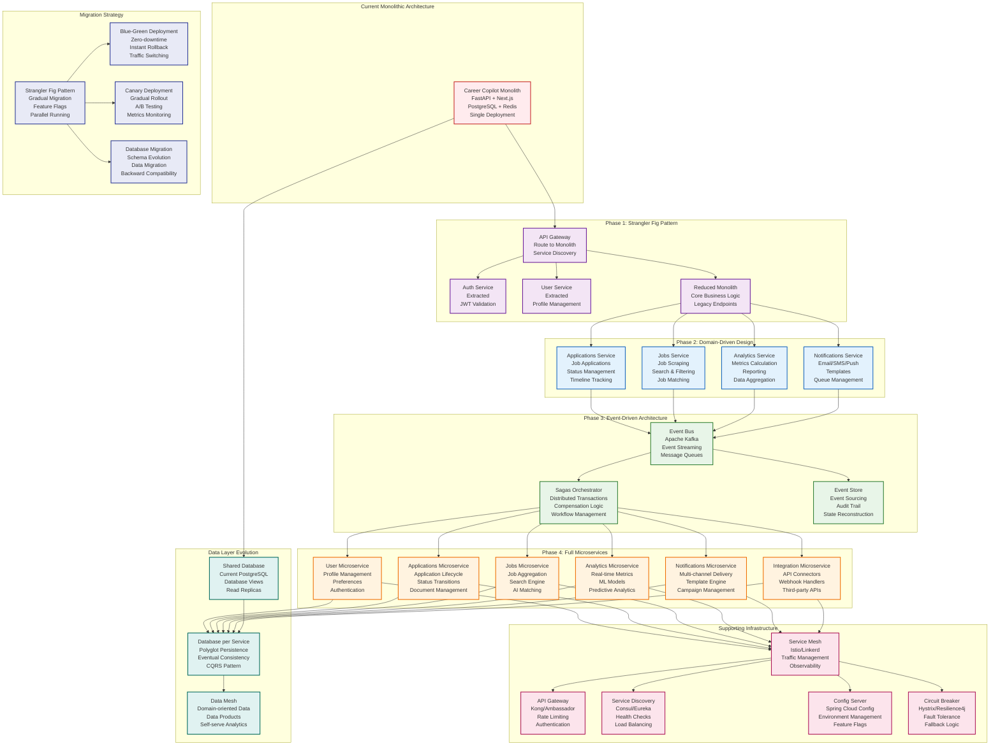

# Microservices Migration Architecture



## Microservices Migration Architecture

This diagram illustrates the strategic migration plan from the current monolithic architecture to a scalable microservices ecosystem, designed to support future growth and maintainability of the Career Copilot platform.

### Current State Assessment

#### Monolithic Architecture Analysis
The current system is built as a monolithic FastAPI application with the following characteristics:

**Strengths:**
- Simple deployment and development
- Strong consistency guarantees
- Easy testing and debugging
- Single codebase management

**Challenges:**
- Tight coupling between components
- Scalability limitations
- Long deployment cycles
- Technology stack lock-in
- Single points of failure

**Performance Metrics:**
- Response time: ~150ms (P95)
- Throughput: ~500 requests/second
- Concurrent users: ~1000
- Database connections: ~50

### Phase 1: Strangler Fig Pattern (3-6 months)

#### Migration Strategy
Implement the Strangler Fig pattern to gradually extract services while maintaining system stability:

```python
# backend/app/migration/strangler_fig.py
from typing import Dict, List, Callable, Any
import asyncio
from enum import Enum

class MigrationStatus(Enum):
    MONOLITH = "monolith"
    MIGRATED = "migrated"
    HYBRID = "hybrid"

class StranglerFigRouter:
    def __init__(self):
        self.service_routes = {}  # endpoint -> service_url
        self.migration_status = {}  # endpoint -> MigrationStatus
        self.fallback_handlers = {}  # endpoint -> monolith_handler

    def register_service_route(self, endpoint: str, service_url: str, status: MigrationStatus = MigrationStatus.HYBRID):
        """Register a service route with migration status"""
        self.service_routes[endpoint] = service_url
        self.migration_status[endpoint] = status

    def register_fallback_handler(self, endpoint: str, handler: Callable):
        """Register fallback handler for monolith"""
        self.fallback_handlers[endpoint] = handler

    async def route_request(self, endpoint: str, request_data: Dict[str, Any]) -> Dict[str, Any]:
        """Route request based on migration status"""
        status = self.migration_status.get(endpoint, MigrationStatus.MONOLITH)

        if status == MigrationStatus.MIGRATED:
            # Route to microservice
            return await self._call_microservice(endpoint, request_data)

        elif status == MigrationStatus.HYBRID:
            # Try microservice, fallback to monolith
            try:
                return await self._call_microservice(endpoint, request_data)
            except Exception as e:
                logger.warning(f"Microservice call failed for {endpoint}, falling back to monolith: {e}")
                return await self._call_monolith_fallback(endpoint, request_data)

        else:
            # Use monolith
            return await self._call_monolith_fallback(endpoint, request_data)

    async def _call_microservice(self, endpoint: str, request_data: Dict[str, Any]) -> Dict[str, Any]:
        """Call microservice endpoint"""
        service_url = self.service_routes[endpoint]

        async with httpx.AsyncClient(timeout=5.0) as client:
            response = await client.post(f"{service_url}{endpoint}", json=request_data)
            response.raise_for_status()
            return response.json()

    async def _call_monolith_fallback(self, endpoint: str, request_data: Dict[str, Any]) -> Dict[str, Any]:
        """Fallback to monolith handler"""
        handler = self.fallback_handlers.get(endpoint)
        if handler:
            return await handler(request_data)
        else:
            raise HTTPException(status_code=404, detail=f"No handler found for {endpoint}")

# Global router instance
strangler_router = StranglerFigRouter()

# Example migration configuration
def configure_strangler_routes():
    """Configure which endpoints are migrated to which services"""

    # Phase 1: Extract authentication service
    strangler_router.register_service_route(
        "/api/v1/auth/login",
        "http://auth-service:8001",
        MigrationStatus.MIGRATED
    )

    strangler_router.register_service_route(
        "/api/v1/auth/register",
        "http://auth-service:8001",
        MigrationStatus.HYBRID  # Still available in monolith as fallback
    )

    # Phase 2: Extract user management
    strangler_router.register_service_route(
        "/api/v1/users/profile",
        "http://user-service:8002",
        MigrationStatus.MIGRATED
    )

    # Register fallback handlers
    strangler_router.register_fallback_handler("/api/v1/auth/login", monolith_auth_login)
    strangler_router.register_fallback_handler("/api/v1/auth/register", monolith_auth_register)
```

#### Service Extraction Plan
Priority order for service extraction based on business value and coupling:

1. **Authentication Service** (High Priority)
   - Independent domain logic
   - Security-critical component
   - Low coupling with other services

2. **User Management Service** (High Priority)
   - Well-defined bounded context
   - Independent data model
   - Low business logic coupling

3. **Jobs Service** (Medium Priority)
   - Complex scraping logic
   - Independent data sources
   - High computational requirements

4. **Applications Service** (Medium Priority)
   - Core business logic
   - Moderate coupling with jobs/users
   - State management complexity

5. **Analytics Service** (Low Priority)
   - Read-heavy workload
   - Can be extracted later
   - Independent data processing

6. **Notifications Service** (Low Priority)
   - Asynchronous processing
   - External dependencies
   - Can be migrated last

#### Database Migration Strategy
Implement database migration with backward compatibility:

```sql
-- migration_scripts/phase1_auth_service.sql

-- Create separate database for auth service
CREATE DATABASE auth_service_db;

-- Create auth schema in new database
CREATE TABLE auth_service_db.users (
    id SERIAL PRIMARY KEY,
    email VARCHAR(255) UNIQUE NOT NULL,
    hashed_password VARCHAR(255) NOT NULL,
    is_active BOOLEAN DEFAULT TRUE,
    created_at TIMESTAMP DEFAULT CURRENT_TIMESTAMP,
    updated_at TIMESTAMP DEFAULT CURRENT_TIMESTAMP
);

-- Create view in main database for backward compatibility
CREATE VIEW main_db.users AS
SELECT * FROM dblink('auth_service_db', 'SELECT * FROM users') AS t(
    id INTEGER,
    email VARCHAR(255),
    hashed_password VARCHAR(255),
    is_active BOOLEAN,
    created_at TIMESTAMP,
    updated_at TIMESTAMP
);

-- Data migration script
INSERT INTO auth_service_db.users (email, hashed_password, is_active, created_at, updated_at)
SELECT email, hashed_password, is_active, created_at, updated_at
FROM main_db.users
WHERE migration_status = 'pending';
```

### Phase 2: Domain-Driven Design (6-12 months)

#### Bounded Contexts Definition
Define clear bounded contexts for each microservice:

```python
# shared/domain_models/bounded_contexts.py
from typing import Dict, List, Set
from dataclasses import dataclass

@dataclass
class BoundedContext:
    name: str
    entities: Set[str]
    value_objects: Set[str]
    domain_events: Set[str]
    upstream_dependencies: Set[str]
    downstream_dependencies: Set[str]

# Define bounded contexts
USER_CONTEXT = BoundedContext(
    name="User Management",
    entities={"User", "UserProfile", "UserPreferences"},
    value_objects={"Email", "PhoneNumber", "Address"},
    domain_events={"UserRegistered", "ProfileUpdated", "PreferencesChanged"},
    upstream_dependencies=set(),
    downstream_dependencies={"Authentication", "Applications"}
)

AUTHENTICATION_CONTEXT = BoundedContext(
    name="Authentication",
    entities={"User", "Session", "OAuthToken"},
    value_objects={"JWTToken", "RefreshToken", "AuthorizationCode"},
    domain_events={"UserLoggedIn", "TokenRefreshed", "SessionExpired"},
    upstream_dependencies={"User Management"},
    downstream_dependencies={"All Services"}
)

APPLICATIONS_CONTEXT = BoundedContext(
    name="Applications",
    entities={"Application", "ApplicationStatus", "ApplicationTimeline"},
    value_objects={"JobApplication", "StatusTransition", "ApplicationNote"},
    domain_events={"ApplicationCreated", "StatusChanged", "ApplicationUpdated"},
    upstream_dependencies={"User Management", "Jobs"},
    downstream_dependencies={"Analytics", "Notifications"}
)

JOBS_CONTEXT = BoundedContext(
    name="Jobs",
    entities={"Job", "Company", "JobRequirements"},
    value_objects={"JobTitle", "SalaryRange", "JobDescription"},
    domain_events={"JobPosted", "JobUpdated", "JobExpired"},
    upstream_dependencies=set(),
    downstream_dependencies={"Applications", "Analytics"}
)

ANALYTICS_CONTEXT = BoundedContext(
    name="Analytics",
    entities={"Metric", "Report", "Dashboard"},
    value_objects={"TimeSeries", "Aggregation", "ChartData"},
    domain_events={"MetricCalculated", "ReportGenerated", "DashboardUpdated"},
    upstream_dependencies={"All Services"},
    downstream_dependencies=set()
)

NOTIFICATIONS_CONTEXT = BoundedContext(
    name="Notifications",
    entities={"Notification", "Template", "DeliveryChannel"},
    value_objects={"EmailMessage", "SMSMessage", "PushNotification"},
    domain_events={"NotificationSent", "DeliveryFailed", "TemplateUpdated"},
    upstream_dependencies={"All Services"},
    downstream_dependencies=set()
)

# Context mapping
BOUNDED_CONTEXTS = {
    "user": USER_CONTEXT,
    "auth": AUTHENTICATION_CONTEXT,
    "applications": APPLICATIONS_CONTEXT,
    "jobs": JOBS_CONTEXT,
    "analytics": ANALYTICS_CONTEXT,
    "notifications": NOTIFICATIONS_CONTEXT
}
```

#### CQRS Pattern Implementation
Implement Command Query Responsibility Segregation for complex domains:

```python
# applications_service/app/cqrs/commands.py
from abc import ABC, abstractmethod
from typing import Any, Dict
from dataclasses import dataclass

@dataclass
class Command(ABC):
    """Base command class"""
    correlation_id: str
    timestamp: datetime

@dataclass
class CreateApplicationCommand(Command):
    user_id: int
    job_id: int
    cover_letter: str = None
    resume_url: str = None

@dataclass
class UpdateApplicationStatusCommand(Command):
    application_id: int
    new_status: str
    notes: str = None

@dataclass
class AddApplicationNoteCommand(Command):
    application_id: int
    note: str
    is_private: bool = False

# Command handlers
class CommandHandler(ABC):
    @abstractmethod
    async def handle(self, command: Command) -> Any:
        pass

class CreateApplicationHandler(CommandHandler):
    def __init__(self, application_repository: ApplicationRepository, event_publisher: EventPublisher):
        self.repository = application_repository
        self.publisher = event_publisher

    async def handle(self, command: CreateApplicationCommand) -> int:
        # Validate command
        await self._validate_command(command)

        # Create application
        application = Application(
            user_id=command.user_id,
            job_id=command.job_id,
            status="applied",
            applied_date=date.today(),
            cover_letter=command.cover_letter,
            resume_url=command.resume_url
        )

        # Save to write database
        application_id = await self.repository.save(application)

        # Publish domain event
        event = ApplicationCreatedEvent(
            application_id=application_id,
            user_id=command.user_id,
            job_id=command.job_id,
            correlation_id=command.correlation_id
        )
        await self.publisher.publish(event)

        return application_id

    async def _validate_command(self, command: CreateApplicationCommand):
        """Validate command data"""
        # Check if job exists
        job = await self.repository.get_job(command.job_id)
        if not job:
            raise ValueError(f"Job {command.job_id} not found")

        # Check if user exists
        user = await self.repository.get_user(command.user_id)
        if not user:
            raise ValueError(f"User {command.user_id} not found")

        # Check for duplicate applications
        existing = await self.repository.get_application_by_user_and_job(
            command.user_id, command.job_id
        )
        if existing:
            raise ValueError("Application already exists for this job")
```

```python
# applications_service/app/cqrs/queries.py
from abc import ABC, abstractmethod
from typing import List, Optional, Dict
from dataclasses import dataclass

@dataclass
class Query(ABC):
    """Base query class"""
    pass

@dataclass
class GetApplicationQuery(Query):
    application_id: int

@dataclass
class GetUserApplicationsQuery(Query):
    user_id: int
    status: Optional[str] = None
    page: int = 1
    limit: int = 20

@dataclass
class GetApplicationStatsQuery(Query):
    user_id: int
    date_from: Optional[date] = None
    date_to: Optional[date] = None

# Query handlers
class QueryHandler(ABC):
    @abstractmethod
    async def handle(self, query: Query) -> Any:
        pass

class GetUserApplicationsHandler(QueryHandler):
    def __init__(self, read_repository: ApplicationReadRepository):
        self.repository = read_repository

    async def handle(self, query: GetUserApplicationsQuery) -> Dict[str, Any]:
        # Get applications from read database (potentially denormalized)
        applications = await self.repository.get_user_applications(
            user_id=query.user_id,
            status=query.status,
            page=query.page,
            limit=query.limit
        )

        # Get total count for pagination
        total_count = await self.repository.get_user_applications_count(
            user_id=query.user_id,
            status=query.status
        )

        return {
            "applications": applications,
            "total_count": total_count,
            "page": query.page,
            "limit": query.limit,
            "total_pages": (total_count + query.limit - 1) // query.limit
        }

class GetApplicationStatsHandler(QueryHandler):
    def __init__(self, analytics_repository: AnalyticsReadRepository):
        self.repository = analytics_repository

    async def handle(self, query: GetApplicationStatsQuery) -> Dict[str, Any]:
        # Get pre-calculated stats from analytics database
        stats = await self.repository.get_application_stats(
            user_id=query.user_id,
            date_from=query.date_from,
            date_to=query.date_to
        )

        return stats
```

### Phase 3: Event-Driven Architecture (12-18 months)

#### Event Sourcing Implementation
Implement event sourcing for audit trails and state reconstruction:

```python
# shared/eventsourcing/event_store.py
from abc import ABC, abstractmethod
from typing import List, Dict, Any, Optional
from dataclasses import dataclass
from datetime import datetime
import json

@dataclass
class DomainEvent:
    event_id: str
    event_type: str
    aggregate_id: str
    aggregate_type: str
    event_data: Dict[str, Any]
    metadata: Dict[str, Any]
    timestamp: datetime
    version: int

class EventStore(ABC):
    @abstractmethod
    async def save_event(self, event: DomainEvent) -> None:
        pass

    @abstractmethod
    async def get_events(self, aggregate_id: str, aggregate_type: str) -> List[DomainEvent]:
        pass

    @abstractmethod
    async def get_events_from_version(self, aggregate_id: str, aggregate_type: str, from_version: int) -> List[DomainEvent]:
        pass

class PostgresEventStore(EventStore):
    def __init__(self, db_connection_string: str):
        self.connection_string = db_connection_string

    async def save_event(self, event: DomainEvent) -> None:
        async with get_db_connection(self.connection_string) as conn:
            await conn.execute("""
                INSERT INTO events (
                    event_id, event_type, aggregate_id, aggregate_type,
                    event_data, metadata, timestamp, version
                ) VALUES ($1, $2, $3, $4, $5, $6, $7, $8)
            """,
            event.event_id,
            event.event_type,
            event.aggregate_id,
            event.aggregate_type,
            json.dumps(event.event_data),
            json.dumps(event.metadata),
            event.timestamp,
            event.version
            )

    async def get_events(self, aggregate_id: str, aggregate_type: str) -> List[DomainEvent]:
        async with get_db_connection(self.connection_string) as conn:
            rows = await conn.fetch("""
                SELECT * FROM events
                WHERE aggregate_id = $1 AND aggregate_type = $2
                ORDER BY version ASC
            """, aggregate_id, aggregate_type)

            return [self._row_to_event(row) for row in rows]

    def _row_to_event(self, row) -> DomainEvent:
        return DomainEvent(
            event_id=row['event_id'],
            event_type=row['event_type'],
            aggregate_id=row['aggregate_id'],
            aggregate_type=row['aggregate_type'],
            event_data=json.loads(row['event_data']),
            metadata=json.loads(row['metadata']),
            timestamp=row['timestamp'],
            version=row['version']
        )

# Event-sourced aggregate
class EventSourcedAggregate(ABC):
    def __init__(self, aggregate_id: str):
        self.aggregate_id = aggregate_id
        self.version = 0
        self.uncommitted_events: List[DomainEvent] = []

    @abstractmethod
    def apply_event(self, event: DomainEvent) -> None:
        pass

    def raise_event(self, event_type: str, event_data: Dict[str, Any], metadata: Dict[str, Any] = None) -> None:
        """Raise a new domain event"""
        event = DomainEvent(
            event_id=str(uuid.uuid4()),
            event_type=event_type,
            aggregate_id=self.aggregate_id,
            aggregate_type=self.__class__.__name__,
            event_data=event_data,
            metadata=metadata or {},
            timestamp=datetime.utcnow(),
            version=self.version + 1
        )

        self.apply_event(event)
        self.uncommitted_events.append(event)
        self.version += 1

    def get_uncommitted_events(self) -> List[DomainEvent]:
        return self.uncommitted_events.copy()

    def clear_uncommitted_events(self) -> None:
        self.uncommitted_events.clear()

# Application aggregate with event sourcing
class ApplicationAggregate(EventSourcedAggregate):
    def __init__(self, aggregate_id: str):
        super().__init__(aggregate_id)
        self.user_id: Optional[int] = None
        self.job_id: Optional[int] = None
        self.status: str = "saved"
        self.applied_date: Optional[date] = None
        self.notes: Optional[str] = None

    def apply_event(self, event: DomainEvent) -> None:
        """Apply event to update aggregate state"""
        if event.event_type == "ApplicationCreated":
            self.user_id = event.event_data["user_id"]
            self.job_id = event.event_data["job_id"]
            self.status = "applied"
            self.applied_date = date.fromisoformat(event.event_data["applied_date"])

        elif event.event_type == "ApplicationStatusChanged":
            self.status = event.event_data["new_status"]
            if "notes" in event.event_data:
                self.notes = event.event_data["notes"]

        elif event.event_type == "ApplicationNoteAdded":
            self.notes = event.event_data["note"]

    def create_application(self, user_id: int, job_id: int) -> None:
        """Create new application"""
        self.raise_event("ApplicationCreated", {
            "user_id": user_id,
            "job_id": job_id,
            "applied_date": date.today().isoformat()
        })

    def change_status(self, new_status: str, notes: str = None) -> None:
        """Change application status"""
        event_data = {"new_status": new_status}
        if notes:
            event_data["notes"] = notes

        self.raise_event("ApplicationStatusChanged", event_data)

    def add_note(self, note: str) -> None:
        """Add note to application"""
        self.raise_event("ApplicationNoteAdded", {
            "note": note,
            "timestamp": datetime.utcnow().isoformat()
        })
```

#### Saga Pattern for Distributed Transactions
Implement sagas for complex business transactions spanning multiple services:

```python
# shared/sagas/saga_orchestrator.py
from abc import ABC, abstractmethod
from typing import Dict, List, Any, Optional, Callable
from enum import Enum
from dataclasses import dataclass
import asyncio

class SagaStatus(Enum):
    PENDING = "pending"
    RUNNING = "running"
    COMPLETED = "completed"
    COMPENSATING = "compensating"
    FAILED = "failed"

@dataclass
class SagaStep:
    step_id: str
    action: Callable[[Dict[str, Any]], Any]
    compensation: Callable[[Dict[str, Any]], Any]
    retry_count: int = 3
    timeout: float = 30.0

class Saga:
    def __init__(self, saga_id: str, steps: List[SagaStep]):
        self.saga_id = saga_id
        self.steps = steps
        self.status = SagaStatus.PENDING
        self.current_step = 0
        self.context: Dict[str, Any] = {}
        self.completed_steps: List[str] = []

    async def execute(self) -> bool:
        """Execute the saga"""
        self.status = SagaStatus.RUNNING

        try:
            for i, step in enumerate(self.steps):
                self.current_step = i
                await self._execute_step(step)
                self.completed_steps.append(step.step_id)

            self.status = SagaStatus.COMPLETED
            return True

        except Exception as e:
            logger.error(f"Saga {self.saga_id} failed at step {self.current_step}: {e}")
            await self._compensate()
            self.status = SagaStatus.FAILED
            return False

    async def _execute_step(self, step: SagaStep) -> None:
        """Execute a single step with retry logic"""
        for attempt in range(step.retry_count + 1):
            try:
                await asyncio.wait_for(
                    step.action(self.context),
                    timeout=step.timeout
                )
                return
            except Exception as e:
                if attempt == step.retry_count:
                    raise e
                logger.warning(f"Step {step.step_id} failed (attempt {attempt + 1}), retrying: {e}")
                await asyncio.sleep(2 ** attempt)  # Exponential backoff

    async def _compensate(self) -> None:
        """Execute compensation actions in reverse order"""
        self.status = SagaStatus.COMPENSATING

        # Reverse the completed steps
        for step_id in reversed(self.completed_steps):
            step = next(s for s in self.steps if s.step_id == step_id)
            try:
                await asyncio.wait_for(
                    step.compensation(self.context),
                    timeout=step.timeout
                )
                logger.info(f"Compensation completed for step {step_id}")
            except Exception as e:
                logger.error(f"Compensation failed for step {step_id}: {e}")

class SagaOrchestrator:
    def __init__(self, event_bus):
        self.event_bus = event_bus
        self.active_sagas: Dict[str, Saga] = {}

    async def start_saga(self, saga_type: str, context: Dict[str, Any]) -> str:
        """Start a new saga"""
        saga_id = str(uuid.uuid4())
        saga = self._create_saga(saga_type, saga_id, context)

        self.active_sagas[saga_id] = saga

        # Start saga execution in background
        asyncio.create_task(self._execute_saga(saga))

        return saga_id

    def _create_saga(self, saga_type: str, saga_id: str, context: Dict[str, Any]) -> Saga:
        """Create saga based on type"""
        if saga_type == "create_application":
            return self._create_application_saga(saga_id, context)
        elif saga_type == "process_job_match":
            return self._create_job_match_saga(saga_id, context)
        else:
            raise ValueError(f"Unknown saga type: {saga_type}")

    def _create_application_saga(self, saga_id: str, context: Dict[str, Any]) -> Saga:
        """Create saga for application creation process"""
        steps = [
            SagaStep(
                step_id="validate_user",
                action=self._validate_user,
                compensation=self._no_op
            ),
            SagaStep(
                step_id="validate_job",
                action=self._validate_job,
                compensation=self._no_op
            ),
            SagaStep(
                step_id="create_application",
                action=self._create_application_record,
                compensation=self._delete_application_record
            ),
            SagaStep(
                step_id="update_user_stats",
                action=self._update_user_application_stats,
                compensation=self._rollback_user_stats
            ),
            SagaStep(
                step_id="send_notifications",
                action=self._send_application_notifications,
                compensation=self._no_op  # Notifications are fire-and-forget
            )
        ]

        saga = Saga(saga_id, steps)
        saga.context = context
        return saga

    async def _validate_user(self, context: Dict[str, Any]) -> None:
        """Validate user exists and is active"""
        user_id = context["user_id"]
        # Call user service to validate
        user_response = await self._call_service("user-service", "validate_user", {"user_id": user_id})
        if not user_response["valid"]:
            raise ValueError("Invalid user")

    async def _validate_job(self, context: Dict[str, Any]) -> None:
        """Validate job exists and is active"""
        job_id = context["job_id"]
        # Call jobs service to validate
        job_response = await self._call_service("jobs-service", "validate_job", {"job_id": job_id})
        if not job_response["valid"]:
            raise ValueError("Invalid job")

    async def _create_application_record(self, context: Dict[str, Any]) -> None:
        """Create application record"""
        # Call applications service
        app_response = await self._call_service("applications-service", "create_application", context)
        context["application_id"] = app_response["application_id"]

    async def _delete_application_record(self, context: Dict[str, Any]) -> None:
        """Compensation: delete application record"""
        if "application_id" in context:
            await self._call_service("applications-service", "delete_application",
                                   {"application_id": context["application_id"]})

    async def _update_user_application_stats(self, context: Dict[str, Any]) -> None:
        """Update user application statistics"""
        await self._call_service("analytics-service", "increment_user_applications",
                               {"user_id": context["user_id"]})

    async def _rollback_user_stats(self, context: Dict[str, Any]) -> None:
        """Compensation: rollback user stats"""
        await self._call_service("analytics-service", "decrement_user_applications",
                               {"user_id": context["user_id"]})

    async def _send_application_notifications(self, context: Dict[str, Any]) -> None:
        """Send application creation notifications"""
        await self._call_service("notifications-service", "send_application_created",
                               {"user_id": context["user_id"], "application_id": context["application_id"]})

    async def _call_service(self, service_name: str, endpoint: str, data: Dict[str, Any]) -> Dict[str, Any]:
        """Call a microservice endpoint"""
        # Implementation would use service discovery and HTTP client
        pass
```

### Phase 4: Full Microservices Architecture (18-24 months)

#### Service Mesh Implementation
Implement service mesh for observability and traffic management:

```yaml
# k8s/service-mesh/istio-config.yaml
apiVersion: networking.istio.io/v1beta1
kind: Gateway
metadata:
  name: career-copilot-gateway
spec:
  selector:
    istio: ingressgateway
  servers:
  - port:
      number: 443
      name: https
      protocol: HTTPS
    tls:
      mode: SIMPLE
      credentialName: career-copilot-tls
    hosts:
    - api.careercopilot.com
---
apiVersion: networking.istio.io/v1beta1
kind: VirtualService
metadata:
  name: applications-service
spec:
  hosts:
  - applications-service
  http:
  - match:
    - uri:
        prefix: "/api/v1/applications"
    route:
    - destination:
        host: applications-service
        subset: v1
    timeout: 30s
    retries:
      attempts: 3
      perTryTimeout: 10s
---
apiVersion: networking.istio.io/v1beta1
kind: DestinationRule
metadata:
  name: applications-service
spec:
  host: applications-service
  subsets:
  - name: v1
    labels:
      version: v1
  - name: v2
    labels:
      version: v2
  trafficPolicy:
    loadBalancer:
      simple: ROUND_ROBIN
    connectionPool:
      tcp:
        maxConnections: 100
      http:
        http1MaxPendingRequests: 10
        maxRequestsPerConnection: 10
    outlierDetection:
      consecutive5xxErrors: 3
      interval: 30s
      baseEjectionTime: 30s
---
apiVersion: networking.istio.io/v1beta1
kind: PeerAuthentication
metadata:
  name: default
  namespace: career-copilot
spec:
  mtls:
    mode: STRICT
---
apiVersion: security.istio.io/v1beta1
kind: AuthorizationPolicy
metadata:
  name: applications-service-policy
  namespace: career-copilot
spec:
  selector:
    matchLabels:
      app: applications-service
  action: ALLOW
  rules:
  - from:
    - source:
        principals: ["cluster.local/ns/career-copilot/sa/api-gateway"]
    to:
    - operation:
        methods: ["GET", "POST", "PUT", "DELETE"]
        paths: ["/api/v1/applications/*"]
```

#### Circuit Breaker Pattern
Implement resilience patterns for service communication:

```python
# shared/resilience/circuit_breaker.py
from enum import Enum
from typing import Callable, Any, Optional
import asyncio
import time
import logging

logger = logging.getLogger(__name__)

class CircuitBreakerState(Enum):
    CLOSED = "closed"
    OPEN = "open"
    HALF_OPEN = "half_open"

class CircuitBreaker:
    def __init__(
        self,
        failure_threshold: int = 5,
        recovery_timeout: float = 60.0,
        expected_exception: Exception = Exception
    ):
        self.failure_threshold = failure_threshold
        self.recovery_timeout = recovery_timeout
        self.expected_exception = expected_exception

        self.state = CircuitBreakerState.CLOSED
        self.failure_count = 0
        self.last_failure_time: Optional[float] = None

    async def call(self, func: Callable, *args, **kwargs) -> Any:
        """Execute function with circuit breaker protection"""
        if self.state == CircuitBreakerState.OPEN:
            if self._should_attempt_reset():
                self.state = CircuitBreakerState.HALF_OPEN
                logger.info("Circuit breaker transitioning to HALF_OPEN")
            else:
                raise CircuitBreakerOpenException("Circuit breaker is OPEN")

        try:
            result = await func(*args, **kwargs)

            # Success - reset failure count
            if self.state == CircuitBreakerState.HALF_OPEN:
                self._reset()
            elif self.failure_count > 0:
                self.failure_count = 0

            return result

        except self.expected_exception as e:
            self._record_failure()
            raise e

    def _record_failure(self):
        """Record a failure and potentially open the circuit"""
        self.failure_count += 1
        self.last_failure_time = time.time()

        if self.failure_count >= self.failure_threshold:
            self.state = CircuitBreakerState.OPEN
            logger.warning(f"Circuit breaker OPEN after {self.failure_count} failures")

    def _should_attempt_reset(self) -> bool:
        """Check if enough time has passed to attempt reset"""
        if self.last_failure_time is None:
            return False

        return time.time() - self.last_failure_time >= self.recovery_timeout

    def _reset(self):
        """Reset the circuit breaker to closed state"""
        self.state = CircuitBreakerState.CLOSED
        self.failure_count = 0
        self.last_failure_time = None
        logger.info("Circuit breaker reset to CLOSED")

class CircuitBreakerOpenException(Exception):
    pass

# Service client with circuit breaker
class ServiceClient:
    def __init__(self, service_name: str, base_url: str):
        self.service_name = service_name
        self.base_url = base_url
        self.circuit_breaker = CircuitBreaker(
            failure_threshold=3,
            recovery_timeout=30.0
        )

    async def call_endpoint(self, endpoint: str, method: str = "GET", data: Optional[Dict] = None) -> Dict:
        """Call service endpoint with circuit breaker protection"""
        async def _make_request():
            async with httpx.AsyncClient(timeout=10.0) as client:
                url = f"{self.base_url}{endpoint}"
                response = await client.request(method, url, json=data)
                response.raise_for_status()
                return response.json()

        return await self.circuit_breaker.call(_make_request)
```

### Database Migration Strategy

#### Polyglot Persistence
Implement different databases for different service requirements:

```python
# infrastructure/database/database_factory.py
from typing import Dict, Any, Optional
from abc import ABC, abstractmethod

class DatabaseAdapter(ABC):
    @abstractmethod
    async def connect(self, config: Dict[str, Any]) -> None:
        pass

    @abstractmethod
    async def disconnect(self) -> None:
        pass

    @abstractmethod
    async def execute_query(self, query: str, params: Optional[Dict] = None) -> Any:
        pass

    @abstractmethod
    async def health_check(self) -> bool:
        pass

class PostgreSQLAdapter(DatabaseAdapter):
    """PostgreSQL adapter for transactional data"""
    def __init__(self):
        self.connection_pool = None

    async def connect(self, config: Dict[str, Any]) -> None:
        self.connection_pool = await asyncpg.create_pool(
            host=config['host'],
            port=config['port'],
            user=config['user'],
            password=config['password'],
            database=config['database'],
            min_size=5,
            max_size=20
        )

    async def execute_query(self, query: str, params: Optional[Dict] = None) -> Any:
        async with self.connection_pool.acquire() as conn:
            return await conn.fetch(query, *params.values()) if params else await conn.fetch(query)

class MongoDBAdapter(DatabaseAdapter):
    """MongoDB adapter for document data"""
    def __init__(self):
        self.client = None
        self.database = None

    async def connect(self, config: Dict[str, Any]) -> None:
        self.client = AsyncIOMotorClient(config['connection_string'])
        self.database = self.client[config['database']]

    async def execute_query(self, query: str, params: Optional[Dict] = None) -> Any:
        # MongoDB query execution logic
        collection = self.database[params.get('collection', 'default')]
        return await collection.find(params.get('filter', {})).to_list(length=None)

class RedisAdapter(DatabaseAdapter):
    """Redis adapter for caching and session data"""
    def __init__(self):
        self.client = None

    async def connect(self, config: Dict[str, Any]) -> None:
        self.client = redis.asyncio.from_url(config['url'])

    async def execute_query(self, query: str, params: Optional[Dict] = None) -> Any:
        # Redis command execution
        command = query.upper()
        if command == 'GET':
            return await self.client.get(params['key'])
        elif command == 'SET':
            return await self.client.set(params['key'], params['value'], ex=params.get('ttl'))
        # Add more Redis commands as needed

class DatabaseFactory:
    @staticmethod
    def create_adapter(database_type: str) -> DatabaseAdapter:
        """Factory method for database adapters"""
        adapters = {
            'postgresql': PostgreSQLAdapter,
            'mongodb': MongoDBAdapter,
            'redis': RedisAdapter,
            # Add more adapters as needed
        }

        adapter_class = adapters.get(database_type.lower())
        if not adapter_class:
            raise ValueError(f"Unsupported database type: {database_type}")

        return adapter_class()

# Service-specific database configuration
SERVICE_DATABASES = {
    'user-service': {
        'type': 'postgresql',
        'config': {
            'host': 'user-db',
            'port': 5432,
            'database': 'user_service',
            'user': 'user_service_user',
            'password': '${USER_DB_PASSWORD}'
        }
    },
    'applications-service': {
        'type': 'postgresql',
        'config': {
            'host': 'applications-db',
            'port': 5432,
            'database': 'applications_service',
            'user': 'applications_user',
            'password': '${APPLICATIONS_DB_PASSWORD}'
        }
    },
    'analytics-service': {
        'type': 'mongodb',
        'config': {
            'connection_string': 'mongodb://analytics-db:27017',
            'database': 'analytics'
        }
    },
    'cache-service': {
        'type': 'redis',
        'config': {
            'url': 'redis://cache-service:6379'
        }
    }
}
```

### Deployment Strategy

#### Blue-Green Deployment
Implement zero-downtime deployments:

```yaml
# k8s/deployments/blue-green-deployment.yaml
apiVersion: apps/v1
kind: Deployment
metadata:
  name: applications-service-blue
  labels:
    app: applications-service
    version: blue
spec:
  replicas: 3
  selector:
    matchLabels:
      app: applications-service
      version: blue
  template:
    metadata:
      labels:
        app: applications-service
        version: blue
    spec:
      containers:
      - name: applications-service
        image: career-copilot/applications-service:v2.1.0
        ports:
        - containerPort: 8000
        env:
        - name: ENVIRONMENT
          value: "production"
        - name: DATABASE_URL
          valueFrom:
            secretKeyRef:
              name: applications-db-secret
              key: connection-string
        livenessProbe:
          httpGet:
            path: /health
            port: 8000
          initialDelaySeconds: 30
          periodSeconds: 10
        readinessProbe:
          httpGet:
            path: /ready
            port: 8000
          initialDelaySeconds: 5
          periodSeconds: 5
---
apiVersion: apps/v1
kind: Deployment
metadata:
  name: applications-service-green
  labels:
    app: applications-service
    version: green
spec:
  replicas: 0  # Start with 0 replicas
  selector:
    matchLabels:
      app: applications-service
      version: green
  template:
    metadata:
      labels:
        app: applications-service
        version: green
    spec:
      containers:
      - name: applications-service
        image: career-copilot/applications-service:v2.2.0  # New version
        ports:
        - containerPort: 8000
        env:
        - name: ENVIRONMENT
          value: "production"
        - name: DATABASE_URL
          valueFrom:
            secretKeyRef:
              name: applications-db-secret
              key: connection-string
---
apiVersion: v1
kind: Service
metadata:
  name: applications-service
spec:
  selector:
    app: applications-service
    version: blue  # Initially route to blue
  ports:
  - port: 80
    targetPort: 8000
  type: ClusterIP
```

```bash
#!/bin/bash
# blue-green-deployment.sh

# Deploy green version
kubectl apply -f k8s/deployments/applications-service-green.yaml

# Wait for green deployment to be ready
kubectl wait --for=condition=available --timeout=300s deployment/applications-service-green

# Run smoke tests against green deployment
if kubectl run smoke-test --image=career-copilot/smoke-test --rm --restart=Never -- \
  --service-url=http://applications-service-green:80 \
  --test-suite=applications; then

  echo "Smoke tests passed, switching traffic to green"

  # Update service to route to green
  kubectl patch service applications-service -p '{"spec":{"selector":{"app":"applications-service","version":"green"}}}'

  # Scale down blue deployment
  kubectl scale deployment applications-service-blue --replicas=0

  echo "Blue-green deployment completed successfully"

else
  echo "Smoke tests failed, rolling back"

  # Scale down green deployment
  kubectl scale deployment applications-service-green --replicas=0

  echo "Rollback completed"
fi
```

#### Canary Deployment
Implement gradual rollout with traffic splitting:

```yaml
# k8s/deployments/canary-deployment.yaml
apiVersion: networking.istio.io/v1beta1
kind: VirtualService
metadata:
  name: applications-service-canary
spec:
  hosts:
  - applications-service
  http:
  - match:
    - headers:
        x-canary:
          exact: "true"
    route:
    - destination:
        host: applications-service
        subset: canary
    timeout: 30s
  - route:  # Default route to stable version
    - destination:
        host: applications-service
        subset: stable
    timeout: 30s
---
apiVersion: networking.istio.io/v1beta1
kind: DestinationRule
metadata:
  name: applications-service-canary
spec:
  host: applications-service
  subsets:
  - name: stable
    labels:
      version: v2.1.0
  - name: canary
    labels:
      version: v2.2.0
```

### Migration Timeline & Success Metrics

#### Phase Timeline
- **Phase 1 (Months 1-6)**: Strangler fig extraction of auth and user services
- **Phase 2 (Months 7-12)**: Domain-driven design implementation for applications and jobs
- **Phase 3 (Months 13-18)**: Event-driven architecture with sagas and event sourcing
- **Phase 4 (Months 19-24)**: Full microservices with service mesh and advanced patterns

#### Success Metrics
- **Performance**: Maintain <200ms P95 response time during migration
- **Reliability**: Achieve 99.9% uptime during each phase
- **Cost**: Keep infrastructure costs within 20% of monolithic baseline
- **Development Velocity**: Improve deployment frequency from weekly to daily
- **Scalability**: Support 10x user growth without architecture changes

#### Risk Mitigation
- **Rollback Strategy**: Maintain ability to rollback any service to monolithic version
- **Data Consistency**: Implement dual-write strategy during migration phases
- **Testing**: Comprehensive integration testing between old and new services
- **Monitoring**: Real-time monitoring of all service interactions and performance

## Related Diagrams

- [[system-architecture|System Architecture]] - Current monolithic structure
- [[data-architecture|Data Architecture]] - Database relationships
- [[deployment-architecture|Deployment Architecture]] - Infrastructure setup
- [[performance-architecture|Performance Architecture]] - Optimization patterns

## Component References

- [[auth-component|Authentication Component]] - User management
- [[applications-component|Applications Component]] - Job tracking system
- [[analytics-component|Analytics Component]] - Metrics and reporting
- [[notifications-component|Notifications Component]] - Alert system

---

*See also: [[domain-driven-design|Domain-Driven Design Principles]], [[event-sourcing|Event Sourcing Guide]], [[service-mesh|Service Mesh Configuration]], [[deployment-strategies|Deployment Strategies]]*"