# Notifications Component Architecture

```mermaid
graph TB
    %% Event Sources
    subgraph "Event Sources"
        APPLICATION_EVENTS[Application Events<br/>Status Changes<br/>Interview Scheduling<br/>Deadline Reminders]
        SYSTEM_EVENTS[System Events<br/>Account Updates<br/>Security Alerts<br/>Maintenance Notices]
        USER_ACTIONS[User Actions<br/>Goal Achievements<br/>Milestone Reached<br/>Profile Updates]
        EXTERNAL_TRIGGERS[External Triggers<br/>Job Matches<br/>Market Updates<br/>Integration Webhooks]
        SCHEDULED_EVENTS[Scheduled Events<br/>Daily Briefings<br/>Weekly Reports<br/>Follow-up Reminders]
    end

    %% Event Processing
    subgraph "Event Processing"
        EVENT_COLLECTOR[Event Collector<br/>Event Ingestion<br/>Validation<br/>Enrichment]
        EVENT_FILTER[Event Filter<br/>User Preferences<br/>Channel Availability<br/>Rate Limiting]
        PRIORITY_ENGINE[Priority Engine<br/>Urgency Assessment<br/>Importance Scoring<br/>Queue Management]
    end

    %% Notification Types
    subgraph "Notification Types"
        IN_APP[In-App Notifications<br/>Toast Messages<br/>Modal Alerts<br/>Status Updates]
        EMAIL[Email Notifications<br/>HTML Templates<br/>SMTP Delivery<br/>Bounce Handling]
        PUSH_MOBILE[Push Notifications<br/>Mobile Alerts<br/>Background Sync<br/>Device Targeting]
        WEBSOCKET[WebSocket Messages<br/>Real-time Updates<br/>Live Dashboard<br/>Instant Alerts]
        SMS[SMS Notifications<br/>Twilio Integration<br/>Critical Alerts<br/>Phone Verification]
    end

    %% Template Engine
    subgraph "Template Engine"
        TEMPLATE_MANAGER[Template Manager<br/>Dynamic Templates<br/>Localization<br/>A/B Testing]
        VARIABLE_RESOLVER[Variable Resolver<br/>User Data<br/>Context Injection<br/>Personalization]
        CONTENT_GENERATOR[Content Generator<br/>AI-Generated Content<br/>Smart Summaries<br/>Actionable Messages]
    end

    %% Delivery Channels
    subgraph "Delivery Channels"
        EMAIL_SERVICE[Email Service<br/>SendGrid/Mailgun<br/>Template Rendering<br/>Delivery Tracking]
        PUSH_SERVICE[Push Service<br/>Firebase/FCM<br/>Device Registration<br/>Token Management]
        SMS_SERVICE[SMS Service<br/>Twilio/Nexmo<br/>Phone Number Validation<br/>Delivery Confirmation]
        WEBSOCKET_MANAGER[WebSocket Manager<br/>Connection Pool<br/>Message Routing<br/>Presence Tracking]
        IN_APP_MANAGER[In-App Manager<br/>UI State Management<br/>Persistence Layer<br/>Dismissal Handling]
    end

    %% Queue & Processing
    subgraph "Queue & Processing"
        NOTIFICATION_QUEUE[(Notification Queue<br/>Redis Pub/Sub<br/>Priority Queues<br/>Dead Letter Queue)]
        WORKER_POOL[Worker Pool<br/>Celery Workers<br/>Parallel Processing<br/>Load Balancing]
        RETRY_MANAGER[Retry Manager<br/>Exponential Backoff<br/>Circuit Breaker<br/>Failure Handling]
        BATCH_PROCESSOR[Batch Processor<br/>Bulk Operations<br/>Digest Creation<br/>Scheduled Delivery]
    end

    %% Storage & State
    subgraph "Storage & State"
        NOTIFICATION_DB[(Notification Database<br/>PostgreSQL<br/>Message History<br/>Delivery Status)]
        USER_PREFERENCES[(User Preferences<br/>Notification Settings<br/>Channel Preferences<br/>Quiet Hours)]
        DELIVERY_LOGS[(Delivery Logs<br/>Send Attempts<br/>Success/Failure<br/>Performance Metrics)]
        ANALYTICS_STORE[(Analytics Store<br/>Engagement Metrics<br/>Open Rates<br/>Click Tracking)]
    end

    %% Analytics & Optimization
    subgraph "Analytics & Optimization"
        ENGAGEMENT_TRACKER[Engagement Tracker<br/>Open Tracking<br/>Click Tracking<br/>Conversion Metrics]
        OPTIMIZATION_ENGINE[Optimization Engine<br/>A/B Testing<br/>Personalization<br/>Smart Scheduling]
        FEEDBACK_LOOP[Feedback Loop<br/>User Responses<br/>Preference Learning<br/>Content Improvement]
    end

    %% API Layer
    subgraph "API Layer"
        NOTIFICATION_API[Notification API<br/>CRUD Operations<br/>Preference Management<br/>Bulk Actions]
        WEBSOCKET_API[WebSocket API<br/>Real-time Subscriptions<br/>Connection Management<br/>Message Broadcasting]
        PREFERENCES_API[Preferences API<br/>User Settings<br/>Channel Configuration<br/>Schedule Management]
    end

    %% Client Consumption
    subgraph "Client Consumption"
        WEB_CLIENT[Web Client<br/>React Components<br/>Real-time Updates<br/>Notification Center]
        MOBILE_CLIENT[Mobile Client<br/>Native Notifications<br/>Background Processing<br/>Offline Queue]
        EMAIL_CLIENT[Email Client<br/>HTML Rendering<br/>Action Buttons<br/>Unsubscribe Links]
        API_CONSUMERS[API Consumers<br/>Third-party Apps<br/>Webhook Receivers<br/>Integration Points]
    end

    %% Data Flow
    APPLICATION_EVENTS --> EVENT_COLLECTOR
    SYSTEM_EVENTS --> EVENT_COLLECTOR
    USER_ACTIONS --> EVENT_COLLECTOR
    EXTERNAL_TRIGGERS --> EVENT_COLLECTOR
    SCHEDULED_EVENTS --> EVENT_COLLECTOR

    EVENT_COLLECTOR --> EVENT_FILTER
    EVENT_FILTER --> PRIORITY_ENGINE

    PRIORITY_ENGINE --> IN_APP
    PRIORITY_ENGINE --> EMAIL
    PRIORITY_ENGINE --> PUSH_MOBILE
    PRIORITY_ENGINE --> WEBSOCKET
    PRIORITY_ENGINE --> SMS

    IN_APP --> TEMPLATE_MANAGER
    EMAIL --> TEMPLATE_MANAGER
    PUSH_MOBILE --> TEMPLATE_MANAGER
    WEBSOCKET --> TEMPLATE_MANAGER
    SMS --> TEMPLATE_MANAGER

    TEMPLATE_MANAGER --> VARIABLE_RESOLVER
    VARIABLE_RESOLVER --> CONTENT_GENERATOR

    CONTENT_GENERATOR --> EMAIL_SERVICE
    CONTENT_GENERATOR --> PUSH_SERVICE
    CONTENT_GENERATOR --> SMS_SERVICE
    CONTENT_GENERATOR --> WEBSOCKET_MANAGER
    CONTENT_GENERATOR --> IN_APP_MANAGER

    EMAIL_SERVICE --> NOTIFICATION_QUEUE
    PUSH_SERVICE --> NOTIFICATION_QUEUE
    SMS_SERVICE --> NOTIFICATION_QUEUE
    WEBSOCKET_MANAGER --> NOTIFICATION_QUEUE
    IN_APP_MANAGER --> NOTIFICATION_QUEUE

    NOTIFICATION_QUEUE --> WORKER_POOL
    WORKER_POOL --> RETRY_MANAGER
    RETRY_MANAGER --> BATCH_PROCESSOR

    BATCH_PROCESSOR --> NOTIFICATION_DB
    BATCH_PROCESSOR --> USER_PREFERENCES
    BATCH_PROCESSOR --> DELIVERY_LOGS

    NOTIFICATION_DB --> ENGAGEMENT_TRACKER
    DELIVERY_LOGS --> ENGAGEMENT_TRACKER

    ENGAGEMENT_TRACKER --> OPTIMIZATION_ENGINE
    OPTIMIZATION_ENGINE --> FEEDBACK_LOOP
    FEEDBACK_LOOP --> TEMPLATE_MANAGER

    NOTIFICATION_DB --> NOTIFICATION_API
    USER_PREFERENCES --> PREFERENCES_API
    WEBSOCKET_MANAGER --> WEBSOCKET_API

    NOTIFICATION_API --> WEB_CLIENT
    PREFERENCES_API --> WEB_CLIENT
    WEBSOCKET_API --> WEB_CLIENT

    NOTIFICATION_API --> MOBILE_CLIENT
    PREFERENCES_API --> MOBILE_CLIENT
    PUSH_SERVICE --> MOBILE_CLIENT

    EMAIL_SERVICE --> EMAIL_CLIENT

    NOTIFICATION_API --> API_CONSUMERS
    WEBSOCKET_API --> API_CONSUMERS

    %% Styling
    classDef sourceClass fill:#e1f5fe,stroke:#01579b,stroke-width:2px
    classDef processingClass fill:#f3e5f5,stroke:#4a148c,stroke-width:2px
    classDef typeClass fill:#fff3e0,stroke:#e65100,stroke-width:2px
    classDef templateClass fill:#e8f5e8,stroke:#1b5e20,stroke-width:2px
    classDef channelClass fill:#fce4ec,stroke:#880e4f,stroke-width:2px
    classDef queueClass fill:#fff8e1,stroke:#f57f17,stroke-width:2px
    classDef storageClass fill:#e0f2f1,stroke:#00695c,stroke-width:2px
    classDef analyticsClass fill:#f5f5f5,stroke:#424242,stroke-width:2px
    classDef apiClass fill:#e8eaf6,stroke:#283593,stroke-width:2px
    classDef clientClass fill:#f1f8e9,stroke:#33691e,stroke-width:2px

    class APPLICATION_EVENTS,SYSTEM_EVENTS,USER_ACTIONS,EXTERNAL_TRIGGERS,SCHEDULED_EVENTS sourceClass
    class EVENT_COLLECTOR,EVENT_FILTER,PRIORITY_ENGINE processingClass
    class IN_APP,EMAIL,PUSH_MOBILE,WEBSOCKET,SMS typeClass
    class TEMPLATE_MANAGER,VARIABLE_RESOLVER,CONTENT_GENERATOR templateClass
    class EMAIL_SERVICE,PUSH_SERVICE,SMS_SERVICE,WEBSOCKET_MANAGER,IN_APP_MANAGER channelClass
    class NOTIFICATION_QUEUE,WORKER_POOL,RETRY_MANAGER,BATCH_PROCESSOR queueClass
    class NOTIFICATION_DB,USER_PREFERENCES,DELIVERY_LOGS,ANALYTICS_STORE storageClass
    class ENGAGEMENT_TRACKER,OPTIMIZATION_ENGINE,FEEDBACK_LOOP analyticsClass
    class NOTIFICATION_API,WEBSOCKET_API,PREFERENCES_API apiClass
    class WEB_CLIENT,MOBILE_CLIENT,EMAIL_CLIENT,API_CONSUMERS clientClass
```



## Notifications Component Architecture

This diagram illustrates the comprehensive notification system architecture for the Career Copilot platform, designed to deliver personalized, timely, and multi-channel communications to users.

### Event Sources

#### Application Events
- Job application status changes (applied → interview → offer)
- Interview scheduling and rescheduling
- Follow-up reminders and deadlines
- Application milestone achievements

#### System Events
- Account security alerts (login from new device)
- System maintenance notifications
- Feature updates and announcements
- Account verification reminders

#### User Actions
- Goal achievement celebrations
- Milestone completions
- Profile completion incentives
- Streak maintenance reminders

#### External Triggers
- New job matches based on saved searches
- Market trend alerts and insights
- Integration webhook notifications
- Third-party service updates

#### Scheduled Events
- Daily career briefings and summaries
- Weekly progress reports
- Monthly goal reviews
- Custom scheduled reminders

### Event Processing Pipeline

#### Event Collection
```python
# backend/app/services/notifications/event_collector.py
class EventCollector:
    def __init__(self, queue: Redis, db: Session):
        self.queue = queue
        self.db = db

    async def collect_event(self, event: NotificationEvent) -> None:
        # Validate event structure
        validated_event = self.validate_event(event)

        # Enrich with user context
        enriched_event = await self.enrich_with_user_context(validated_event)

        # Add metadata
        enriched_event.metadata = {
            'collected_at': datetime.utcnow(),
            'source': event.source,
            'priority': self.calculate_priority(event)
        }

        # Queue for processing
        await self.queue_event(enriched_event)

    async def enrich_with_user_context(self, event: dict) -> dict:
        user = await self.db.get(User, event['user_id'])

        return {
            **event,
            'user': {
                'name': user.name,
                'email': user.email,
                'timezone': user.timezone,
                'preferences': user.notification_preferences
            }
        }
```

#### Event Filtering
```python
# backend/app/services/notifications/event_filter.py
class EventFilter:
    def __init__(self, db: Session, cache: Redis):
        self.db = db
        self.cache = cache

    async def filter_event(self, event: dict) -> Optional[dict]:
        user_id = event['user_id']

        # Check user preferences
        preferences = await self.get_user_preferences(user_id)
        if not self.passes_user_filters(event, preferences):
            return None

        # Check rate limiting
        if await self.is_rate_limited(user_id, event['type']):
            return None

        # Check quiet hours
        if self.is_quiet_hours(user_id, preferences):
            # Queue for later delivery
            await self.schedule_quiet_hour_delivery(event, preferences)
            return None

        return event

    async def get_user_preferences(self, user_id: int) -> dict:
        cache_key = f"notification_prefs:{user_id}"
        cached = await self.cache.get(cache_key)

        if cached:
            return json.loads(cached)

        preferences = await self.db.get(NotificationPreferences, user_id)
        await self.cache.setex(cache_key, 300, json.dumps(preferences.__dict__))
        return preferences.__dict__
```

#### Priority Engine
```python
# backend/app/services/notifications/priority_engine.py
class PriorityEngine:
    PRIORITY_RULES = {
        'interview_scheduled': 'high',
        'offer_received': 'urgent',
        'application_deadline': 'high',
        'security_alert': 'urgent',
        'goal_achieved': 'medium',
        'daily_briefing': 'low',
        'market_update': 'low'
    }

    def calculate_priority(self, event: dict) -> str:
        base_priority = self.PRIORITY_RULES.get(event['type'], 'medium')

        # Adjust based on user engagement
        if self.is_highly_engaged_user(event['user_id']):
            # High engagement users get lower priority for routine notifications
            if base_priority == 'low':
                return 'lowest'

        # Adjust based on time sensitivity
        if self.is_time_sensitive(event):
            return 'urgent'

        return base_priority

    def is_time_sensitive(self, event: dict) -> bool:
        # Check if event has a deadline within 24 hours
        if 'deadline' in event:
            deadline = datetime.fromisoformat(event['deadline'])
            return (deadline - datetime.utcnow()) < timedelta(hours=24)

        return False
```

### Notification Types & Channels

#### In-App Notifications
```typescript
// frontend/src/components/notifications/InAppNotification.tsx
interface InAppNotificationProps {
  notification: Notification;
  onDismiss: (id: string) => void;
  onAction: (id: string, action: string) => void;
}

export function InAppNotification({ notification, onDismiss, onAction }: InAppNotificationProps) {
  const [isVisible, setIsVisible] = useState(true);

  const handleDismiss = () => {
    setIsVisible(false);
    onDismiss(notification.id);
  };

  const handleAction = (action: string) => {
    onAction(notification.id, action);
    setIsVisible(false);
  };

  return (
    <AnimatePresence>
      {isVisible && (
        <motion.div
          initial={{ opacity: 0, y: -50 }}
          animate={{ opacity: 1, y: 0 }}
          exit={{ opacity: 0, y: -50 }}
          className="notification-toast"
        >
          <div className="notification-content">
            <h4>{notification.title}</h4>
            <p>{notification.message}</p>
            {notification.actions && (
              <div className="notification-actions">
                {notification.actions.map(action => (
                  <button
                    key={action.id}
                    onClick={() => handleAction(action.id)}
                    className={`action-btn ${action.primary ? 'primary' : 'secondary'}`}
                  >
                    {action.label}
                  </button>
                ))}
              </div>
            )}
          </div>
          <button onClick={handleDismiss} className="dismiss-btn">×</button>
        </motion.div>
      )}
    </AnimatePresence>
  );
}
```

#### Email Notifications
```python
# backend/app/services/notifications/email_service.py
class EmailService:
    def __init__(self, smtp_config: dict, template_engine: TemplateEngine):
        self.smtp = aiosmtplib.SMTP(**smtp_config)
        self.templates = template_engine

    async def send_notification_email(self, notification: dict, user: dict) -> bool:
        # Render email template
        html_content = await self.templates.render(
            'notification.html',
            notification=notification,
            user=user,
            unsubscribe_url=self.generate_unsubscribe_url(user['id'])
        )

        # Create email message
        message = EmailMessage()
        message['From'] = self.from_email
        message['To'] = user['email']
        message['Subject'] = notification['title']
        message.set_content(html_content, subtype='html')

        # Add tracking pixel
        tracking_pixel = self.generate_tracking_pixel(notification['id'])
        html_content += tracking_pixel
        message.set_content(html_content, subtype='html')

        # Send email
        try:
            await self.smtp.send_message(message)
            await self.log_delivery(notification['id'], 'sent', user['id'])
            return True
        except Exception as e:
            await self.log_delivery(notification['id'], 'failed', user['id'], str(e))
            return False
```

#### Push Notifications
```typescript
// frontend/src/services/pushNotifications.ts
class PushNotificationService {
  private registration: ServiceWorkerRegistration | null = null;

  async register(): Promise<void> {
    if ('serviceWorker' in navigator && 'PushManager' in window) {
      try {
        this.registration = await navigator.serviceWorker.register('/sw.js');
        const subscription = await this.registration.pushManager.subscribe({
          userVisibleOnly: true,
          applicationServerKey: this.urlBase64ToUint8Array(VAPID_PUBLIC_KEY)
        });

        // Send subscription to backend
        await this.sendSubscriptionToBackend(subscription);
      } catch (error) {
        console.error('Push notification registration failed:', error);
      }
    }
  }

  async sendSubscriptionToBackend(subscription: PushSubscription): Promise<void> {
    const response = await fetch('/api/notifications/push/subscribe', {
      method: 'POST',
      headers: { 'Content-Type': 'application/json' },
      body: JSON.stringify({
        endpoint: subscription.endpoint,
        keys: {
          p256dh: arrayBufferToBase64(subscription.getKey('p256dh')!),
          auth: arrayBufferToBase64(subscription.getKey('auth')!)
        }
      })
    });

    if (!response.ok) {
      throw new Error('Failed to subscribe to push notifications');
    }
  }
}
```

#### WebSocket Real-time Updates
```python
# backend/app/services/notifications/websocket_manager.py
class WebSocketManager:
    def __init__(self):
        self.connections: Dict[int, List[WebSocket]] = defaultdict(list)
        self.connection_manager = ConnectionManager()

    async def connect(self, websocket: WebSocket, user_id: int):
        await websocket.accept()
        self.connections[user_id].append(websocket)

        # Send welcome message
        await self.send_to_user(user_id, {
            'type': 'connection_established',
            'message': 'Connected to notification service'
        })

    async def disconnect(self, websocket: WebSocket, user_id: int):
        if user_id in self.connections:
            self.connections[user_id].remove(websocket)
            if not self.connections[user_id]:
                del self.connections[user_id]

    async def send_to_user(self, user_id: int, message: dict):
        if user_id not in self.connections:
            return

        disconnected = []
        for websocket in self.connections[user_id]:
            try:
                await websocket.send_json(message)
            except Exception:
                disconnected.append(websocket)

        # Clean up disconnected websockets
        for websocket in disconnected:
            await self.disconnect(websocket, user_id)
```

### Template Engine

#### Dynamic Template Management
```python
# backend/app/services/notifications/template_engine.py
class TemplateEngine:
    def __init__(self, template_dir: str, cache: Redis):
        self.template_dir = template_dir
        self.cache = cache
        self.templates = self.load_templates()

    async def render(self, template_name: str, context: dict) -> str:
        cache_key = f"template:{template_name}:{hash(str(context))}"

        # Check cache first
        cached = await self.cache.get(cache_key)
        if cached:
            return cached

        # Render template
        template = self.templates.get(template_name)
        if not template:
            raise ValueError(f"Template {template_name} not found")

        rendered = template.render(**context)

        # Cache rendered template
        await self.cache.setex(cache_key, 3600, rendered)  # 1 hour

        return rendered

    def load_templates(self) -> Dict[str, Template]:
        templates = {}
        for file_path in Path(self.template_dir).glob('*.html'):
            with open(file_path, 'r') as f:
                templates[file_path.stem] = Template(f.read())
        return templates
```

#### Content Personalization
```python
# backend/app/services/notifications/content_generator.py
class ContentGenerator:
    def __init__(self, llm_service: LLMService, user_service: UserService):
        self.llm = llm_service
        self.users = user_service

    async def generate_personalized_content(self, notification: dict, user_id: int) -> str:
        user_profile = await self.users.get_profile(user_id)

        # Use LLM to generate personalized message
        prompt = f"""
        Generate a personalized notification message for a job seeker.

        User Profile:
        - Name: {user_profile['name']}
        - Current role: {user_profile['current_role']}
        - Target role: {user_profile['target_role']}
        - Industry: {user_profile['industry']}

        Notification Type: {notification['type']}
        Base Message: {notification['message']}

        Make it personal, encouraging, and actionable. Keep it under 100 words.
        """

        personalized_content = await self.llm.generate_completion(
            prompt=prompt,
            max_tokens=150,
            temperature=0.7
        )

        return personalized_content.strip()
```

### Queue Processing & Reliability

#### Celery Task Processing
```python
# backend/app/tasks/notification_tasks.py
@shared_task(bind=True, name="notifications.send_email", max_retries=3)
def send_email_notification(self, notification_id: int, user_id: int):
    """Send email notification with retry logic"""

    try:
        # Get notification and user data
        notification = get_notification(notification_id)
        user = get_user(user_id)

        # Send email
        email_service = EmailService()
        success = email_service.send_notification_email(notification, user)

        if success:
            # Mark as sent
            mark_notification_sent(notification_id)
        else:
            # Retry with exponential backoff
            raise self.retry(countdown=2 ** self.request.retries)

    except Exception as e:
        logger.error(f"Email notification failed: {e}")
        # Mark as failed after max retries
        mark_notification_failed(notification_id, str(e))
        raise
```

#### Batch Processing
```python
# backend/app/services/notifications/batch_processor.py
class BatchProcessor:
    def __init__(self, db: Session, email_service: EmailService):
        self.db = db
        self.email = email_service

    async def process_daily_digest(self, user_id: int):
        """Create and send daily digest notification"""

        # Get user's activity for the day
        activities = await self.get_daily_activities(user_id)

        # Generate digest content
        digest_content = await self.generate_digest_content(activities)

        # Check if there's enough content for digest
        if self.should_send_digest(digest_content):
            # Send digest email
            await self.email.send_digest_email(user_id, digest_content)

            # Mark activities as digested
            await self.mark_activities_digested(user_id, activities)

    async def generate_digest_content(self, activities: List[dict]) -> dict:
        # Group activities by type
        grouped = defaultdict(list)
        for activity in activities:
            grouped[activity['type']].append(activity)

        # Generate summary for each group
        summary = {}
        for activity_type, items in grouped.items():
            summary[activity_type] = {
                'count': len(items),
                'summary': await self.summarize_activities(activity_type, items)
            }

        return {
            'date': date.today().isoformat(),
            'summary': summary,
            'total_activities': len(activities)
        }
```

### Storage & Analytics

#### Notification Database Schema
```sql
-- Notification storage schema
CREATE TABLE notifications (
    id SERIAL PRIMARY KEY,
    user_id INTEGER REFERENCES users(id) ON DELETE CASCADE,
    type VARCHAR(50) NOT NULL,
    priority VARCHAR(20) DEFAULT 'medium',
    title VARCHAR(200) NOT NULL,
    message TEXT NOT NULL,
    data JSONB DEFAULT '{}',
    action_url VARCHAR(500),
    is_read BOOLEAN DEFAULT FALSE,
    read_at TIMESTAMP,
    expires_at TIMESTAMP,
    created_at TIMESTAMP DEFAULT CURRENT_TIMESTAMP,
    updated_at TIMESTAMP DEFAULT CURRENT_TIMESTAMP
);

-- Delivery tracking
CREATE TABLE notification_deliveries (
    id SERIAL PRIMARY KEY,
    notification_id INTEGER REFERENCES notifications(id),
    channel VARCHAR(50) NOT NULL, -- email, push, sms, in_app, websocket
    status VARCHAR(20) NOT NULL, -- sent, delivered, failed, bounced
    provider_message_id VARCHAR(255),
    error_message TEXT,
    sent_at TIMESTAMP,
    delivered_at TIMESTAMP,
    created_at TIMESTAMP DEFAULT CURRENT_TIMESTAMP
);

-- User preferences
CREATE TABLE notification_preferences (
    user_id INTEGER PRIMARY KEY REFERENCES users(id) ON DELETE CASCADE,
    email_enabled BOOLEAN DEFAULT TRUE,
    push_enabled BOOLEAN DEFAULT TRUE,
    sms_enabled BOOLEAN DEFAULT FALSE,
    in_app_enabled BOOLEAN DEFAULT TRUE,
    websocket_enabled BOOLEAN DEFAULT TRUE,

    -- Channel-specific preferences
    email_digest_frequency VARCHAR(20) DEFAULT 'daily', -- immediate, hourly, daily, weekly
    quiet_hours_start TIME DEFAULT '22:00',
    quiet_hours_end TIME DEFAULT '08:00',

    -- Event type preferences
    application_updates BOOLEAN DEFAULT TRUE,
    interview_reminders BOOLEAN DEFAULT TRUE,
    job_matches BOOLEAN DEFAULT TRUE,
    goal_achievements BOOLEAN DEFAULT TRUE,
    system_announcements BOOLEAN DEFAULT TRUE,

    created_at TIMESTAMP DEFAULT CURRENT_TIMESTAMP,
    updated_at TIMESTAMP DEFAULT CURRENT_TIMESTAMP
);
```

#### Analytics & Optimization
```python
# backend/app/services/notifications/analytics_service.py
class NotificationAnalytics:
    def __init__(self, db: Session):
        self.db = db

    async def track_engagement(self, notification_id: int, action: str, user_id: int):
        """Track user engagement with notifications"""

        await self.db.execute(
            """
            INSERT INTO notification_engagement
            (notification_id, user_id, action, timestamp)
            VALUES ($1, $2, $3, $4)
            """,
            notification_id, user_id, action, datetime.utcnow()
        )

    async def calculate_open_rate(self, user_id: int, period_days: int = 30) -> float:
        """Calculate email open rate for user"""

        result = await self.db.fetch_one(
            """
            SELECT
                COUNT(CASE WHEN ne.action = 'opened' THEN 1 END)::float /
                COUNT(DISTINCT n.id) as open_rate
            FROM notifications n
            LEFT JOIN notification_engagement ne ON n.id = ne.notification_id
            WHERE n.user_id = $1
            AND n.type = 'email'
            AND n.created_at >= CURRENT_DATE - INTERVAL '%s days'
            """,
            user_id, period_days
        )

        return result['open_rate'] or 0.0

    async def optimize_delivery_time(self, user_id: int) -> str:
        """Find optimal delivery time based on engagement history"""

        # Analyze engagement by hour
        hourly_engagement = await self.db.fetch_all(
            """
            SELECT
                EXTRACT(hour FROM ne.timestamp) as hour,
                COUNT(*) as engagement_count
            FROM notification_engagement ne
            JOIN notifications n ON ne.notification_id = n.id
            WHERE n.user_id = $1
            AND ne.action IN ('opened', 'clicked')
            GROUP BY EXTRACT(hour FROM ne.timestamp)
            ORDER BY engagement_count DESC
            """,
            user_id
        )

        if hourly_engagement:
            best_hour = hourly_engagement[0]['hour']
            return f"{best_hour:02d}:00"
        else:
            return "09:00"  # Default to 9 AM
```

### API Layer

#### Notification Management API
```python
# backend/app/api/v1/notifications.py
@router.get("/")
async def get_notifications(
    page: int = Query(1, ge=1),
    limit: int = Query(20, ge=1, le=100),
    unread_only: bool = Query(False),
    type_filter: Optional[str] = None,
    user_id: int = Depends(get_current_user_id),
    db: Session = Depends(get_db)
):
    """Get user notifications with pagination and filtering"""

    service = NotificationService(db)
    notifications = await service.get_notifications(
        user_id=user_id,
        page=page,
        limit=limit,
        unread_only=unread_only,
        type_filter=type_filter
    )

    return notifications

@router.put("/{notification_id}/read")
async def mark_as_read(
    notification_id: int,
    user_id: int = Depends(get_current_user_id),
    db: Session = Depends(get_db)
):
    """Mark notification as read"""

    service = NotificationService(db)
    success = await service.mark_as_read(notification_id, user_id)

    if not success:
        raise HTTPException(status_code=404, detail="Notification not found")

    return {"message": "Notification marked as read"}

@router.post("/preferences")
async def update_preferences(
    preferences: NotificationPreferencesUpdate,
    user_id: int = Depends(get_current_user_id),
    db: Session = Depends(get_db)
):
    """Update notification preferences"""

    service = NotificationService(db)
    await service.update_preferences(user_id, preferences.dict())

    return {"message": "Preferences updated successfully"}
```

### Client Integration

#### Web Client Notification Center
```tsx
// frontend/src/components/notifications/NotificationCenter.tsx
'use client';

import { useNotifications } from '@/hooks/useNotifications';
import { NotificationItem } from './NotificationItem';
import { NotificationPreferences } from './NotificationPreferences';

export function NotificationCenter() {
  const {
    notifications,
    unreadCount,
    markAsRead,
    markAllAsRead,
    preferences,
    updatePreferences
  } = useNotifications();

  return (
    <div className="notification-center">
      <div className="notification-header">
        <h3>Notifications {unreadCount > 0 && `(${unreadCount})`}</h3>
        <button onClick={markAllAsRead} disabled={unreadCount === 0}>
          Mark all read
        </button>
      </div>

      <div className="notification-list">
        {notifications.map(notification => (
          <NotificationItem
            key={notification.id}
            notification={notification}
            onMarkAsRead={markAsRead}
          />
        ))}
      </div>

      <div className="notification-settings">
        <NotificationPreferences
          preferences={preferences}
          onUpdate={updatePreferences}
        />
      </div>
    </div>
  );
}
```

#### Real-time WebSocket Integration
```typescript
// frontend/src/hooks/useNotifications.ts
import { useWebSocket } from './useWebSocket';
import { useQueryClient } from '@tanstack/react-query';

export function useNotifications() {
  const queryClient = useQueryClient();
  const { subscribe } = useWebSocket();

  useEffect(() => {
    const handleNewNotification = (notification: Notification) => {
      // Add to notifications list
      queryClient.setQueryData(['notifications'], (old: Notification[]) => [
        notification,
        ...(old || [])
      ]);

      // Show toast notification
      showToast(notification);

      // Update unread count
      queryClient.invalidateQueries(['notificationCount']);
    };

    subscribe('notifications.new', handleNewNotification);

    return () => {
      // Cleanup subscription
    };
  }, [subscribe, queryClient]);

  // ... rest of hook implementation
}
```

## Related Diagrams

- [[system-architecture|System Architecture]] - Overall system structure
- [[api-architecture|API Architecture]] - API endpoint organization
- [[data-architecture|Data Architecture]] - Database relationships
- [[deployment-architecture|Deployment Architecture]] - Infrastructure setup

## Component References

- [[auth-component|Authentication Component]] - User management
- [[applications-component|Applications Component]] - Job tracking
- [[analytics-component|Analytics Component]] - Metrics and reporting

---

*See also: [[notification-api|Notification API Reference]], [[email-templates|Email Template Guide]], [[websocket-integration|WebSocket Integration]]*"