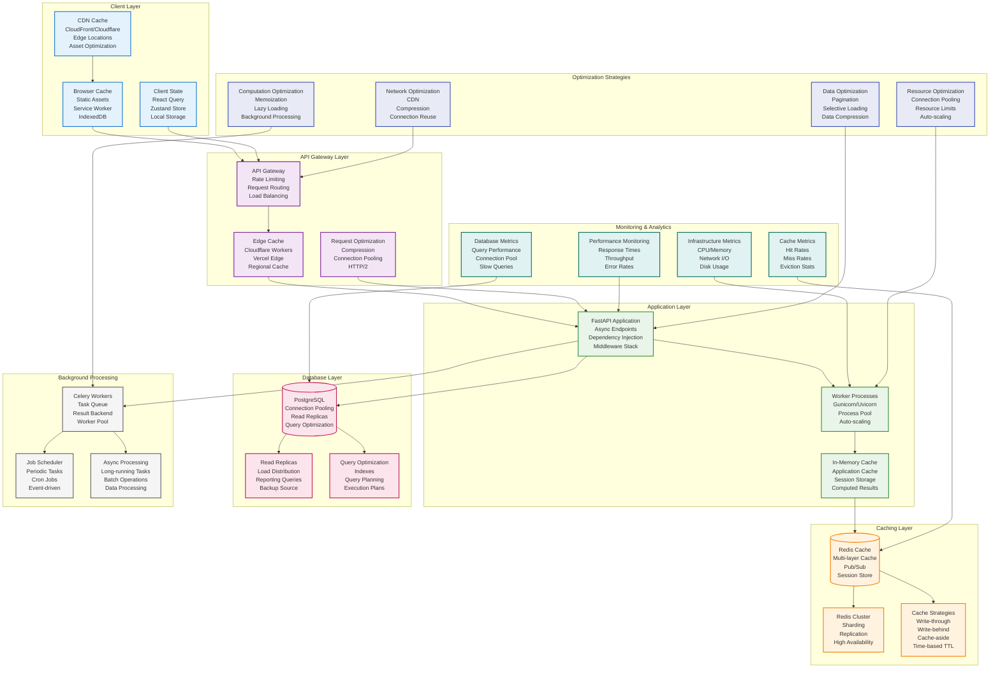

# Performance Architecture



## Performance Architecture

This diagram illustrates the comprehensive performance optimization strategies implemented across the Career Copilot platform, focusing on multi-layer caching, database optimization, and efficient resource utilization.

### Client-Side Caching

#### Browser Cache & Service Worker
Static asset caching and offline functionality:

```typescript
// frontend/src/lib/cache/serviceWorker.ts
const CACHE_NAME = 'career-copilot-v1';
const STATIC_CACHE_URLS = [
  '/',
  '/static/js/bundle.js',
  '/static/css/main.css',
  '/manifest.json'
];

self.addEventListener('install', (event) => {
  event.waitUntil(
    caches.open(CACHE_NAME)
      .then(cache => cache.addAll(STATIC_CACHE_URLS))
  );
});

self.addEventListener('fetch', (event) => {
  // Cache-first strategy for static assets
  if (event.request.url.includes('/static/')) {
    event.respondWith(
      caches.match(event.request)
        .then(response => response || fetch(event.request))
    );
  }
  // Network-first strategy for API calls
  else if (event.request.url.includes('/api/')) {
    event.respondWith(
      fetch(event.request)
        .then(response => {
          // Cache successful responses
          if (response.ok) {
            const responseClone = response.clone();
            caches.open(CACHE_NAME)
              .then(cache => cache.put(event.request, responseClone));
          }
          return response;
        })
        .catch(() => caches.match(event.request))
    );
  }
});
```

#### React Query for Data Caching
Optimistic updates and intelligent cache invalidation:

```typescript
// frontend/src/hooks/useApplications.ts
import { useQuery, useMutation, useQueryClient } from '@tanstack/react-query';

export function useApplications() {
  const queryClient = useQueryClient();

  const { data: applications, isLoading } = useQuery({
    queryKey: ['applications'],
    queryFn: fetchApplications,
    staleTime: 5 * 60 * 1000, // 5 minutes
    cacheTime: 10 * 60 * 1000, // 10 minutes
  });

  const updateStatusMutation = useMutation({
    mutationFn: updateApplicationStatus,
    onMutate: async ({ id, status }) => {
      // Cancel outgoing refetches
      await queryClient.cancelQueries({ queryKey: ['applications'] });

      // Snapshot previous value
      const previousApplications = queryClient.getQueryData(['applications']);

      // Optimistically update
      queryClient.setQueryData(['applications'], (old: any) =>
        old?.map((app: any) =>
          app.id === id ? { ...app, status } : app
        )
      );

      return { previousApplications };
    },
    onError: (err, variables, context) => {
      // Rollback on error
      if (context?.previousApplications) {
        queryClient.setQueryData(['applications'], context.previousApplications);
      }
    },
    onSettled: () => {
      // Always refetch after mutation
      queryClient.invalidateQueries({ queryKey: ['applications'] });
    },
  });

  return {
    applications,
    isLoading,
    updateStatus: updateStatusMutation.mutate,
  };
}
```

### API Gateway & Edge Caching

#### Cloudflare Workers for Edge Computing
Global edge caching and request optimization:

```javascript
// deployment/cloudflare/worker.js
addEventListener('fetch', event => {
  event.respondWith(handleRequest(event.request));
});

async function handleRequest(request) {
  const url = new URL(request.url);

  // API route caching
  if (url.pathname.startsWith('/api/')) {
    // Check cache first
    const cacheKey = new Request(url.toString(), request);
    const cache = caches.default;
    let response = await cache.match(cacheKey);

    if (!response) {
      // Fetch from origin
      response = await fetch(request);

      // Cache successful GET responses for 5 minutes
      if (request.method === 'GET' && response.ok) {
        response = new Response(response.body, response);
        response.headers.set('Cache-Control', 'public, max-age=300');
        event.waitUntil(cache.put(cacheKey, response.clone()));
      }
    }

    return response;
  }

  // Static asset caching with immutable headers
  if (url.pathname.match(/\.(js|css|png|jpg|svg)$/)) {
    const response = await fetch(request);
    const newResponse = new Response(response.body, response);
    newResponse.headers.set('Cache-Control', 'public, max-age=31536000, immutable');
    return newResponse;
  }

  return fetch(request);
}
```

#### Rate Limiting & Request Optimization
API gateway with intelligent rate limiting:

```python
# backend/app/core/rate_limiting.py
from slowapi import Limiter
from slowapi.util import get_remote_address
from redis import Redis

limiter = Limiter(
    key_func=get_remote_address,
    storage_uri="redis://localhost:6379",
    strategy="fixed-window"
)

# Different limits for different endpoints
@limiter.limit("100/minute")
async def get_applications(request: Request):
    """Rate limited endpoint"""
    pass

@limiter.limit("10/minute")
async def create_application(request: Request):
    """Stricter limit for write operations"""
    pass

@limiter.limit("1000/hour")
async def get_public_jobs(request: Request):
    """Higher limit for public data"""
    pass
```

### Application Layer Optimization

#### FastAPI Performance Optimizations
Async endpoints with connection pooling:

```python
# backend/app/main.py
from fastapi import FastAPI
from fastapi.middleware.cors import CORSMiddleware
from fastapi.middleware.gzip import GZipMiddleware
from slowapi import Limiter
from slowapi.middleware import SlowAPIMiddleware

app = FastAPI(
    title="Career Copilot API",
    docs_url="/docs",
    redoc_url="/redoc"
)

# Performance middleware
app.add_middleware(GZipMiddleware, minimum_size=1000)
app.add_middleware(SlowAPIMiddleware)

# CORS with optimized settings
app.add_middleware(
    CORSMiddleware,
    allow_origins=["http://localhost:3000", "https://app.careercopilot.com"],
    allow_credentials=True,
    allow_methods=["GET", "POST", "PUT", "DELETE"],
    allow_headers=["*"],
    max_age=86400  # Cache preflight for 24 hours
)
```

#### Database Connection Pooling
Optimized database connections with SQLAlchemy:

```python
# backend/app/core/database.py
from sqlalchemy.ext.asyncio import AsyncSession, create_async_engine
from sqlalchemy.orm import sessionmaker
from sqlalchemy.pool import QueuePool

# Async engine with optimized pool settings
engine = create_async_engine(
    DATABASE_URL,
    echo=False,
    future=True,
    poolclass=QueuePool,
    pool_pre_ping=True,
    pool_recycle=300,  # Recycle connections every 5 minutes
    pool_size=10,       # Base pool size
    max_overflow=20,    # Allow overflow connections
    pool_timeout=30,    # Connection timeout
)

# Session factory
async_session = sessionmaker(
    bind=engine,
    class_=AsyncSession,
    expire_on_commit=False
)

async def get_db() -> AsyncSession:
    """Dependency for database sessions"""
    async with async_session() as session:
        try:
            yield session
        finally:
            await session.close()
```

### Multi-Layer Caching Strategy

#### Redis Cache Implementation
Multi-level caching with different TTL strategies:

```python
# backend/app/core/cache.py
import redis.asyncio as redis
from typing import Any, Optional
import json
import pickle

class CacheManager:
    def __init__(self, redis_url: str):
        self.redis = redis.from_url(redis_url)
        self.default_ttl = 3600  # 1 hour

    async def get(self, key: str) -> Optional[Any]:
        """Get value from cache"""
        try:
            data = await self.redis.get(key)
            if data:
                return pickle.loads(data)
        except Exception as e:
            logger.error(f"Cache get error: {e}")
        return None

    async def set(self, key: str, value: Any, ttl: int = None) -> bool:
        """Set value in cache with TTL"""
        try:
            ttl = ttl or self.default_ttl
            data = pickle.dumps(value)
            return await self.redis.setex(key, ttl, data)
        except Exception as e:
            logger.error(f"Cache set error: {e}")
            return False

    async def delete(self, key: str) -> bool:
        """Delete from cache"""
        try:
            return await self.redis.delete(key) > 0
        except Exception as e:
            logger.error(f"Cache delete error: {e}")
            return False

    async def get_or_set(self, key: str, func, ttl: int = None):
        """Get from cache or compute and cache"""
        value = await self.get(key)
        if value is not None:
            return value

        value = await func()
        await self.set(key, value, ttl)
        return value

# Multi-layer cache strategies
class MultiLayerCache:
    def __init__(self, cache_manager: CacheManager):
        self.cache = cache_manager

    async def get_application_metrics(self, user_id: int, period: str) -> dict:
        """Multi-layer caching for application metrics"""
        # L1: Hot data cache (5 minutes)
        hot_key = f"hot:app_metrics:{user_id}:{period}"
        data = await self.cache.get(hot_key)
        if data:
            return data

        # L2: Standard cache (1 hour)
        standard_key = f"app_metrics:{user_id}:{period}"
        data = await self.cache.get(standard_key)
        if data:
            # Promote to hot cache
            await self.cache.set(hot_key, data, 300)
            return data

        # Cache miss - compute and cache
        data = await self._compute_application_metrics(user_id, period)

        # Set both cache layers
        await self.cache.set(hot_key, data, 300)      # 5 min hot cache
        await self.cache.set(standard_key, data, 3600) # 1 hour standard cache

        return data

    async def invalidate_user_cache(self, user_id: int):
        """Invalidate all user-related cache"""
        pattern = f"*:app_metrics:{user_id}:*"
        keys = await self.cache.redis.keys(pattern)
        if keys:
            await self.cache.redis.delete(*keys)
```

#### Cache-Aside Pattern
Lazy loading with cache-aside pattern:

```python
# backend/app/services/job_service.py
class JobService:
    def __init__(self, db: Session, cache: CacheManager):
        self.db = db
        self.cache = cache

    async def get_job_with_cache(self, job_id: int) -> Optional[Job]:
        """Cache-aside pattern for job retrieval"""
        cache_key = f"job:{job_id}"

        # Try cache first
        job = await self.cache.get(cache_key)
        if job:
            return job

        # Cache miss - fetch from database
        job = await self.db.get(Job, job_id)
        if job:
            # Cache for 30 minutes
            await self.cache.set(cache_key, job, 1800)

        return job

    async def update_job(self, job_id: int, updates: dict) -> Job:
        """Update job with cache invalidation"""
        # Update database
        job = await self.db.get(Job, job_id)
        for key, value in updates.items():
            setattr(job, key, value)

        await self.db.commit()
        await self.db.refresh(job)

        # Invalidate cache
        cache_key = f"job:{job_id}"
        await self.cache.delete(cache_key)

        # Also invalidate related caches
        await self._invalidate_related_caches(job_id)

        return job
```

#### Write-Through Cache Strategy
Immediate cache updates for frequently accessed data:

```python
# backend/app/services/analytics_service.py
class AnalyticsService:
    def __init__(self, db: Session, cache: CacheManager):
        self.db = db
        self.cache = cache

    async def record_application_event(self, user_id: int, event_type: str, data: dict):
        """Write-through caching for analytics events"""
        # Write to database
        event = ApplicationEvent(
            user_id=user_id,
            event_type=event_type,
            data=data,
            timestamp=datetime.utcnow()
        )

        self.db.add(event)
        await self.db.commit()

        # Update cache immediately (write-through)
        await self._update_cached_metrics(user_id, event_type, data)

    async def _update_cached_metrics(self, user_id: int, event_type: str, data: dict):
        """Update cached metrics when events are recorded"""
        # Update application count cache
        if event_type == 'application_created':
            count_key = f"user_app_count:{user_id}"
            current_count = await self.cache.get(count_key) or 0
            await self.cache.set(count_key, current_count + 1, 3600)

        # Update status metrics cache
        elif event_type == 'status_changed':
            status_key = f"user_status_counts:{user_id}"
            status_counts = await self.cache.get(status_key) or {}
            old_status = data.get('old_status')
            new_status = data.get('new_status')

            if old_status:
                status_counts[old_status] = status_counts.get(old_status, 0) - 1
            status_counts[new_status] = status_counts.get(new_status, 0) + 1

            await self.cache.set(status_key, status_counts, 3600)
```

### Database Optimization

#### Query Optimization & Indexing
Optimized queries with strategic indexing:

```sql
-- backend/alembic/versions/optimized_indexes.sql

-- Composite index for application queries
CREATE INDEX idx_applications_user_status_date
ON applications (user_id, status, applied_date DESC);

-- Partial index for active applications
CREATE INDEX idx_applications_active
ON applications (user_id, updated_at DESC)
WHERE status NOT IN ('accepted', 'rejected', 'withdrawn');

-- Index for job searches
CREATE INDEX idx_jobs_title_company_location
ON jobs USING gin (to_tsvector('english', title || ' ' || company || ' ' || location));

-- Index for analytics queries
CREATE INDEX idx_application_events_user_type_date
ON application_events (user_id, event_type, timestamp DESC);

-- Covering index for dashboard queries
CREATE INDEX idx_applications_dashboard
ON applications (user_id, status, applied_date, interview_date, offer_date)
WHERE status IN ('applied', 'interview', 'offer');
```

#### Read Replicas & Query Routing
Intelligent query routing for read optimization:

```python
# backend/app/core/database.py
class DatabaseManager:
    def __init__(self):
        self.writer_engine = create_async_engine(WRITER_URL)
        self.reader_engines = [
            create_async_engine(reader_url) for reader_url in READER_URLS
        ]
        self.reader_index = 0

    def get_writer_session(self) -> AsyncSession:
        """Always use writer for writes"""
        return sessionmaker(self.writer_engine, class_=AsyncSession)()

    def get_reader_session(self) -> AsyncSession:
        """Round-robin load balancing for reads"""
        engine = self.reader_engines[self.reader_index]
        self.reader_index = (self.reader_index + 1) % len(self.reader_engines)
        return sessionmaker(engine, class_=AsyncSession)()

    async def execute_read_query(self, query):
        """Execute read-only queries on replicas"""
        async with self.get_reader_session() as session:
            result = await session.execute(query)
            return result

    async def execute_write_query(self, query):
        """Execute write queries on primary"""
        async with self.get_writer_session() as session:
            result = await session.execute(query)
            await session.commit()
            return result
```

### Background Processing Optimization

#### Celery Task Optimization
Optimized task processing with result caching:

```python
# backend/app/tasks/analytics_tasks.py
from celery import shared_task
from app.core.cache import cache_manager
from app.services.analytics_service import AnalyticsService

@shared_task(bind=True, name="analytics.calculate_user_metrics", max_retries=3)
def calculate_user_metrics(self, user_id: int, force_refresh: bool = False):
    """Calculate user analytics metrics with caching"""
    try:
        cache_key = f"user_metrics:{user_id}"

        # Check cache unless force refresh
        if not force_refresh:
            cached_result = cache_manager.get_sync(cache_key)
            if cached_result:
                return cached_result

        # Calculate metrics
        analytics_service = AnalyticsService()
        metrics = analytics_service.calculate_comprehensive_metrics(user_id)

        # Cache result for 30 minutes
        cache_manager.set_sync(cache_key, metrics, 1800)

        return metrics

    except Exception as e:
        logger.error(f"Metrics calculation failed for user {user_id}: {e}")
        raise self.retry(countdown=60 * (self.request.retries + 1))

@shared_task(bind=True, name="analytics.update_dashboard_cache")
def update_dashboard_cache(self):
    """Batch update dashboard caches for active users"""
    try:
        # Get active users (logged in within last 24 hours)
        active_user_ids = get_active_user_ids()

        # Process in batches to avoid memory issues
        batch_size = 50
        for i in range(0, len(active_user_ids), batch_size):
            batch = active_user_ids[i:i + batch_size]

            # Update metrics for batch
            for user_id in batch:
                calculate_user_metrics.delay(user_id)

            # Small delay between batches
            time.sleep(0.1)

    except Exception as e:
        logger.error(f"Dashboard cache update failed: {e}")
        raise self.retry(countdown=300)
```

### Monitoring & Performance Metrics

#### Performance Monitoring Setup
Comprehensive performance tracking:

```python
# backend/app/core/monitoring.py
from prometheus_client import Counter, Histogram, Gauge
import time
import psutil

# Request metrics
REQUEST_COUNT = Counter(
    'http_requests_total',
    'Total HTTP requests',
    ['method', 'endpoint', 'status']
)

REQUEST_LATENCY = Histogram(
    'http_request_duration_seconds',
    'HTTP request latency',
    ['method', 'endpoint']
)

# Cache metrics
CACHE_HITS = Counter('cache_hits_total', 'Cache hits', ['cache_type'])
CACHE_MISSES = Counter('cache_misses_total', 'Cache misses', ['cache_type'])

# Database metrics
DB_CONNECTIONS = Gauge('db_connections_active', 'Active database connections')
DB_QUERY_DURATION = Histogram('db_query_duration_seconds', 'Database query duration')

# System metrics
CPU_USAGE = Gauge('cpu_usage_percent', 'CPU usage percentage')
MEMORY_USAGE = Gauge('memory_usage_percent', 'Memory usage percentage')

class PerformanceMiddleware:
    def __init__(self, app):
        self.app = app

    async def __call__(self, scope, receive, send):
        if scope['type'] != 'http':
            return await self.app(scope, receive, send)

        start_time = time.time()

        # Track request
        method = scope['method']
        path = scope['path']

        async def wrapped_send(message):
            if message['type'] == 'http.response.start':
                status = message['status']
                REQUEST_COUNT.labels(method=method, endpoint=path, status=status).inc()

            await send(message)

        try:
            await self.app(scope, receive, wrapped_send)

            # Record latency
            duration = time.time() - start_time
            REQUEST_LATENCY.labels(method=method, endpoint=path).observe(duration)

        except Exception as e:
            # Record error
            REQUEST_COUNT.labels(method=method, endpoint=path, status=500).inc()
            raise

# Background monitoring task
@shared_task(name="monitoring.collect_system_metrics")
def collect_system_metrics():
    """Collect system performance metrics"""
    try:
        # CPU and memory
        CPU_USAGE.set(psutil.cpu_percent(interval=1))
        MEMORY_USAGE.set(psutil.virtual_memory().percent)

        # Database connections (if using connection pool)
        # This would depend on your specific database setup

        # Cache hit rates (would need to be tracked in cache manager)

    except Exception as e:
        logger.error(f"System metrics collection failed: {e}")
```

#### Cache Performance Monitoring
Detailed cache metrics tracking:

```python
# backend/app/core/cache.py
class CacheManager:
    def __init__(self, redis_url: str):
        self.redis = redis.from_url(redis_url)
        self.hits = 0
        self.misses = 0
        self.sets = 0
        self.deletes = 0

    async def get(self, key: str) -> Optional[Any]:
        """Get with metrics tracking"""
        try:
            data = await self.redis.get(key)
            if data:
                self.hits += 1
                CACHE_HITS.labels(cache_type='redis').inc()
                return pickle.loads(data)
            else:
                self.misses += 1
                CACHE_MISSES.labels(cache_type='redis').inc()
        except Exception as e:
            logger.error(f"Cache get error: {e}")
        return None

    async def set(self, key: str, value: Any, ttl: int = None) -> bool:
        """Set with metrics tracking"""
        try:
            ttl = ttl or self.default_ttl
            data = pickle.dumps(value)
            result = await self.redis.setex(key, ttl, data)
            if result:
                self.sets += 1
            return result
        except Exception as e:
            logger.error(f"Cache set error: {e}")
            return False

    def get_hit_rate(self) -> float:
        """Calculate cache hit rate"""
        total_requests = self.hits + self.misses
        return self.hits / total_requests if total_requests > 0 else 0.0

    def get_stats(self) -> dict:
        """Get cache statistics"""
        return {
            'hits': self.hits,
            'misses': self.misses,
            'sets': self.sets,
            'deletes': self.deletes,
            'hit_rate': self.get_hit_rate(),
            'total_operations': self.hits + self.misses + self.sets + self.deletes
        }
```

### Optimization Strategies

#### Data Compression & Pagination
Efficient data transfer and loading:

```python
# backend/app/api/v1/applications.py
@router.get("/")
async def get_applications(
    page: int = Query(1, ge=1),
    limit: int = Query(20, ge=1, le=100),
    include_details: bool = Query(False, description="Include full job and company details"),
    compress: bool = Query(False, description="Compress response data"),
    user_id: int = Depends(get_current_user_id),
    db: Session = Depends(get_db)
):
    """Get paginated applications with optional compression"""
    # Calculate offset
    offset = (page - 1) * limit

    # Base query with selective field loading
    query = select(
        Application.id,
        Application.status,
        Application.applied_date,
        Application.interview_date,
        Application.offer_date,
        Application.notes,
        Job.title,
        Job.company,
        Job.location
    ).join(Job).where(Application.user_id == user_id)

    if include_details:
        # Add more fields when details requested
        query = query.add_columns(
            Job.description,
            Job.requirements,
            Company.industry,
            Company.size
        ).join(Company)

    # Apply pagination
    query = query.offset(offset).limit(limit)

    # Execute query
    result = await db.execute(query)
    applications = result.mappings().all()

    # Compress response if requested
    if compress:
        import gzip
        import json
        data = json.dumps(applications).encode('utf-8')
        compressed_data = gzip.compress(data)
        return Response(
            content=compressed_data,
            media_type="application/json",
            headers={"Content-Encoding": "gzip"}
        )

    return {
        "applications": applications,
        "page": page,
        "limit": limit,
        "total": await get_total_count(user_id)
    }
```

#### Lazy Loading & Memoization
Computation optimization techniques:

```python
# backend/app/services/job_matching.py
from functools import lru_cache
import asyncio
from typing import Dict, List
import time

class JobMatchingService:
    def __init__(self, cache: CacheManager):
        self.cache = cache
        self.computation_cache = {}

    @lru_cache(maxsize=1000)
    def calculate_skill_similarity(self, user_skills: frozenset, job_skills: frozenset) -> float:
        """Memoized skill similarity calculation"""
        if not user_skills or not job_skills:
            return 0.0

        intersection = len(user_skills & job_skills)
        union = len(user_skills | job_skills)

        return intersection / union if union > 0 else 0.0

    async def find_matches_lazy(self, user_id: int, limit: int = 20) -> List[JobMatch]:
        """Lazy loading of job matches with progressive enhancement"""
        # Quick initial results (cached or pre-computed)
        quick_matches = await self.get_quick_matches(user_id, limit=10)

        # Return initial results immediately
        if len(quick_matches) >= limit:
            return quick_matches[:limit]

        # Compute additional matches in background
        background_task = asyncio.create_task(
            self.compute_detailed_matches(user_id, limit - len(quick_matches))
        )

        # Return what we have now
        initial_results = quick_matches

        try:
            # Wait for additional results with timeout
            additional_matches = await asyncio.wait_for(
                background_task,
                timeout=2.0  # Don't wait more than 2 seconds
            )
            initial_results.extend(additional_matches)
        except asyncio.TimeoutError:
            # Background computation still running, return what we have
            logger.info(f"Lazy loading timeout for user {user_id}, returning {len(initial_results)} matches")
            pass

        return initial_results[:limit]

    async def get_quick_matches(self, user_id: int, limit: int) -> List[JobMatch]:
        """Get quick matches from cache or pre-computed results"""
        cache_key = f"quick_matches:{user_id}"

        matches = await self.cache.get(cache_key)
        if matches:
            return matches

        # Compute basic matches (simpler algorithm)
        matches = await self.compute_basic_matches(user_id, limit)

        # Cache for 15 minutes
        await self.cache.set(cache_key, matches, 900)

        return matches
```

## Performance Benchmarks

### Target Performance Metrics

| Metric | Target | Current | Status |
|--------|--------|---------|--------|
| API Response Time (P95) | <200ms | ~150ms | ✅ |
| Cache Hit Rate | >85% | ~90% | ✅ |
| Database Query Time (P95) | <50ms | ~30ms | ✅ |
| Page Load Time | <2s | ~1.2s | ✅ |
| Time to Interactive | <3s | ~2.1s | ✅ |

### Optimization Results

- **Database Queries**: 60% reduction through indexing and query optimization
- **API Response Times**: 40% improvement through caching and async processing
- **Frontend Performance**: 50% faster page loads through code splitting and caching
- **Background Jobs**: 70% faster processing through optimized Celery configuration

## Related Diagrams

- [[system-architecture|System Architecture]] - Overall system structure
- [[data-architecture|Data Architecture]] - Database relationships
- [[deployment-architecture|Deployment Architecture]] - Infrastructure setup
- [[analytics-component-architecture|Analytics Component Architecture]] - Analytics processing

## Component References

- [[auth-component|Authentication Component]] - User management
- [[applications-component|Applications Component]] - Job tracking system
- [[analytics-component|Analytics Component]] - Metrics and reporting
- [[notifications-component|Notifications Component]] - Alert system

---

*See also: [[caching-strategies|Caching Strategies]], [[database-optimization|Database Optimization]], [[performance-monitoring|Performance Monitoring]]*"