# System Architecture Overview

```mermaid
graph TB
    %% External Interfaces
    subgraph "External Interfaces"
        WEB[Web Browser<br/>Next.js Frontend]
        API[REST API<br/>FastAPI Backend]
        WS[WebSocket<br/>Real-time Updates]
        EMAIL[Email Service<br/>SMTP/SendGrid]
    end

    %% Frontend Layer
    subgraph "Frontend Layer (Next.js 15)"
        UI[User Interface<br/>React Components]
        STATE[State Management<br/>Context + Hooks]
        API_CLIENT[API Client<br/>HTTP/WebSocket]
        ROUTING[App Router<br/>File-based Routing]
    end

    %% Backend Layer
    subgraph "Backend Layer (FastAPI)"
        AUTH[Authentication<br/>JWT/OAuth]
        API_ROUTES[API Routes<br/>REST Endpoints]
        WS_HANDLER[WebSocket Handler<br/>Real-time Events]
        MIDDLEWARE[Middleware<br/>CORS/Auth/Logging]
    end

    %% Service Layer
    subgraph "Service Layer"
        AUTH_SVC[Auth Service<br/>User Management]
        APP_SVC[Application Service<br/>Job Tracking]
        ANALYTICS_SVC[Analytics Service<br/>Metrics & Reporting]
        NOTIF_SVC[Notification Service<br/>Alerts & Updates]
        JOB_SVC[Job Service<br/>Scraping & Matching]
        LLM_SVC[LLM Service<br/>AI Content Generation]
    end

    %% Data Layer
    subgraph "Data Layer"
        POSTGRES[(PostgreSQL<br/>Main Database)]
        REDIS[(Redis<br/>Cache & Sessions)]
        CHROMA[(ChromaDB<br/>Vector Embeddings)]
    end

    %% Background Processing
    subgraph "Background Processing (Celery)"
        JOB_SCRAPER[Job Scraping<br/>9 Job Boards]
        EMAIL_WORKER[Email Worker<br/>Notifications]
        ANALYTICS_WORKER[Analytics Worker<br/>Data Processing]
        LLM_WORKER[LLM Worker<br/>Content Generation]
    end

    %% External Services
    subgraph "External Services"
        LINKEDIN[LinkedIn API<br/>Profile Data]
        GOOGLE[Google OAuth<br/>Authentication]
        OPENAI[OpenAI API<br/>AI Services]
        GMAIL[Gmail API<br/>Email Integration]
        SENDGRID[SendGrid<br/>Email Delivery]
    end

    %% Connections
    WEB --> UI
    UI --> API_CLIENT
    API_CLIENT --> API
    API_CLIENT --> WS

    API --> AUTH
    API --> API_ROUTES
    WS --> WS_HANDLER

    API_ROUTES --> AUTH_SVC
    API_ROUTES --> APP_SVC
    API_ROUTES --> ANALYTICS_SVC
    API_ROUTES --> NOTIF_SVC
    API_ROUTES --> JOB_SVC
    API_ROUTES --> LLM_SVC

    AUTH_SVC --> POSTGRES
    APP_SVC --> POSTGRES
    ANALYTICS_SVC --> POSTGRES
    NOTIF_SVC --> POSTGRES
    JOB_SVC --> POSTGRES
    LLM_SVC --> POSTGRES

    ANALYTICS_SVC --> REDIS
    NOTIF_SVC --> REDIS
    LLM_SVC --> CHROMA

    JOB_SCRAPER --> POSTGRES
    EMAIL_WORKER --> EMAIL
    ANALYTICS_WORKER --> POSTGRES
    LLM_WORKER --> OPENAI

    AUTH_SVC --> GOOGLE
    EMAIL_WORKER --> SENDGRID
    LLM_SVC --> OPENAI

    %% Clickable links to component references
    click AUTH_SVC "docs/components/auth-component.md" "Authentication Component"
    click ANALYTICS_SVC "docs/components/analytics-component.md" "Analytics Component"
    click APP_SVC "docs/components/applications-component.md" "Applications Component"
    click NOTIF_SVC "docs/components/notifications-component.md" "Notifications Component"

    %% Styling
    classDef frontend fill:#e1f5fe,stroke:#01579b,stroke-width:2px
    classDef backend fill:#f3e5f5,stroke:#4a148c,stroke-width:2px
    classDef service fill:#e8f5e8,stroke:#1b5e20,stroke-width:2px
    classDef data fill:#fff3e0,stroke:#e65100,stroke-width:2px
    classDef external fill:#fce4ec,stroke:#880e4f,stroke-width:2px
    classDef processing fill:#f3e5f5,stroke:#4a148c,stroke-width:2px

    class WEB,UI,STATE,API_CLIENT,ROUTING frontend
    class API,AUTH,API_ROUTES,WS_HANDLER,MIDDLEWARE backend
    class AUTH_SVC,APP_SVC,ANALYTICS_SVC,NOTIF_SVC,JOB_SVC,LLM_SVC service
    class POSTGRES,REDIS,CHROMA data
    class JOB_SCRAPER,EMAIL_WORKER,ANALYTICS_WORKER,LLM_WORKER processing
    class LINKEDIN,GOOGLE,OPENAI,GMAIL,SENDGRID external
```

## Architecture Overview

This diagram shows the high-level architecture of the Career Copilot system, a comprehensive AI-powered job application tracking platform.

### Key Components

- **Frontend**: Next.js 15 with App Router, React components, and real-time WebSocket connections
- **Backend**: FastAPI with async endpoints, JWT authentication, and middleware stack
- **Services**: Modular service layer handling business logic for auth, applications, analytics, and notifications
- **Data Layer**: PostgreSQL for relational data, Redis for caching, ChromaDB for vector embeddings
- **Background Processing**: Celery workers for job scraping, email delivery, and AI content generation
- **External Services**: Integration with LinkedIn, Google OAuth, OpenAI, and email providers

### Data Flow

1. **User Interaction**: Frontend components handle user input and display data
2. **API Communication**: RESTful APIs and WebSocket connections for real-time updates
3. **Business Logic**: Service layer processes requests and manages data operations
4. **Data Persistence**: Multiple storage systems for different data types and access patterns
5. **Background Tasks**: Asynchronous processing for resource-intensive operations
6. **External Integration**: API calls to third-party services for enhanced functionality

### Scalability Considerations

- **Horizontal Scaling**: Stateless services can be scaled independently
- **Caching Layer**: Redis provides fast access to frequently requested data
- **Background Jobs**: Celery distributes processing load across worker instances
- **Database Optimization**: Connection pooling and query optimization for high throughput

### Security Architecture

- **Authentication**: JWT tokens with OAuth integration for secure user sessions
- **Authorization**: Role-based access control with service-level permissions
- **Data Protection**: Encryption at rest and in transit, input validation
- **API Security**: Rate limiting, CORS configuration, and request validation

## Related Diagrams

- [[authentication-architecture|Authentication Architecture]] - Detailed auth flow
- [[data-architecture|Data Architecture]] - Database relationships and schemas
- [[api-architecture|API Architecture]] - Endpoint organization and patterns
- [[deployment-architecture|Deployment Architecture]] - Infrastructure and scaling

## Component References

- [[auth-component|Authentication Component]] - User management and OAuth
- [[analytics-component|Analytics Component]] - Metrics and reporting
- [[applications-component|Applications Component]] - Job tracking system
- [[notifications-component|Notifications Component]] - Real-time alerts

---

*Click on any service box in the diagram above to view detailed component documentation.*