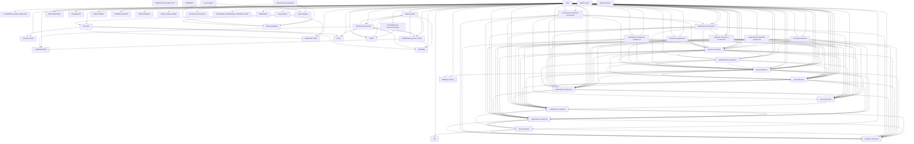

# WikiLink Network Graph

```mermaid
graph TD
    INSTALLATION["INSTALLATION"]
    PRODUCTION_CHECKLIST["PRODUCTION_CHECKLIST"]
    performance_architecture["performance-architecture"]
    FRONTEND_ISSUES_ANALYSIS["FRONTEND_ISSUES_ANALYSIS"]
    jobs_component["jobs-component"]
    RUNBOOK["RUNBOOK"]
    USER_GUIDE["USER_GUIDE"]
    api_architecture["api-architecture"]
    security_architecture["security-architecture"]
    FRONTEND_QUICK_START["FRONTEND_QUICK_START"]
    analytics_component["analytics-component"]
    adr_index["adr-index"]
    auth_component["auth-component"]
    ARCHITECTURE["ARCHITECTURE"]
    code_examples["code-examples"]
    CONFIGURATION["CONFIGURATION"]
    ARCHITECTURE["ARCHITECTURE"]
    deployment_architecture["deployment-architecture"]
    DEVELOPER_GUIDE["DEVELOPER_GUIDE"]
    CHANGELOG["CHANGELOG"]
    automated_documentation["automated-documentation"]
    analytics_component_architecture["analytics-component-architecture"]
    microservices_migration_architecture["microservices-migration-architecture"]
    applications_component["applications-component"]
    API["API"]
    CONTRIBUTING["CONTRIBUTING"]
    database_schema["database-schema"]
    authentication_architecture["authentication-architecture"]
    notifications_component["notifications-component"]
    PLAN["PLAN"]
    testing_strategies["testing-strategies"]
    DEPLOYMENT["DEPLOYMENT"]
    API["API"]
    TODO["TODO"]
    how_to_guides["how-to-guides"]
    applications_component_architecture["applications-component-architecture"]
    data_architecture["data-architecture"]
    index["index"]
    adr_index["adr-index"]
    README["README"]
    COMMON_ISSUES["COMMON_ISSUES"]
    DEVELOPMENT["DEVELOPMENT"]
    system_architecture["system-architecture"]
    index["index"]
    DEMO_VIDEO_GUIDE["DEMO_VIDEO_GUIDE"]
    knowledge_base_enhancement_plan["knowledge-base-enhancement-plan"]
    INSTALLATION["INSTALLATION"]
    README["README"]
    code_patterns["code-patterns"]
    notifications_component_architecture["notifications-component-architecture"]
    maintenance_guidelines["maintenance-guidelines"]
    wikilink_report["wikilink-report"]
    wikilink_network["wikilink-network"]
    workflow_documentation["workflow-documentation"]
    FRONTEND_ENTERPRISE_UPGRADE_PLAN["FRONTEND_ENTERPRISE_UPGRADE_PLAN"]
    RESEARCH["RESEARCH"]
    knowledge_base_enhancement_plan --> TODO
    USER_GUIDE --> README
    USER_GUIDE --> TODO
    USER_GUIDE --> DEVELOPER_GUIDE
    USER_GUIDE --> FRONTEND_QUICK_START
    FRONTEND_QUICK_START --> README
    FRONTEND_QUICK_START --> CONTRIBUTING
    FRONTEND_QUICK_START --> DEVELOPER_GUIDE
    FRONTEND_QUICK_START --> USER_GUIDE
    index --> README
    index --> TODO
    index --> PLAN
    index --> RESEARCH
    index --> CHANGELOG
    index --> CONTRIBUTING
    index --> knowledge_base_enhancement_plan
    index --> jobs_component
    index --> USER_GUIDE
    index --> DEMO_VIDEO_GUIDE
    index --> DEVELOPER_GUIDE
    index --> FRONTEND_QUICK_START
    index --> FRONTEND_ENTERPRISE_UPGRADE_PLAN
    index --> FRONTEND_ISSUES_ANALYSIS
    index --> code_patterns
    index --> API
    index --> ARCHITECTURE
    index --> database_schema
    index --> DEVELOPMENT
    index --> DEPLOYMENT
    index --> INSTALLATION
    index --> CONFIGURATION
    index --> COMMON_ISSUES
    index --> adr_index
    DEVELOPER_GUIDE --> README
    DEVELOPER_GUIDE --> TODO
    DEVELOPER_GUIDE --> PLAN
    DEVELOPER_GUIDE --> CONTRIBUTING
    DEVELOPER_GUIDE --> USER_GUIDE
    DEVELOPER_GUIDE --> FRONTEND_QUICK_START
    code_examples --> testing_strategies
    automated_documentation --> code_examples
    automated_documentation --> testing_strategies
    automated_documentation --> workflow_documentation
    how_to_guides --> code_examples
    how_to_guides --> testing_strategies
    code_patterns --> ARCHITECTURE
    code_patterns --> adr_index
    testing_strategies --> code_examples
    adr_index --> ARCHITECTURE
    adr_index --> INSTALLATION
    adr_index --> README
    adr_index --> PLAN
    analytics_component --> jobs_component
    analytics_component --> applications_component
    auth_component --> notifications_component
    notifications_component --> applications_component
    notifications_component --> jobs_component
    notifications_component --> analytics_component
    applications_component --> jobs_component
    applications_component --> analytics_component
    applications_component --> notifications_component
    jobs_component --> applications_component
    jobs_component --> analytics_component
    jobs_component --> API
    data_architecture --> system_architecture
    data_architecture --> authentication_architecture
    data_architecture --> api_architecture
    data_architecture --> deployment_architecture
    data_architecture --> auth_component
    data_architecture --> applications_component
    data_architecture --> analytics_component
    data_architecture --> notifications_component
    data_architecture --> database_schema
    security_architecture --> system_architecture
    security_architecture --> authentication_architecture
    security_architecture --> data_architecture
    security_architecture --> deployment_architecture
    security_architecture --> auth_component
    security_architecture --> applications_component
    security_architecture --> analytics_component
    security_architecture --> notifications_component
    api_architecture --> system_architecture
    api_architecture --> data_architecture
    api_architecture --> authentication_architecture
    api_architecture --> deployment_architecture
    api_architecture --> auth_component
    api_architecture --> applications_component
    api_architecture --> analytics_component
    api_architecture --> notifications_component
    system_architecture --> authentication_architecture
    system_architecture --> data_architecture
    system_architecture --> api_architecture
    system_architecture --> deployment_architecture
    system_architecture --> auth_component
    system_architecture --> analytics_component
    system_architecture --> applications_component
    system_architecture --> notifications_component
    applications_component_architecture --> system_architecture
    applications_component_architecture --> data_architecture
    applications_component_architecture --> api_architecture
    applications_component_architecture --> deployment_architecture
    applications_component_architecture --> auth_component
    applications_component_architecture --> applications_component
    applications_component_architecture --> analytics_component
    applications_component_architecture --> notifications_component
    analytics_component_architecture --> system_architecture
    analytics_component_architecture --> data_architecture
    analytics_component_architecture --> api_architecture
    analytics_component_architecture --> deployment_architecture
    analytics_component_architecture --> auth_component
    analytics_component_architecture --> applications_component
    analytics_component_architecture --> notifications_component
    deployment_architecture --> system_architecture
    deployment_architecture --> api_architecture
    deployment_architecture --> data_architecture
    deployment_architecture --> authentication_architecture
    deployment_architecture --> auth_component
    deployment_architecture --> applications_component
    deployment_architecture --> analytics_component
    deployment_architecture --> notifications_component
    index --> system_architecture
    index --> data_architecture
    index --> api_architecture
    index --> authentication_architecture
    index --> analytics_component_architecture
    index --> applications_component_architecture
    index --> notifications_component_architecture
    index --> deployment_architecture
    index --> performance_architecture
    index --> security_architecture
    index --> microservices_migration_architecture
    index --> system_architecture
    index --> data_architecture
    index --> api_architecture
    index --> authentication_architecture
    index --> performance_architecture
    index --> security_architecture
    index --> microservices_migration_architecture
    index --> deployment_architecture
    index --> auth_component
    index --> applications_component
    index --> analytics_component
    index --> notifications_component
    index --> api_architecture
    index --> data_architecture
    index --> authentication_architecture
    index --> deployment_architecture
    index --> system_architecture
    index --> analytics_component_architecture
    index --> notifications_component_architecture
    index --> api_architecture
    index --> data_architecture
    index --> maintenance_guidelines
    index --> maintenance_guidelines
    authentication_architecture --> auth_component
    authentication_architecture --> system_architecture
    authentication_architecture --> data_architecture
    authentication_architecture --> api_architecture
    performance_architecture --> system_architecture
    performance_architecture --> data_architecture
    performance_architecture --> deployment_architecture
    performance_architecture --> analytics_component_architecture
    performance_architecture --> auth_component
    performance_architecture --> applications_component
    performance_architecture --> analytics_component
    performance_architecture --> notifications_component
    notifications_component_architecture --> system_architecture
    notifications_component_architecture --> api_architecture
    notifications_component_architecture --> data_architecture
    notifications_component_architecture --> deployment_architecture
    notifications_component_architecture --> auth_component
    notifications_component_architecture --> applications_component
    notifications_component_architecture --> analytics_component
    maintenance_guidelines --> system_architecture
    maintenance_guidelines --> data_architecture
    maintenance_guidelines --> system_architecture
    microservices_migration_architecture --> system_architecture
    microservices_migration_architecture --> data_architecture
    microservices_migration_architecture --> deployment_architecture
    microservices_migration_architecture --> performance_architecture
    microservices_migration_architecture --> auth_component
    microservices_migration_architecture --> applications_component
    microservices_migration_architecture --> analytics_component
    microservices_migration_architecture --> notifications_component

```
