```mermaid
graph TD
    index["index"]
    app["app"]
    feature_flags["feature_flags"]
    .env[".env"]
    INSTALLATION["INSTALLATION"]
    job_services_architecture["job-services-architecture"]
    Dashboard.contrast_verification["Dashboard.contrast-verification"]
    docker_compose["docker-compose"]
    nginx["nginx"]
    JOB_DATA_SOURCES["JOB_DATA_SOURCES"]
    USER_GUIDE["USER_GUIDE"]
    database_schema["database-schema"]
    database["database"]
    cspell["cspell"]
    cleanup["cleanup"]
    ruff["ruff"]
    workflow_documentation["workflow-documentation"]
    .env[".env"]
    code_patterns["code-patterns"]
    README["README"]
    tsconfig["tsconfig"]
    TESTING_NOTES["TESTING_NOTES"]
    Dashboard.implementation_summary["Dashboard.implementation-summary"]
    INTEGRATION_GUIDE["INTEGRATION_GUIDE"]
    data_architecture["data-architecture"]
    eslint.config["eslint.config"]
    performance_architecture["performance-architecture"]
    pyproject["pyproject"]
    copilot_instructions["copilot-instructions"]
    DEMO_VIDEO_GUIDE["DEMO_VIDEO_GUIDE"]
    ARCHITECTURE["ARCHITECTURE"]
    setup["setup"]
    testing_strategies["testing-strategies"]
    components["components"]
    DARK_MODE_VERIFICATION["DARK_MODE_VERIFICATION"]
    security_architecture["security-architecture"]
    API["API"]
    api_architecture["api-architecture"]
    services["services"]
    security["security"]
    RUNBOOK["RUNBOOK"]
    COMMON_ISSUES["COMMON_ISSUES"]
    adr_index["adr-index"]
    CONFIGURATION["CONFIGURATION"]
    Card2.before_after["Card2.before-after"]
    INTEGRATION_GUIDE["INTEGRATION_GUIDE"]
    FRONTEND_QUICK_START["FRONTEND_QUICK_START"]
    DARK_MODE_TEST_REPORT["DARK_MODE_TEST_REPORT"]
    USAGE_EXAMPLES["USAGE_EXAMPLES"]
    QUICK_START["QUICK_START"]
    reporting["reporting"]
    INTEGRATION_GUIDE["INTEGRATION_GUIDE"]
    CONTRIBUTING["CONTRIBUTING"]
    CONTEXTUAL_HELP_INTEGRATION_GUIDE["CONTEXTUAL_HELP_INTEGRATION_GUIDE"]
    README_GAP_ANALYSIS["README_GAP_ANALYSIS"]
    testing["testing"]
    Card2.implementation_summary["Card2.implementation-summary"]
    Dockerfile["Dockerfile"]
    PROJECT_STATUS["PROJECT_STATUS"]
    test_all_endpoints["test_all_endpoints"]
    analytics["analytics"]
    LOCAL_SETUP["LOCAL_SETUP"]
    DARK_MODE_MANUAL_TEST_CHECKLIST["DARK_MODE_MANUAL_TEST_CHECKLIST"]
    llm_config["llm_config"]
    application["application"]
    DEVELOPER_GUIDE["DEVELOPER_GUIDE"]
    Dockerfile["Dockerfile"]
    DEPLOYMENT["DEPLOYMENT"]
    DEVELOPMENT["DEVELOPMENT"]
    performance["performance"]
    README["README"]
    SENTRY_INTEGRATION_GUIDE["SENTRY_INTEGRATION_GUIDE"]
    Card2.verification["Card2.verification"]
    init["init"]
    PRODUCTION_CHECKLIST["PRODUCTION_CHECKLIST"]
    CHANGELOG["CHANGELOG"]
    USER_GUIDE --> README
    USER_GUIDE --> DEMO_VIDEO_GUIDE
    USER_GUIDE --> DEVELOPER_GUIDE
    USER_GUIDE --> LOCAL_SETUP
    USER_GUIDE --> FRONTEND_QUICK_START
    USER_GUIDE --> index
    USER_GUIDE --> ARCHITECTURE
    USER_GUIDE --> API
    USER_GUIDE --> COMMON_ISSUES
    FRONTEND_QUICK_START --> index
    FRONTEND_QUICK_START --> README
    FRONTEND_QUICK_START --> README
    FRONTEND_QUICK_START --> LOCAL_SETUP
    FRONTEND_QUICK_START --> DEVELOPER_GUIDE
    FRONTEND_QUICK_START --> README
    FRONTEND_QUICK_START --> CONTRIBUTING
    FRONTEND_QUICK_START --> USER_GUIDE
    FRONTEND_QUICK_START --> README
    FRONTEND_QUICK_START --> ARCHITECTURE
    FRONTEND_QUICK_START --> code_patterns
    FRONTEND_QUICK_START --> testing_strategies
    FRONTEND_QUICK_START --> README
    FRONTEND_QUICK_START --> README
    FRONTEND_QUICK_START --> README
    FRONTEND_QUICK_START --> SENTRY_INTEGRATION_GUIDE
    FRONTEND_QUICK_START --> DARK_MODE_TEST_REPORT
    DEMO_VIDEO_GUIDE --> README
    DEMO_VIDEO_GUIDE --> index
    DEMO_VIDEO_GUIDE --> USER_GUIDE
    DEMO_VIDEO_GUIDE --> DEVELOPER_GUIDE
    DEMO_VIDEO_GUIDE --> LOCAL_SETUP
    DEMO_VIDEO_GUIDE --> FRONTEND_QUICK_START
    DEMO_VIDEO_GUIDE --> PROJECT_STATUS
    DEMO_VIDEO_GUIDE --> ARCHITECTURE
    index --> README
    index --> LOCAL_SETUP
    index --> PROJECT_STATUS
    index --> LOCAL_SETUP
    index --> DEVELOPER_GUIDE
    index --> CONTRIBUTING
    index --> FRONTEND_QUICK_START
    index --> PROJECT_STATUS
    index --> CHANGELOG
    index --> USER_GUIDE
    index --> DEMO_VIDEO_GUIDE
    index --> app
    index --> components
    index --> README
    index --> README
    index --> USAGE_EXAMPLES
    index --> README
    index --> README
    index --> INTEGRATION_GUIDE
    index --> SENTRY_INTEGRATION_GUIDE
    index --> CONTEXTUAL_HELP_INTEGRATION_GUIDE
    index --> README
    index --> INTEGRATION_GUIDE
    index --> README
    index --> QUICK_START
    index --> INTEGRATION_GUIDE
    index --> README
    index --> DARK_MODE_TEST_REPORT
    index --> DARK_MODE_VERIFICATION
    index --> DARK_MODE_MANUAL_TEST_CHECKLIST
    index --> Card2.implementation_summary
    index --> Card2.verification
    index --> Card2.before_after
    index --> Dashboard.implementation_summary
    index --> Dashboard.contrast_verification
    index --> README
    index --> README_GAP_ANALYSIS
    index --> README
    index --> analyze_api_endpoints
    index --> analyze_database_schema
    index --> analyze_components
    index --> generate_openapi_docs
    index --> create_missing_routers
    index --> check_wikilinks
    index --> monitor_docs_health
    index --> update_architecture_diagrams
    index --> test_all_apis
    index --> test_all_endpoints
    index --> runtime_smoke
    index --> setup
    index --> database
    index --> testing
    index --> security
    index --> performance
    index --> analytics
    index --> services
    index --> reporting
    index --> cleanup
    index --> TESTING_NOTES
    index --> README
    index --> README_GAP_ANALYSIS
    index --> .env
    index --> .env
    index --> llm_config
    index --> feature_flags
    index --> application
    index --> ruff
    index --> cspell
    index --> docker_compose
    index --> Dockerfile
    index --> Dockerfile
    index --> nginx
    index --> init
    index --> pyproject
    index --> tsconfig
    index --> eslint.config
    index --> ARCHITECTURE
    index --> database_schema
    index --> job_services_architecture
    index --> security_architecture
    index --> api_architecture
    index --> data_architecture
    index --> performance_architecture
    index --> ARCHITECTURE
    index --> API
    index --> INSTALLATION
    index --> CONFIGURATION
    index --> JOB_DATA_SOURCES
    index --> DEPLOYMENT
    index --> README
    index --> PRODUCTION_CHECKLIST
    index --> DEVELOPMENT
    index --> testing_strategies
    index --> code_patterns
    index --> workflow_documentation
    index --> COMMON_ISSUES
    index --> RUNBOOK
    index --> adr_index
    index --> LOCAL_SETUP
    index --> LOCAL_SETUP
    index --> COMMON_ISSUES
    index --> TESTING_NOTES
    index --> copilot_instructions
    index --> PROJECT_STATUS
    index --> DEVELOPMENT
    index --> DEVELOPER_GUIDE
    DEVELOPER_GUIDE --> README
    DEVELOPER_GUIDE --> LOCAL_SETUP
    DEVELOPER_GUIDE --> PROJECT_STATUS
    DEVELOPER_GUIDE --> CONTRIBUTING
    DEVELOPER_GUIDE --> index
    DEVELOPER_GUIDE --> ARCHITECTURE
    DEVELOPER_GUIDE --> database_schema
    DEVELOPER_GUIDE --> job_services_architecture
    DEVELOPER_GUIDE --> security_architecture
    DEVELOPER_GUIDE --> API
    DEVELOPER_GUIDE --> README
    DEVELOPER_GUIDE --> README
    DEVELOPER_GUIDE --> DEVELOPMENT
    DEVELOPER_GUIDE --> testing_strategies
    DEVELOPER_GUIDE --> code_patterns
    DEVELOPER_GUIDE --> INSTALLATION
    DEVELOPER_GUIDE --> CONFIGURATION
    DEVELOPER_GUIDE --> FRONTEND_QUICK_START
    DEVELOPER_GUIDE --> COMMON_ISSUES
    DEVELOPER_GUIDE --> RUNBOOK
    DEVELOPER_GUIDE --> USER_GUIDE
    DEVELOPER_GUIDE --> DEMO_VIDEO_GUIDE
    DEVELOPER_GUIDE --> README
    DEVELOPER_GUIDE --> README
    DEVELOPER_GUIDE --> analyze_api_endpoints
    DEVELOPER_GUIDE --> analyze_database_schema
    DEVELOPER_GUIDE --> analyze_components
    DEVELOPER_GUIDE --> generate_openapi_docs
    DEVELOPER_GUIDE --> create_missing_routers
    DEVELOPER_GUIDE --> check_wikilinks
    DEVELOPER_GUIDE --> monitor_docs_health
    DEVELOPER_GUIDE --> update_architecture_diagrams
    DEVELOPER_GUIDE --> test_all_apis
    DEVELOPER_GUIDE --> runtime_smoke
    DEVELOPER_GUIDE --> setup
    DEVELOPER_GUIDE --> database
    DEVELOPER_GUIDE --> testing
    DEVELOPER_GUIDE --> security
    DEVELOPER_GUIDE --> performance
    DEVELOPER_GUIDE --> services
    README --> index
    README --> README
    README --> PRODUCTION_CHECKLIST
    README --> README
    README --> LOCAL_SETUP
    README --> PRODUCTION_CHECKLIST
    README --> README

```

# WikiLink Network Graph

---
## 🧭 Quick Navigation

- [[PLAN]] – Project Plan
- [[TESTING_AND_UI_REFACTORING_OVERVIEW]] – Testing & UI Refactoring Overview
- [[COMPONENT_LIBRARY_INVENTORY.md]] – Component Inventory
- [[DESIGN_SYSTEM.md]] – Design System Guide
- [[ERROR_HANDLING_GUIDE.md]] – Error Handling Guide
- [[E2E_TESTING_MIGRATION.md]] – E2E Testing Migration Guide
- [[docs/DEVELOPER_GUIDE]] – Developer Guide
- [[TODO.md]] – Todo List
- [[FRONTEND_QUICK_START.md]] – Frontend Quick Start
- [[USER_GUIDE.md]] – User Guide
- [[ENVIRONMENT_CONFIGURATION.md]] – Environment Configuration
---

